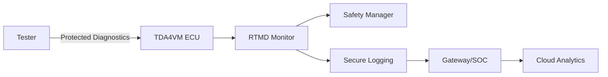
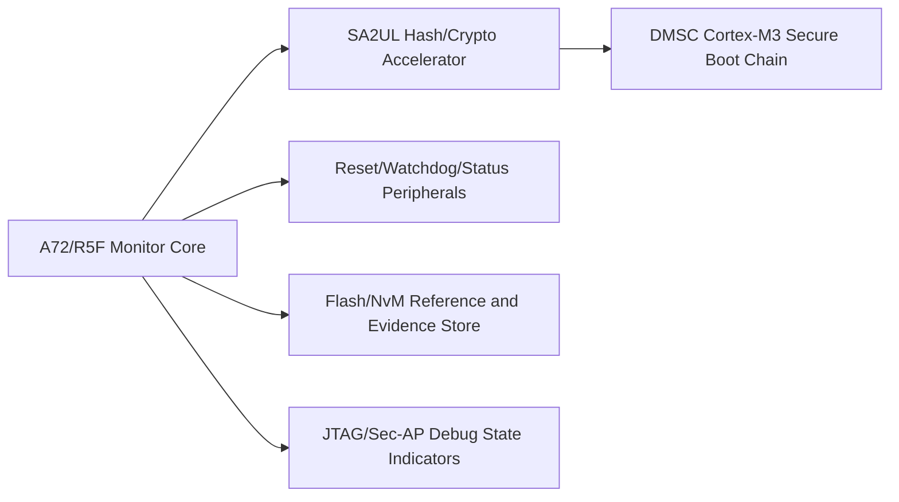
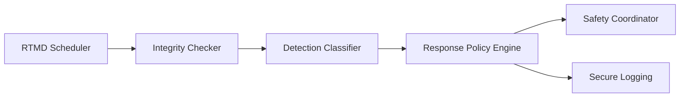
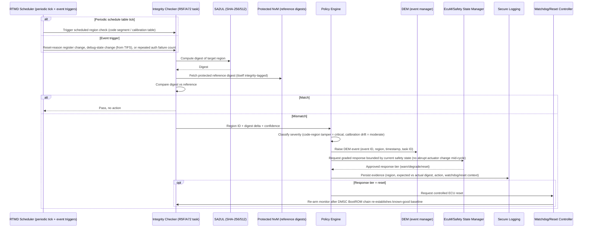

# Runtime Tamper Monitoring and Detection (RTMD) Security Architecture Requirements - TDA4VM ADAS ECU

## 1. Functional Security Concept

### 1.1 Cybersecurity Goals (CSG)
- CSG-RTMD-1: Selected code/data/control indicators shall be monitored during runtime.
- CSG-RTMD-2: Detection events shall trigger graded response actions by severity/confidence.
- CSG-RTMD-3: Evidence for detections and actions shall be preserved for post-incident analysis.
- CSG-RTMD-4: Monitoring shall combine periodic checks and event-triggered checks.
- CSG-RTMD-5: Response actions shall be coordinated with safety management logic.

### 1.2 Functional Security Concept (FSC)
- FSC-RTMD-1: Combine continuous (periodic) and event-triggered detection so that both slow-drift tampering and sudden anomalies are caught.
- FSC-RTMD-2: Scale the response to the confidence and severity of what was detected, rather than a single fixed reaction for every anomaly.
- FSC-RTMD-3: Preserve a forensic trail from first detection through the action finally taken, so incidents remain analyzable after the fact.

### 1.3 Functional Security Requirements (FSR)
- FSR-RTMD-1: Defined code, data, and control-flow indicators shall be evaluated on both a periodic schedule and in response to specific trigger events.
- FSR-RTMD-2: Each detection shall be classified by severity/confidence and mapped to a predetermined response tier before any action is taken.
- FSR-RTMD-3: Detection evidence (indicator, timestamp, context) shall be captured and retained independently of whether the response mitigates the condition.
- FSR-RTMD-4: Both periodic and event-triggered monitoring paths shall feed the same classification and response logic, avoiding duplicated or conflicting handling.
- FSR-RTMD-5: A response action affecting vehicle behavior shall be coordinated with safety state management before being applied.

## 2. System Requirements and System Static Architecture

### 2.1 System entities
- Runtime-monitored ECU (TDA4VM)
- Safety manager/supervisor
- Gateway or SOC for event collection
- Cloud/backend for fleet incident analytics
- Service/tester endpoint for diagnostics

### 2.2 Trust boundaries and interfaces
- Boundary A: ECU security monitor to safety manager (graded-response contract)
- Boundary B: ECU to gateway/backend telemetry path (forensic evidence export)
- Boundary C: Tester diagnostics interface to protected monitoring status
- Boundary D: Monitor policy/configuration boundary (only authorized updates)

### 2.3 System Requirements (SYSR)
- SYSR-RTMD-1: The RTMD Monitor domain shall report all detections to the Safety Manager only through the graded-response contract (Boundary A), never triggering a vehicle-behavior action directly.
- SYSR-RTMD-2: Evidence export crossing Boundary B to the Gateway/backend shall be independent of and not blocked by the safety-response decision path.
- SYSR-RTMD-3: The Monitor policy/configuration boundary (Boundary D) shall accept updates only from an authorized source, consistent with the SecureAccess doc's access-level model.

## 3. Technical Security Concept

### 3.1 Technical Security Concept (TSC)
- TSC-RTMD-1: Combine periodic integrity checks with trigger-based checks (reset anomalies, debug-state changes, repeated auth anomalies).
- TSC-RTMD-2: Apply deterministic policy mapping from detection class to response tier.
- TSC-RTMD-3: Coordinate security reactions with safety state manager to avoid unsafe abrupt transitions.
- TSC-RTMD-4: Keep forensic continuity from detection through mitigation.

### 3.2 Technical Security Requirements (TSR)
- TSR-RTMD-1: Use SA2UL-assisted hashing for runtime integrity computation.
- TSR-RTMD-2: Compare against protected reference values from secure storage/NvM design.
- TSR-RTMD-3: Integrate outcomes with DEM/EcuM response logic and secure logging path.
- TSR-RTMD-4: Correlate watchdog/reset/status context for diagnosis and controlled recovery.

## 4. Hardware Requirements and Hardware Static Architecture

### 4.1 Hardware elements
- TDA4VM (J721E) execution domains: Cortex-A72, Cortex-R5F, DMSC (System Firmware/TIFS)
- SA2UL hash/crypto accelerator used for runtime re-hashing
- DMSC BootROM and secure boot chain as the trust anchor the monitor extends at runtime
- Flash/NvM for reference values and evidence persistence
- Reset/watchdog/status peripherals
- JTAG/Sec-AP debug interface state indicators

### 4.2 Hardware Requirements (HWR)
- HWR-RTMD-1: Hardware crypto supports periodic integrity checks
- HWR-RTMD-2: Reset/watchdog telemetry available for correlation
- HWR-RTMD-3: Evidence storage survives power interruption

## 5. Software Requirements and Software Static & Dynamic Architecture

### 5.1 Software blocks
- RTMD scheduler (periodic + event-triggered)
- Integrity checker (hash/reference comparator)
- Detection classifier and policy engine
- Safety response coordinator
- Secure logging adapter

### 5.2 Software Requirements (SWR)
- SWR-RTMD-1: Tiered responses (warn/degrade/reset)
- SWR-RTMD-2: Periodic and triggered execution modes
- SWR-RTMD-3: Evidence structure with region/time/action metadata
- SWR-RTMD-4: Deterministic safety-coordinated response

### 5.3 Runtime tamper detection sequence

  

Mermaid source (for editing/regeneration)

### 5.4 Behavioral requirement focus
- Monitoring runs on both a scheduled cadence and discrete triggers (reset-reason register, TIFS debug-state change notification, repeated SecurityAccess failures) rather than a single polling loop (CSG-RTMD-4, TSC-RTMD-1)
- Severity classification is table-driven (region/class -> tier), and any reset-tier response is arbitrated through EcuM/safety-state logic so it cannot fire mid safety-critical actuation cycle (CSG-RTMD-2, CSG-RTMD-5, TSC-RTMD-3)
- Reference digests themselves are protected (stored with their own integrity tag in NvM) so a compromised reference cannot mask a real violation (TSR-RTMD-2)
- Evidence recorded includes region ID, expected-vs-actual digest, and correlated watchdog/reset/debug-state context to support root-cause diagnosis, not just a pass/fail flag (CSG-RTMD-3, TSR-RTMD-4)
- A reset-tier response re-enters the DMSC BootROM chain, giving the monitor a freshly attested baseline rather than re-arming against a potentially compromised state (TSR-RTMD-3)

## 6. Hardware-Software Interface (HSI)

### 6.1 HSI elements
- SA2UL SHA-256/512 register interface for digest computation
- Protected NvM reference-digest register/read interface
- Watchdog/reset-reason register interface
- TIFS debug-state-change notification interface

### 6.2 HSI Requirements (HSI)
- HSI-RTMD-1: The SA2UL digest interface shall return a distinguishable accelerator-fault status separate from a computed-digest result, so the Integrity Checker never mistakes an engine fault for a passing comparison.
- HSI-RTMD-2: The reset-reason register interface shall be readable by the RTMD Scheduler as an event trigger source without requiring a full reset-history software log to be independently maintained.
- HSI-RTMD-3: The TIFS debug-state-change notification interface shall deliver JTAG/debug transition events to the RTMD Scheduler as a trigger, consistent with the Secure JTAG doc's boundary D logging obligation.
