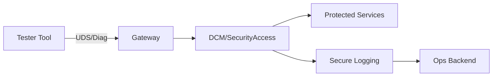
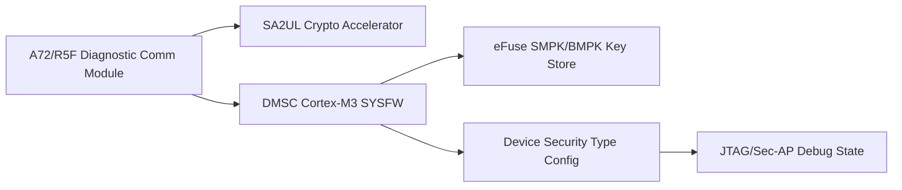
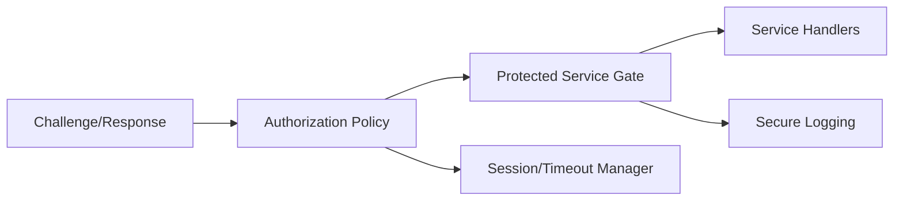
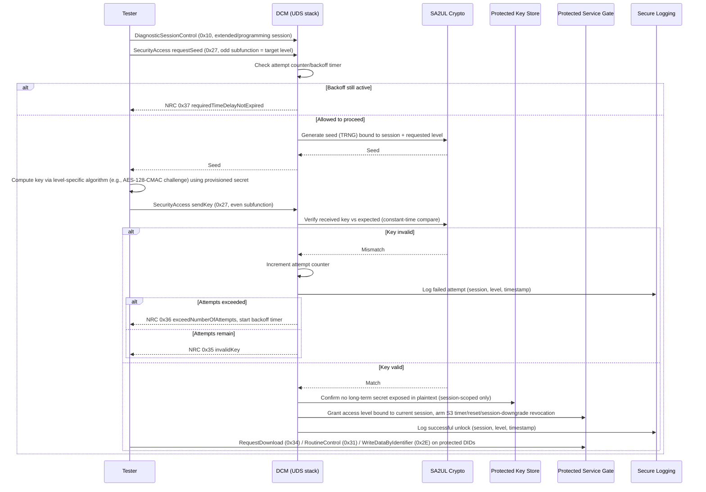

# Secure Access (Diagnostics and Protected Services) Architecture Requirements - TDA4VM ADAS ECU

## 1. Functional Security Concept

### 1.1 Cybersecurity Goals (CSG)
- CSG-SA-1: Protected services shall require successful security access before execution.
- CSG-SA-2: Challenge-response shall include freshness/nonce and anti-replay protection.
- CSG-SA-3: Failed attempts shall trigger lockout/backoff and audit logging.
- CSG-SA-4: Access rights shall be role/session specific.
- CSG-SA-5: Elevated access shall expire automatically and require re-authentication.

### 1.2 Functional Security Concept (FSC)
- FSC-SA-1: Require successful, freshness-protected authentication before granting access to any protected diagnostic service.
- FSC-SA-2: Bound elevated access in both scope (role/session) and time, so a granted session cannot be reused indefinitely or beyond its intended purpose.
- FSC-SA-3: Resist brute-force attempts through graded delay/lockout rather than a fixed, guessable retry limit alone.

### 1.3 Functional Security Requirements (FSR)
- FSR-SA-1: A protected diagnostic service shall refuse execution unless the requesting session has completed successful security access for that service's required level.
- FSR-SA-2: The authentication challenge/response exchange shall include a freshness value and shall reject any replayed exchange.
- FSR-SA-3: A failed security access attempt shall be logged and shall count toward a defined lockout/backoff policy before further attempts are permitted.
- FSR-SA-4: Granted access rights shall be scoped to the specific role and session that obtained them, not shared across sessions.
- FSR-SA-5: Elevated access shall expire automatically after a defined condition (timeout, session end, reset) and shall require re-authentication thereafter.

## 2. System Requirements and System Static Architecture

### 2.1 System entities
- Authorized tester/service tool
- Vehicle gateway
- Target ECU diagnostics endpoint (DCM)
- Security policy authority/provisioning backend
- Fleet operations backend for audit telemetry

### 2.2 Trust boundaries and interfaces
- Boundary A: Tester to gateway/ECU diagnostic interface
- Boundary B: DCM service layer to protected ECU services
- Boundary C: Access-state management to session manager boundary
- Boundary D: ECU logging path to backend audit domain

### 2.3 System Requirements (SYSR)
- SYSR-SA-1: The Tester/Gateway domain shall reach Protected Services only through the DCM boundary (Boundary B), never bypassing SecurityAccess state.
- SYSR-SA-2: The Session Manager (Boundary C) shall be the sole authority for access-state validity across all protected service gates in the system.
- SYSR-SA-3: Security event data crossing Boundary D to the backend shall include role/session identifiers sufficient for fleet-level correlation without exposing long-term secrets.

## 3. Technical Security Concept

### 3.1 Technical Security Concept (TSC)
- TSC-SA-1: Separate authentication (identity proof) from authorization (service scope).
- TSC-SA-2: Enforce deny-by-default for protected services when access state is invalid.
- TSC-SA-3: Invalidate access state on timeout, reset, and session downgrade.
- TSC-SA-4: Apply graded delay/lockout policy for brute-force resistance.

### 3.2 Technical Security Requirements (TSR)
- TSR-SA-1: Implement challenge-response using hardware-assisted crypto (SA2UL where applicable).
- TSR-SA-2: Keep long-term secrets in secure storage/provisioning flow and prevent plaintext export.
- TSR-SA-3: Bind decisions to lifecycle state and policy configuration.
- TSR-SA-4: Emit security events to protected logging path for forensic continuity.

## 4. Hardware Requirements and Hardware Static Architecture

### 4.1 Hardware elements
- TDA4VM (J721E) processing domain: Cortex-A72/R5F application cores plus DMSC (System Firmware/TIFS)
- SA2UL crypto acceleration support for challenge-response operations
- eFuse-anchored key storage (SMPK/BMPK) via System Firmware provisioning services
- DMSC BootROM + device security type (GP/HS-FS/HS-SE) constrain which access levels are possible
- JTAG/Sec-AP debug state controls affecting access policy (see Secure JTAG doc)

### 4.2 Hardware Requirements (HWR)
- HWR-SA-1: Auth timing targets met through crypto acceleration
- HWR-SA-2: Hardware-backed credential handling and key protection
- HWR-SA-3: Device security type (GP/HS-FS/HS-SE) and lifecycle state bound which access levels are reachable (TSR-SA-3)

## 5. Software Requirements and Software Static & Dynamic Architecture

### 5.1 Software blocks
- DCM SecurityAccess state machine
- Authentication challenge/response module
- Authorization policy evaluator
- Protected service gates (RequestDownload, RoutineControl, WriteData)
- Session timeout/revocation manager
- Secure logging emitter

### 5.2 Software Requirements (SWR)
- SWR-SA-1: DCM gates protected UDS services by access level
- SWR-SA-2: Enforce timeout, retry counter, lockout windows
- SWR-SA-3: Validate access state per protected request
- SWR-SA-4: Log and expose security failures

### 5.3 Secure access challenge-response flow (ISO 14229-1 SecurityAccess, service 0x27)

  

Mermaid source (for editing/regeneration)

### 5.4 Behavioral requirement focus
- Access is deny-by-default: no protected service gate opens until a `sendKey` verification succeeds for the matching session and level (CSG-SA-1, TSC-SA-2)
- Seeds are single-use, TRNG-generated, and bound to the current session and requested level, preventing replay of a previously observed seed/key pair (CSG-SA-2)
- Failure handling follows ISO 14229-1 NRCs explicitly: 0x35 invalidKey, 0x36 exceedNumberOfAttempts, 0x37 requiredTimeDelayNotExpired drive the retry/backoff state machine rather than a generic "deny" (CSG-SA-3)
- Granted access is automatically revoked on S3 timer expiry, ECU reset, or session downgrade to default session - there is no persistent unlock across power cycles (CSG-SA-5, SWR-SA-2)
- The shared secret/key derivation material never leaves protected key storage in plaintext; only the computed key/seed values cross the tester interface (TSR-SA-2)

## 6. Hardware-Software Interface (HSI)

### 6.1 HSI elements
- SA2UL challenge-response register interface (seed generation, key verification)
- Protected key store register/API interface
- DCM-to-SA2UL crypto request interface

### 6.2 HSI Requirements (HSI)
- HSI-SA-1: The SA2UL seed-generation interface shall expose only a request/response API to DCM, never a directly readable TRNG register, preventing prediction or replay of seeds by software outside DCM.
- HSI-SA-2: The protected key store interface shall support key-verify operations without ever returning the stored secret to the calling software layer.
- HSI-SA-3: The DCM-to-SA2UL interface shall report constant-time-verified match/mismatch status only, with no timing-observable intermediate state exposed across the hardware/software boundary.

## Interview Appendix: Expert Q&A (20 Questions)

The following expert-level Q&A set is intended for interview practice and design review on this topic.

| # | Question | Difficulty | Detailed answer | Evidence |
|---|---|---|---|---|
| 1 | Why is SecurityAccess not treated as a simple login check? | L1 | In automotive diagnostics, SecurityAccess is a stateful challenge-response process designed to bind access to a session and to ensure freshness, not just possession of a static secret. A static password would be replayable and would not protect well against passive capture or repeated diagnostic probing. The design uses challenge-response logic so the ECU can ensure that the request is fresh and tied to the current session. | ISO 14229 SecurityAccess principles, secure access requirements |
| 2 | What is the core security value of a fresh challenge in a SecurityAccess flow? | L2 | Freshness prevents an attacker from reusing an old valid key in a later diagnostic session or across a different vehicle context. If the request is tied to a nonce or challenge value, the ECU can confirm the response matches the current state and not a previously observed transaction. This reduces replay likelihood and strengthens the service against capture-and-repeat attack patterns. | SecurityAccess requirements, ISO 14229 |
| 3 | Why do repeated wrong `sendKey` values matter from a security perspective? | L2 | A wrong key is not just a benign failed service call; it is evidence of a probing attempt. Diagnostic ports are valuable attack surfaces, and repeated failures often lead to lockout or delay behavior to frustrate brute-force or oracle attacks. The state machine is designed to degrade the attacker’s ability to iterate through keys without making the service unusable for a legitimate tester. | SecurityAccess state-machine requirements |
| 4 | What happens if a tester sends the same key again after an accepted session? | L2 | The system should treat it as a repeat of a previous response in a stateful session, and the service must enforce the correct transition rules. Accepting duplicate keys without a proper state change can weaken the whole flow by reducing the value of freshness and access sequencing. That is why the design includes explicit state transitions and session expectations, not only a pass/fail compare. | SecurityAccess state-machine design |
| 5 | Why is SecurityAccess usually implemented with a key-verify flow instead of returning the secret itself? | L3 | Returning the secret would turn the ECU into a key-disclosure oracle and would create a direct confidentiality problem. A key-verify model allows the ECU to check whether the tester knows the correct secret without exposing the secret from the device. This is substantially safer because it narrows the secret to the verification logic and reduces the leak surface. | SecureAccess requirements, hardware-protected key validation |
| 6 | What is the impact of a missing or broken state machine on a SecurityAccess implementation? | L3 | Without a proper state machine, an attacker or a malformed tester can reuse responses, skip required transitions, or exploit order assumptions. The result is a design that is hard to reason about and easier to brute force or bypass by protocol manipulation. The security value of the design comes not only from the key itself but from the correct sequence and isolation of state transitions. | SecurityAccess state-machine design |
| 7 | Why is it important that SecurityAccess is separate from ordinary application data access? | L2 | Diagnostic services are often a special channel with different trust assumptions than the normal application runtime. If diagnostics were simply treated as ordinary user traffic, the system could accidentally grant broad access or bypass the intended security controls. Separation ensures the access-control policy is specific to the diagnostic interface and can be treated differently from normal vehicle functions. | Diagnostic access control requirements |
| 8 | What is the attack opportunity of a replayed valid diagnostic key? | L2 | A replayed valid key allows a malicious actor to impersonate a trusted tester and continue using the diagnostic service without being the original legitimate actor. This undermines access accountability and can enable unauthorized software or parameter changes, especially if the ECU accepts the response without verifying freshness or state continuity. | ISO 14229 SecurityAccess, replay prevention |
| 9 | Why is a strong SecurityAccess design not only about authenticity but also about access scope? | L3 | A tester may be authenticated but still should not get unrestricted access to all diagnostic functions. The design should gate which services are available after the key is accepted so the session matches the called service and the expected privilege model. This is a least-privilege issue that matters for safety and security. | SecurityAccess policy design |
| 10 | What is the security consequence of a partial or broken key verification path? | L2 | If the ECU uses a weak verification path or exposes intermediate values, an attacker can recover enough information to refine guesses or bypass verification entirely. It also makes the system more difficult to validate in a repeatable and trustworthy way. The correct design ensures that the verification result is visible only as a final match or mismatch outcome, not as a leaky side channel. | HSI-SA-3, constant-time verification concept |
| 11 | Why is it important that the secret is never returned to the calling software layer? | L3 | If the ECU returns the secret to the software interface, the secret now exists in host memory or a shared buffer, exposing it to memory attacks or unexpected code paths. A secure verification model keeps the secret in the protected domain and exposes only a match/mismatch result. This minimizes the number of copies of the secret and reduces the attack surface. | HSI-SA-2, protected key store logic |
| 12 | How does the hardware/software split strengthen SecurityAccess? | L2 | The hardware portion can run the cryptographic verification in a protected context, while the software layer only manages session states and request sequencing. This reduces the chance that a compromised application layer can directly observe or manipulate the verification secret. The separation strengthens both confidentiality and integrity of the access control path. | HSI-SA-1, HSI-SA-2, HSI-SA-3 |
| 13 | Why is a seed-generation interface often restricted to the secure controller path? | L2 | If the challenge or seed is directly readable by the host or ordinary application software, the attacker can predict or replay it and use that information to refine access attacks. Restricting the interface to a protected controller ensures the seed is generated in a controlled environment and not observable through general-purpose software. | HSI-SA-1 |
| 14 | What is the practical difference between a secure vehicle tester and a generic off-board tool? | L3 | A secure vehicle tester should be able to satisfy the challenge-response model, operate under the proper state machine, and remain within the diagnostic policy envelope. A generic off-board tool without the right state or key material should be rejected even if it can send the correct protocol frames. This is why the service is both cryptographic and policy-driven. | SecurityAccess state machine and policy |
| 15 | What is the major risk if challenge-response values are not properly tied to the session? | L2 | Without session binding, an attacker can reuse a valid response from one session in a different context or after the vehicle state has changed. That weakens the value of the challenge and allows cross-session replay or misuse. Session binding is therefore essential to the meaningful security of the protocol. | SecurityAccess state binding design |
| 16 | Why does the repo emphasize constant-time verification in the hardware interface? | L3 | Timing side channels can leak whether a secret partially matches, allowing an attacker to infer the key or narrow the search space. Constant-time behavior prevents timing differences from exposing intermediate state. This is especially important for a diagnostic verifier that may be exposed to repeated probing attempts. | HSI-SA-3 |
| 17 | How do lockout and delay rules improve the SecurityAccess model? | L2 | They turn a protocol-level attack into a slower and much less useful operation. Every failed attempt reduces the attacker’s time budget and increases the cost of guessing or brute forcing. This does not replace cryptographic strength, but it improves resilience when an attacker is repeatedly probing the service. | SecurityAccess lockout/delay behavior |
| 18 | Why is the proper handling of failed attempts important even when the key is strong? | L2 | A strong key alone does not prevent abuse if the service reveals too much information or allows unrestricted retries. Failures must be handled in a way that keeps the service available for legitimate use while making exhaustive probing impractical. The access-control design therefore combines cryptography, policy, and state handling. | SecurityAccess response policy |
| 19 | How would you explain the SecurityAccess design to a skeptical stakeholder? | L3 | I would explain that the diagnostic interface is a privileged control path and must therefore behave like a challenge-response authentication system rather than a convenience service. The ECU verifies the value without exposing the secret, binds it to a fresh challenge and session, and enforces a state machine with controlled failure handling. This reduces both replay risk and brute-force risk while keeping legitimate service access intact. | ISO 14229, secure access design principles |
| 20 | If you had to summarize the SecurityAccess principle in one sentence, what would it be? | L1 | SecurityAccess exists to ensure that a diagnostic tester proves freshness and knowledge of the correct secret in a controlled, stateful, and protected way before any privileged service is enabled. | SecurityAccess state model, key verification design |
