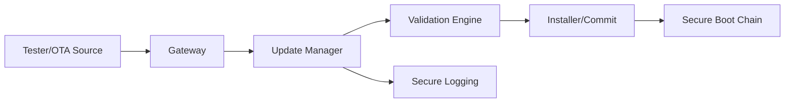
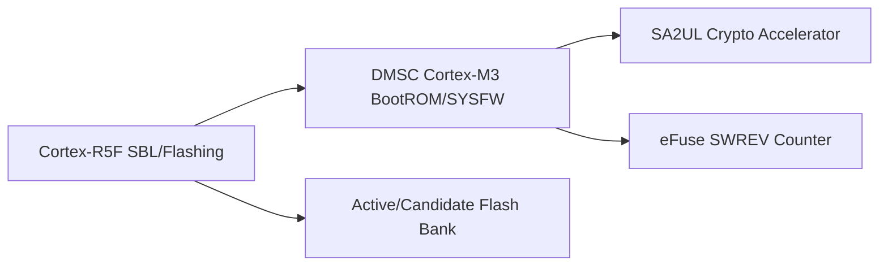
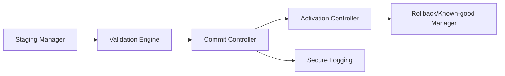
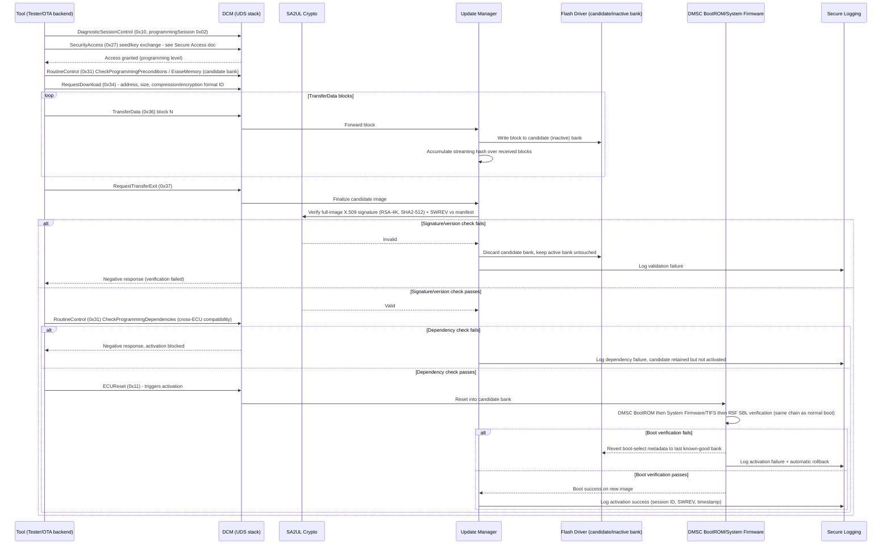

# Secure Reprogramming Architecture Requirements - TDA4VM ADAS ECU

## 1. Functional Security Concept

### 1.1 Cybersecurity Goals (CSG)
- CSG-SRP-1: Downloaded images shall be authenticated and integrity-checked prior to activation.
- CSG-SRP-2: Anti-rollback policy shall reject vulnerable older versions.
- CSG-SRP-3: Interruption during flashing shall not create undefined executable state.
- CSG-SRP-4: Activation reset shall pass through the standard secure boot chain.
- CSG-SRP-5: Update metadata shall include compatibility/dependency policy inputs.

### 1.2 Functional Security Concept (FSC)
- FSC-SRP-1: Separate delivery, verification, and activation into distinct stages so a failure at any stage cannot silently proceed to the next.
- FSC-SRP-2: Never allow the currently active, known-good image to be overwritten until a candidate image is fully verified.
- FSC-SRP-3: Reuse the same trust chain for post-update activation as for ordinary boot, rather than a reduced-check path.

### 1.3 Functional Security Requirements (FSR)
- FSR-SRP-1: A downloaded image shall be authenticated and integrity-checked before it is committed as the active image.
- FSR-SRP-2: An image whose version fails the anti-rollback policy shall be rejected regardless of otherwise-valid signature/integrity.
- FSR-SRP-3: An interruption during the flashing process shall leave the ECU able to boot a known-valid image, never an undefined or partially written one.
- FSR-SRP-4: The activation reset following reprogramming shall pass through the same verification chain used at ordinary power-on.
- FSR-SRP-5: Update metadata shall be checked against target identity, dependency, and version-compatibility policy before activation is permitted.

## 2. System Requirements and System Static Architecture

### 2.1 System entities
- Authorized update source (tester or OTA backend)
- Gateway transport domain
- ECU update manager and installer domain
- Boot verification chain domain
- Logging and fleet operations domain

### 2.2 Trust boundaries and interfaces
- Boundary A: External update source to ECU download interface
- Boundary B: Downloaded candidate image to validation/commit boundary
- Boundary C: Commit boundary to activation reset/secure boot boundary
- Boundary D: Update state transitions to audit logging boundary

### 2.3 System Requirements (SYSR)
- SYSR-SRP-1: The Update Manager domain shall be the only entity permitted to move an image from the download boundary (Boundary A) to the validation boundary (Boundary B).
- SYSR-SRP-2: The Commit boundary (Boundary C) shall require an explicit pass result from validation before any activation-reset request is issued.
- SYSR-SRP-3: Update state transitions crossing Boundary D to logging shall be emitted for every boundary crossing, including rejected/blocked transitions, not only successful ones.

## 3. Technical Security Concept

### 3.1 Technical Security Concept (TSC)
- TSC-SRP-1: Use staged workflow (download, verify, commit, activate).
- TSC-SRP-2: Keep active and candidate images separable with explicit commit decision.
- TSC-SRP-3: Maintain rollback-safe recovery to last known-good executable image.
- TSC-SRP-4: Refuse activation if verification or policy checks fail.

### 3.2 Technical Security Requirements (TSR)
- TSR-SRP-1: Perform signature/hash checks using SA2UL-assisted cryptography.
- TSR-SRP-2: Enforce SWREV/equivalent monotonic version policy in trust chain.
- TSR-SRP-3: Activation shall re-run the DMSC BootROM -> System Firmware/TIFS -> R5F SBL -> application verification sequence.
- TSR-SRP-4: Log update state transitions and security failures using secure logging path.

## 4. Hardware Requirements and Hardware Static Architecture

### 4.1 Hardware elements
- TDA4VM (J721E) update control and flash programming domain: Cortex-R5F (SBL/flashing), DMSC (System Firmware/TIFS)
- SA2UL cryptographic acceleration for signature/hash verification
- DMSC BootROM trust anchor re-entered at every activation reset
- Flash layout for active/candidate image separation
- Monotonic anti-rollback source: eFuse SWREV counter checked by System Firmware

### 4.2 Hardware Requirements (HWR)
- HWR-SRP-1: Active/candidate image separation with atomic metadata updates
- HWR-SRP-2: DMSC BootROM + System Firmware enforce activation authenticity checks
- HWR-SRP-3: eFuse SWREV anti-rollback policy anchored in the hardware trust chain (TSR-SRP-2)

## 5. Software Requirements and Software Static & Dynamic Architecture

### 5.1 Software blocks
- Update manager state machine
- Download and staging manager
- Signature/hash/version/compatibility validator
- Installer and commit controller
- Rollback/known-good recovery manager
- Secure logging integration

### 5.2 Software Requirements (SWR)
- SWR-SRP-1: Deterministic update state machine with interruption recovery
- SWR-SRP-2: Validation gates for signature/integrity/version/compatibility
- SWR-SRP-3: Block activation on policy or validation failure
- SWR-SRP-4: Automatic rollback/known-good recovery after failed activation

### 5.3 Secure reprogramming sequence (ISO 14229-1 UDS flashing flow)

  

Mermaid source (for editing/regeneration)

### 5.4 Behavioral requirement focus
- Reprogramming follows the standard UDS staged workflow - session control, SecurityAccess, erase/precondition check, block-wise download, transfer exit, dependency check, then reset-triggered activation - with an explicit commit decision at each gate (TSC-SRP-1, TSC-SRP-2)
- The active bank is never modified during download; only the candidate/inactive bank is written, so an interrupted transfer cannot leave the running image undefined (CSG-SRP-3, HWR-SRP-1)
- Full-image signature and SWREV/anti-rollback checks happen twice conceptually: once by the Update Manager/SA2UL at transfer-exit, and again by DMSC BootROM/System Firmware at activation reset using the same chain as ordinary power-on (CSG-SRP-4, TSR-SRP-3)
- Cross-ECU dependency/compatibility checks (RoutineControl CheckProgrammingDependencies) gate activation independently from image-integrity checks (CSG-SRP-5)
- A failed activation automatically reverts to the last known-good bank rather than leaving the ECU non-bootable (CSG-SRP-3, SWR-SRP-4)

## 6. Hardware-Software Interface (HSI)

### 6.1 HSI elements
- Flash driver-to-candidate/inactive-bank register interface
- SA2UL signature/hash register interface
- DMSC BootROM/System Firmware activation-trigger interface
- UDS RequestDownload/TransferData block-transfer register/DMA interface

### 6.2 HSI Requirements (HSI)
- HSI-SRP-1: The flash driver interface shall expose write access only to the candidate/inactive bank address range during TransferData, with the active bank's range hardware-protected against writes.
- HSI-SRP-2: The SA2UL full-image verification interface shall be invoked by the Update Manager only after RequestTransferExit, and its pass/fail result shall gate the commit-controller's activation request.
- HSI-SRP-3: The activation-trigger interface shall carry no software-settable flag capable of skipping the DMSC BootROM -> System Firmware -> R5F SBL verification sequence for a reprogramming-originated reset.

## Interview Appendix: Expert Q&A (20 Questions)

The following expert-level Q&A set is intended for interview practice and design review on this topic.

| # | Question | Difficulty | Detailed answer | Evidence |
|---|---|---|---|---|
| 1 | Why is secure reprogramming treated as a staged workflow rather than a single flash-write operation? | L1 | Reprogramming touches the most security-sensitive part of the ECU lifecycle: replacing the executable image. If download, verification, and activation were collapsed into one step, a failure partway through could leave the device in an undefined state or allow an unverified image to become active by accident. Staging the process into download, validate, commit, and activate gives each phase an explicit gate, so a failure at any stage is contained rather than silently propagating forward. | FSC-SRP-1, TSC-SRP-1 |
| 2 | Why is the active bank never modified during download? | L2 | If the active bank were overwritten during transfer, an interrupted or corrupted download could leave the ECU with no bootable image at all. By writing only to the candidate/inactive bank, the currently running, known-good image remains untouched until a full validation pass is achieved. This means an aborted update never threatens the vehicle's ability to boot. | CSG-SRP-3, HWR-SRP-1, FSC-SRP-2 |
| 3 | Why does the design verify the image signature twice, once at transfer-exit and again at activation reset? | L3 | The first check, done by the Update Manager/SA2UL right after transfer, confirms the image is well formed and authentic before it is even considered a candidate for activation. The second check, performed by DMSC BootROM/System Firmware at the actual reset, re-validates using the same trust chain as ordinary power-on. This double-check exists because the time between commit and activation is a window an attacker could exploit if only one check were trusted; requiring the boot chain to redo its own independent validation removes any implicit trust in the earlier software-only check. | CSG-SRP-4, TSR-SRP-1, TSR-SRP-3 |
| 4 | What is the purpose of anti-rollback checks specifically in the reprogramming flow? | L2 | Anti-rollback prevents an attacker or a misconfigured update from reinstalling an older image that is signed correctly but contains a known vulnerability. The SWREV/eFuse-based check ensures that even a validly signed old image is rejected if its version is lower than what the device has already accepted. Without this, a compromise could be achieved simply by upgrading to an older, weaker version. | CSG-SRP-2, FSR-SRP-2, TSR-SRP-2 |
| 5 | Why does the sequence include a CheckProgrammingDependencies step separate from the image integrity check? | L3 | Image integrity confirms the binary itself is authentic and untampered, but it says nothing about whether the ECU or its peers are in a compatible state to run it. A dependency check validates cross-ECU version constraints, hardware variant compatibility, and other preconditions that are unrelated to cryptographic trust. Keeping these checks separate ensures a cryptographically valid image is still blocked if activating it would break a system-level compatibility contract. | CSG-SRP-5, FSR-SRP-5, SYSR-SRP-2 |
| 6 | What happens if the flashing process is interrupted mid-transfer? | L2 | Because writes only target the candidate/inactive bank and the active bank is hardware-protected from writes during this window, an interrupted transfer simply leaves an incomplete candidate that will fail validation at transfer-exit. The ECU continues booting from the untouched active bank. This design converts what could be a catastrophic failure mode into a simple, recoverable rejected-update event. | CSG-SRP-3, HSI-SRP-1 |
| 7 | Why is the activation reset required to pass through the same secure boot chain as ordinary power-on? | L3 | If activation had a separate, reduced-check path, it would become a preferred attack target since bypassing normal boot security would only require triggering an update-based reset. Requiring the identical DMSC BootROM to System Firmware to R5F SBL sequence ensures there is exactly one trust chain in the system, not two, and that reprogramming cannot be used to sidestep the standard verification the device relies on for all other resets. | CSG-SRP-4, TSR-SRP-3, HSI-SRP-3 |
| 8 | What is the security value of automatic rollback to the last known-good bank after a failed activation? | L2 | Automatic rollback ensures a failed or malicious update cannot leave the vehicle non-functional or stuck attempting to boot an invalid image repeatedly. This closes a potential denial-of-service angle where an attacker intentionally corrupts an update to strand the ECU. It also means operational safety is preserved even when a security check correctly rejects a bad image at the last possible moment. | CSG-SRP-3, SWR-SRP-4 |
| 9 | Why must the flash driver interface expose write access only to the candidate bank at the hardware level, not just by software convention? | L3 | A software-only restriction can be bypassed if the application or driver layer is compromised, so the guarantee that the active bank cannot be modified needs to be hardware-enforced, not just policy-enforced. If the active bank's address range is genuinely write-protected in hardware during TransferData, even a fully compromised update client cannot corrupt the running image. This shifts the trust requirement from software correctness to a verifiable hardware property. | HSI-SRP-1 |
| 10 | Why is UDS SecurityAccess required before a programming session can proceed? | L2 | Reprogramming is one of the most powerful operations available on the diagnostic interface, since it can replace the entire executable image. Requiring a validated SecurityAccess exchange before RequestDownload ensures only an authorized tester or backend can initiate the flashing sequence, preventing an unauthenticated actor from injecting arbitrary firmware. | UDS programming session flow, SecureAccess integration |
| 11 | What would go wrong if the streaming hash were only computed once at the very end instead of accumulated per block? | L3 | Accumulating the hash incrementally as blocks arrive allows early detection of corruption without needing to buffer or re-read the entire image later, and it matches the natural streaming nature of TransferData. If the hash were computed once at the end from a re-read of flash, any latent storage corruption between write and re-read could be masked, and errors would only surface much later, delaying failure detection and complicating root cause analysis. | TSR-SRP-1, streaming validation approach |
| 12 | Why is the commit boundary required to see an explicit pass result from validation before issuing an activation-reset request? | L2 | Without an explicit gate, a race condition or a logic bug in the update manager could allow activation to be requested even though validation had not truly succeeded. Requiring an explicit, checked pass result at Boundary C means activation can never proceed based on an assumed or default state, keeping the fail-closed principle intact even under implementation bugs. | SYSR-SRP-2, TSC-SRP-4 |
| 13 | How does this design defend against a compromised gateway trying to push an unauthorized image? | L2 | The image itself must still pass full signature and SWREV verification at the ECU regardless of which path it arrived through, so a compromised gateway cannot bypass validation simply by delivering the payload. The ECU's Update Manager and SA2UL perform their own independent checks rather than trusting the gateway's assertion that the payload is authorized. This means the trust boundary is anchored at the ECU, not at the transport layer. | TSR-SRP-1, TSR-SRP-3, Boundary A/B |
| 14 | Why does the design log rejected and blocked transitions, not just successful ones? | L2 | Rejected or blocked events are often the most valuable security signal, since they may indicate an attacker probing the update mechanism or a misconfigured campaign. If only successes were logged, a pattern of repeated failed reprogramming attempts would be invisible to later forensic analysis. Logging every boundary crossing, including failures, preserves the evidence needed to detect an attack in progress. | SYSR-SRP-3, TSR-SRP-4 |
| 15 | What is the risk if update metadata compatibility checks were skipped in favor of image-integrity checks alone? | L3 | A cryptographically valid image could still be the wrong image for the target ECU variant or could violate a cross-ECU dependency, potentially causing a functional or safety issue even though it is fully authentic. Compatibility failures are not a security bypass in the cryptographic sense, but ignoring them could still result in an ECU running mismatched software that behaves unpredictably in an integrated vehicle context. This is why dependency and version-compatibility checks are a mandatory, independent gate. | CSG-SRP-5, FSR-SRP-5 |
| 16 | Why is the candidate/inactive bank concept preferable to a single-bank in-place update? | L3 | A single-bank update would require overwriting the only bootable image, meaning any failure during that write leaves the device with no valid image to boot. The two-bank model guarantees an always-bootable fallback exists throughout the entire update process, since the currently active image is never touched until the new one is fully verified and explicitly committed. This tradeoff costs extra flash space but removes an entire class of bricking failure modes. | HWR-SRP-1, TSC-SRP-2 |
| 17 | What is the purpose of distinguishing signature/version validation failures from dependency-check failures in the sequence diagram? | L2 | These are different failure classes with different remedies: a signature or version failure means the image itself cannot be trusted and must be discarded, while a dependency failure means the image may be valid but activation is currently unsafe due to cross-ECU state. Treating them identically would either discard a perfectly valid image unnecessarily or, worse, risk activating an image despite a compatibility conflict. Distinguishing them allows the candidate to be retained without activation in the dependency-failure case. | 5.3 sequence diagram, CSG-SRP-5 |
| 18 | Why must the SA2UL verification interface be invoked only after RequestTransferExit rather than continuously per block for the full-image signature? | L2 | The full-image signature is computed over the complete assembled image, so it can only be meaningfully verified once all blocks have arrived and the streaming hash is finalized. Per-block verification of a full-image signature would be meaningless because the signature covers the entire payload, not individual chunks. This is why the sequence performs full-image verification once, at transfer-exit, distinct from any per-block integrity checks that may exist during transfer. | HSI-SRP-2 |
| 19 | How would you explain the security tradeoff of reprogramming being both a powerful maintenance tool and a high-value attack target? | L3 | Reprogramming exists because ECUs must be updatable in the field, but the same capability that enables legitimate fixes is exactly what an attacker would want to abuse to install persistent malicious firmware. The design manages this tension by requiring authenticated diagnostic access, cryptographic validation of the image, anti-rollback enforcement, and reuse of the standard secure boot chain at activation, so that the update mechanism cannot become a bypass for the device's core trust model. | CSG-SRP-1 through CSG-SRP-5, whole-doc synthesis |
| 20 | If you had to summarize the secure reprogramming principle in one sentence, what would it be? | L1 | Secure reprogramming must never let an unverified or partially-written image become active, and every activation must re-enter the exact same trust chain used at ordinary power-on rather than a reduced-check shortcut. | CSG-SRP-1, CSG-SRP-4, TSC-SRP-1, TSR-SRP-3 |

