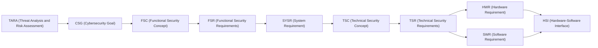

# Parking ECU — ADAS Parking Assist / Surround View System (SVS)

[← Back to ECU selector]({{ '/' | relative_url }})

TDA4VM (TI Jacinto 7 / J721E) ADAS ECU cybersecurity requirements documents, a TARA dashboard,
and a vulnerability analysis report/evidence set, all scoped to the Parking Assist / Surround
View System (SVS) ECU.

Each requirements document follows the same flow: **TARA (→CSG) → FSC (→FSR) → System
Requirements + System Static Architecture → TSC (→TSR) → Hardware Requirements + Hardware Static
Architecture → Software Requirements + Software Static & Dynamic Architecture → HSI**, using a
consistent CSG/FSC/FSR/SYSR/TSC/TSR/HWR/SWR/HSI requirement ID taxonomy.

## Topics

| Document | Topic |
|---|---|
| [Secure and Authentic Boot with Runtime Integrity]({{ "/Parking/TDA4VM_Secure_Authentic_Boot_Runtime_Integrity_Requirements.html" | relative_url }}) | Secure/authentic boot and runtime integrity |
| [Secure JTAG and Debug Control]({{ "/Parking/TDA4VM_Secure_JTAG_Requirements.html" | relative_url }}) | JTAG/debug port access control |
| [Secure Access]({{ "/Parking/TDA4VM_SecureAccess_Requirements.html" | relative_url }}) | UDS SecurityAccess (diagnostic access control) |
| [SecOC]({{ "/Parking/TDA4VM_SecOC_Requirements.html" | relative_url }}) | Secure communication stack: AUTOSAR SecOC per-PDU authenticity/freshness, confidentiality channels, off-board TLS |
| [Secure Logging]({{ "/Parking/TDA4VM_Secure_Logging_Requirements.html" | relative_url }}) | Secure/tamper-evident logging |
| [OTA/FOTA/SOTA]({{ "/Parking/TDA4VM_OTA_FOTA_SOTA_Requirements.html" | relative_url }}) | OTA/FOTA/SOTA update delivery |
| [Secure Reprogramming]({{ "/Parking/TDA4VM_Secure_Reprogramming_Requirements.html" | relative_url }}) | Secure ECU reprogramming |
| [RTMD]({{ "/Parking/TDA4VM_RTMD_Requirements.html" | relative_url }}) | Runtime tamper monitoring and detection |
| [Secure Storage]({{ "/Parking/TDA4VM_Secure_Storage_Requirements.html" | relative_url }}) | Secure storage of keys/credentials at rest |
| [Parking/TARA/Ref/]({{ "/Parking/TARA/Ref/index.html" | relative_url }}) | TARA dashboard |

## Vulnerability analysis: process vs. deliverable

These two documents are deliberately kept separate and live together under `Parking/Vulnerability_Analysis/`:

| Document | What it is |
|---|---|
| [Vulnerability Management Process]({{ "/Parking/Vulnerability_Analysis/TDA4VM_Vulnerability_Analysis_Requirements.html" | relative_url }}) | **Requirements doc.** Defines the ongoing ISO 21434 continuous-cybersecurity-activity capability (SBOM/CVE monitoring, TARA re-assessment, risk-treatment routing) using this repo's CSG/FSR/SYSR/TSC/TSR taxonomy. Says a capability must exist - contains no analysis of a specific subsystem. |
| [SVS / Parking Assist Vulnerability Analysis Report]({{ "/Parking/Vulnerability_Analysis/SVS_ParkingAssist_Vulnerability_Analysis_Report.html" | relative_url }}) | **Point-in-time report.** One concrete engagement deliverable produced *by* that process for the SVS/Parking Assist subsystem: attack surfaces, STRIDE, CVSS-scored risk matrix, case-study narratives, and evidence appendices (CAN/UDS logs, pen-test findings, static/dynamic/fuzz results). |

## Requirement ID taxonomy

TARA (Threat Analysis and Risk Assessment - see the TARA Dashboard above) is what supplies the
CSG: every Cybersecurity Goal comes from a TARA risk-treatment decision, and each subsequent ID in
the chain below is derived from the one before it, in order:

- **CSG** - Cybersecurity Goal (what must be true)
- **FSC** - Functional Security Concept (the overarching strategy for realizing the CSGs)
- **FSR** - Functional Security Requirements (decomposed, testable, still implementation-agnostic)
- **SYSR** - System Requirement (system-level allocation across entities/trust boundaries)
- **TSC** - Technical Security Concept (how, at a functional level)
- **TSR** - Technical Security Requirements (how, at a concrete TI TDA4VM mechanism level)
- **HWR** - Hardware Requirement
- **SWR** - Software Requirement
- **HSI** - Hardware-Software Interface Requirement (register/API/message contract)
