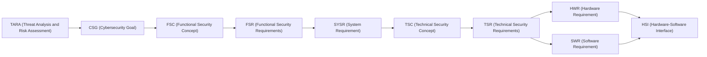

# TDA4VM ADAS ECU Cybersecurity Requirements

🔗 **[Browse the live site](https://vinodneelakantam.github.io/Sec_Concepts_Req_tracability/)**
(rendered docs with navigation and Mermaid diagrams, published via GitHub Pages from `main`).

This repository is a collection of automotive cybersecurity requirements documents for a
TDA4VM (TI Jacinto 7 / J721E) ADAS ECU. It exists as a learning and interview-preparation
resource for grounding automotive cybersecurity concepts in real hardware/firmware facts
(TI TISCI mailbox APIs, DMSC, SA2UL, TIFS, eFuse/OTP, etc.) rather than generic textbook
descriptions, while following established standards vocabulary (ISO 21434, ISO 14229 UDS,
AUTOSAR SecOC).

## What's in here

Each `TDA4VM_*_Requirements.md` file covers one security concept end-to-end, following the flow
**FSC (→FSR) → System Requirements + System Static Architecture → TSC (→TSR) → Hardware
Requirements + Hardware Static Architecture → Software Requirements + Software Static & Dynamic
Architecture → HSI**, structured as six sections:

1. **Functional Security Concept** - the CSG (cybersecurity goal), the overarching FSC strategy
   realizing it, and the decomposed FSR.
2. **System Requirements and System Static Architecture** - entities, trust boundaries, a Mermaid
   diagram, and the system-level requirement allocation (`SYSR-*`).
3. **Technical Security Concept** - the TSC (how, functionally) and TSR (how, at a concrete TI
   TDA4VM mechanism level).
4. **Hardware Requirements and Hardware Static Architecture** - the HW blocks/registers involved
   (`HWR-*`).
5. **Software Requirements and Software Static & Dynamic Architecture** - software blocks, `SWR-*`
   requirements, and sequence diagrams for the security-relevant flows.
6. **Hardware-Software Interface (HSI)** - the register/API/message-level contract between the
   hardware and software layers (`HSI-*`).

Requirements are layered per topic using a consistent ID taxonomy. TARA (Threat Analysis and Risk
Assessment - see the Parking ECU's TARA dashboard) is what supplies the CSG: every Cybersecurity
Goal comes from a TARA risk-treatment decision, and each subsequent ID in the chain below is
derived from the one before it, in order:



- **CSG** - Cybersecurity Goal (what must be true)
- **FSC** - Functional Security Concept (the overarching strategy for realizing the CSGs)
- **FSR** - Functional Security Requirements (decomposed, testable, still implementation-agnostic)
- **SYSR** - System Requirement (system-level allocation across entities/trust boundaries)
- **TSC** - Technical Security Concept (how, at a functional level)
- **TSR** - Technical Security Requirements (how, at a concrete TI TDA4VM mechanism level)
- **HWR** - Hardware Requirement
- **SWR** - Software Requirement
- **HSI** - Hardware-Software Interface Requirement (register/API/message contract)

## Site structure: per-ECU

Content is organized per ECU. The landing page lets you pick one:

| Folder | ECU | Status |
|---|---|---|
| [`Parking/`](Parking/) | ADAS Parking Assist / Surround View System (SVS) | All 9 requirements docs + vulnerability analysis + TARA dashboard |
| [`SDV/`](SDV/) | Software Defined Vehicle platform | TBD |

Topics currently covered (Parking ECU):

| Document | Topic |
|---|---|
| [Parking/TDA4VM_Secure_Authentic_Boot_Runtime_Integrity_Requirements.md](Parking/TDA4VM_Secure_Authentic_Boot_Runtime_Integrity_Requirements.md) | Secure/authentic boot and runtime integrity |
| [Parking/TDA4VM_Secure_JTAG_Requirements.md](Parking/TDA4VM_Secure_JTAG_Requirements.md) | JTAG/debug port access control |
| [Parking/TDA4VM_SecureAccess_Requirements.md](Parking/TDA4VM_SecureAccess_Requirements.md) | UDS SecurityAccess (diagnostic access control) |
| [Parking/TDA4VM_SecOC_Requirements.md](Parking/TDA4VM_SecOC_Requirements.md) | Secure communication stack: AUTOSAR SecOC per-PDU authenticity/freshness, confidentiality channels, off-board TLS |
| [Parking/TDA4VM_Secure_Logging_Requirements.md](Parking/TDA4VM_Secure_Logging_Requirements.md) | Secure/tamper-evident logging |
| [Parking/TDA4VM_OTA_FOTA_SOTA_Requirements.md](Parking/TDA4VM_OTA_FOTA_SOTA_Requirements.md) | OTA/FOTA/SOTA update delivery |
| [Parking/TDA4VM_Secure_Reprogramming_Requirements.md](Parking/TDA4VM_Secure_Reprogramming_Requirements.md) | Secure ECU reprogramming |
| [Parking/TDA4VM_RTMD_Requirements.md](Parking/TDA4VM_RTMD_Requirements.md) | Runtime tamper monitoring and detection |
| [Parking/TDA4VM_Secure_Storage_Requirements.md](Parking/TDA4VM_Secure_Storage_Requirements.md) | Secure storage of keys/credentials at rest |
| [Parking/Vulnerability_Analysis/TDA4VM_Vulnerability_Analysis_Requirements.md](Parking/Vulnerability_Analysis/TDA4VM_Vulnerability_Analysis_Requirements.md) | ISO 21434 continuous vulnerability monitoring/analysis/management (process doc) |
| [Parking/Vulnerability_Analysis/SVS_ParkingAssist_Vulnerability_Analysis_Report.md](Parking/Vulnerability_Analysis/SVS_ParkingAssist_Vulnerability_Analysis_Report.md) | Point-in-time SVS/Parking Assist vulnerability analysis report + evidence appendices |

An interactive TARA dashboard for the Parking ECU lives under
[`Parking/TARA/Ref/`](Parking/TARA/Ref/).

## Offline single-file export

Every push to `main` builds a single self-contained HTML file - all docs and diagrams
inlined as base64, no internet/CDN/repo checkout needed to view it - via
`tools/build-static-html/` (see [.github/workflows/build-static-html.yml](.github/workflows/build-static-html.yml)).

### Download the latest build (no checkout needed)

1. Go to the
   [`latest-build` release](https://github.com/vinodneelakantam/Sec_Concepts_Req_tracability/releases/tag/latest-build)
   (always overwritten with the newest commit on `main`).
2. Under **Assets**, download `TDA4VM_Full_Requirements_Static.html`.
3. Open the downloaded file directly in any browser - it works fully offline.

To get the build from one specific commit instead of always the newest, open the
[Releases page](https://github.com/vinodneelakantam/Sec_Concepts_Req_tracability/releases)
and pick the `build-<short-sha>` tag matching that commit (each push creates a new,
permanent one alongside `latest-build`).

### Build it yourself locally

```sh
cd tools/mermaid-render && npm install    # one-time: provides mmdc + Chrome
cd ../build-static-html && npm install    # one-time: provides markdown-it
node build.mjs                            # writes ../../dist/TDA4VM_Full_Requirements_Static.html
```

See [tools/build-static-html/README.md](tools/build-static-html/README.md) for details
(custom output paths, what gets inlined, troubleshooting Chrome/puppeteer on Linux).

## Repo tooling

The [.github/skills](.github/skills) folder contains Copilot skill files that encode the
domain knowledge and workflows used to write and maintain these documents:

- `automotive-cybersecurity-requirements` - grounded TI TDA4VM/TISCI facts, the requirement
  taxonomy, doc structure convention, and Mermaid authoring/validation rules.
- `requirements-doc-scaffolding` - procedure for adding a brand-new topic document.
- `requirements-review` - audit checklist for structure, ID taxonomy, and grounding quality.
- `traceability-matrix` - builds a cross-document CSG/FSC/FSR/SYSR/TSC/TSR/SWR/HWR/HSI
  traceability matrix.
- `iso21434-tara-grounding` - ISO 21434 TARA vocabulary to justify why a given CSG exists.
- `interview-qa-generator` - generates practice interview Q&A grounded in these documents.

## Intended use

This is not a product specification for a real vehicle program - it's a self-contained
knowledge base for studying automotive cybersecurity engineering (requirements writing,
TARA-based rationale, and TI TDA4VM-specific security mechanisms) in a realistic, traceable
format.
