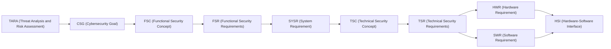

# TDA4VM ADAS ECU Cybersecurity Requirements

🔗 **[Browse the live site](https://vinodneelakantam.github.io/Sec_Concepts_Req_tracability/)**
(rendered docs with navigation and Mermaid diagrams, published via GitHub Pages from `main`).

A collection of automotive cybersecurity requirements documents for a TDA4VM (TI Jacinto 7 /
J721E) ADAS ECU. It's a learning and interview-prep resource for grounding automotive
cybersecurity concepts in real hardware/firmware facts (TI TISCI mailbox APIs, DMSC, SA2UL,
TIFS, eFuse/OTP, etc.) rather than generic textbook descriptions, following established
standards vocabulary (ISO 21434, ISO 14229 UDS, AUTOSAR SecOC).

## What's in here

Each `TDA4VM_*_Requirements.md` document covers one security concept end-to-end through six
sections, tracing requirements from a TARA risk-treatment decision down to the hardware/software
interface:

1. **Functional Security Concept** - CSG (cybersecurity goal), FSC (strategy), FSR (decomposed
   requirements).
2. **System Requirements and System Static Architecture** - entities, trust boundaries, `SYSR-*`.
3. **Technical Security Concept** - TSC (how, functionally), TSR (how, at a concrete TDA4VM
   mechanism level).
4. **Hardware Requirements and Hardware Static Architecture** - `HWR-*`.
5. **Software Requirements and Software Static & Dynamic Architecture** - `SWR-*` and sequence
   diagrams for the security-relevant flows.
6. **Hardware-Software Interface (HSI)** - the register/API/message-level contract, `HSI-*`.

Each ID derives from the one before it, in order:

## Offline single-file export

Every push to `main` builds a single self-contained HTML file - all docs and diagrams
inlined as base64, no internet/CDN/repo checkout needed to view it. Go to the
[`latest-build` release](https://github.com/vinodneelakantam/Sec_Concepts_Req_tracability/releases/tag/latest-build)
and download `TDA4VM_Full_Requirements_Static.html` under **Assets** - it opens directly in
any browser, fully offline. (Building it yourself, and per-commit `build-<short-sha>` tags,
are documented in [tools/build-static-html/README.md](tools/build-static-html/README.md).)

## Repo tooling

The [.github/skills](.github/skills) folder contains Copilot skill files that encode the
domain knowledge and workflows used to write and maintain these documents (grounded TI
TDA4VM/TISCI facts, the requirement taxonomy, doc scaffolding, review checklists, a
traceability matrix, ISO 21434 TARA rationale, and interview Q&A generation).

## Intended use

Not a product specification for a real vehicle program - a self-contained knowledge base for
studying automotive cybersecurity engineering (requirements writing, TARA-based rationale, and
TI TDA4VM-specific security mechanisms) in a realistic, traceable format.

