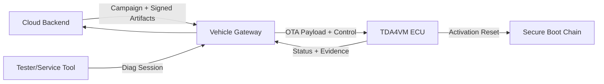
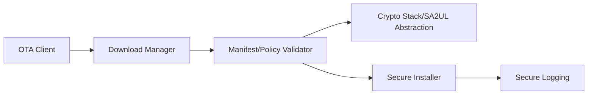
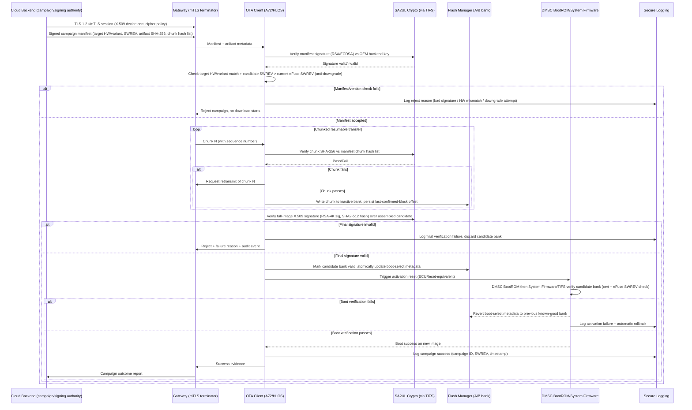

# OTA/FOTA/SOTA Security Architecture Requirements - TDA4VM ADAS ECU

## 1. Functional Security Concept

### 1.1 Cybersecurity Requirements (CSR)
- CSR-OTA-1: Update artifacts shall be signed and campaign-authorized.
- CSR-OTA-2: Transport shall provide endpoint authentication, confidentiality, and integrity.
- CSR-OTA-3: ECU shall verify artifact authenticity and compatibility before installation.
- CSR-OTA-4: Resume/retry logic shall preserve end-to-end integrity guarantees.
- CSR-OTA-5: Update outcomes shall be auditable and reportable.

### 1.2 Functional Security Concept (FSC)
- FSC-OTA-1: Realize update trust through two independent, layered checks - channel-level trust (who you're talking to) and content-level trust (what was delivered) - so compromise of either alone is insufficient to install unauthorized code.
- FSC-OTA-2: Treat an update campaign as a policy-gated workflow (authorization, compatibility, resumability) rather than a bare file transfer, so partial/interrupted delivery cannot degrade end-to-end guarantees.
- FSC-OTA-3: Make every campaign decision and outcome observable and auditable after the fact.

### 1.3 Functional Security Requirements (FSR)
- FSR-OTA-1: The update client shall reject any artifact whose signature or campaign authorization cannot be validated, before any part of it is applied.
- FSR-OTA-2: The transport session shall be mutually authenticated and shall detect any tampering or eavesdropping attempt on transferred data.
- FSR-OTA-3: Installation shall be preceded by an explicit compatibility/version check against the target ECU's identity and current state.
- FSR-OTA-4: A resumed or retried transfer shall re-validate integrity of already-received and newly-received chunks rather than trusting prior partial progress unconditionally.
- FSR-OTA-5: Every campaign decision (accepted, rejected, deferred) and installation outcome shall be recorded in a form retrievable for later audit.

## 2. System Requirements and System Static Architecture

### 2.1 System entities
- Cloud update backend (campaign, policy, signing authority)
- Service technician/tester endpoint
- In-vehicle gateway
- Target ECU (TDA4VM)
- Peer ECUs participating in dependency checks

### 2.2 Trust boundaries and interfaces
- Boundary A: Cloud/backend trust domain to vehicle domain (TLS/mTLS OTA channel)
- Boundary B: Gateway domain to target ECU domain (routed update/control interface)
- Boundary C: Tester domain to ECU diagnostics domain (service session + access control)
- Boundary D: Target ECU secure update manager to boot trust chain (activation boundary)

### 2.3 System Requirements (SYSR)
- SYSR-OTA-1: The Gateway domain shall be the sole path between the Cloud Backend and the Target ECU (Boundary A/B), so no direct cloud-to-ECU channel bypasses gateway-mediated policy.
- SYSR-OTA-2: The Target ECU's Secure Update Manager shall be the only system entity permitted to invoke the Activation boundary (Boundary D) into the secure boot chain.
- SYSR-OTA-3: Peer ECU dependency data used in CheckProgrammingDependencies-equivalent checks shall be sourced consistently by all ECUs in a campaign, avoiding split-brain compatibility decisions.

## 3. Technical Security Concept

### 3.1 Technical Security Concept (TSC)
- TSC-OTA-1: Enforce both secure channel validation and package signature validation.
- TSC-OTA-2: Apply manifest-based policy checks (target identity, dependencies, version bounds).
- TSC-OTA-3: Integrate OTA client with rollback-safe secure reprogramming process.
- TSC-OTA-4: Use resumable chunk transfer with chunk integrity checks.

### 3.2 Technical Security Requirements (TSR)
- TSR-OTA-1: Use TLS with device credentials and approved cipher/policy profile.
- TSR-OTA-2: Verify package signature before handoff to installer.
- TSR-OTA-3: Activation path shall converge to secure boot + anti-rollback checks.
- TSR-OTA-4: Record campaign/install state changes in secure logging.

## 4. Hardware Requirements and Hardware Static Architecture

### 4.1 Hardware elements
- TDA4VM (J721E) compute domain: Cortex-A72 (HLOS), Cortex-R5F (SBL/real-time), DMSC (Cortex-M3 running System Firmware/TIFS)
- SA2UL crypto accelerator for signature/hash operations
- DMSC immutable BootROM + eFuse-held SMPK/BMPK key hash and SWREV anti-rollback counter
- Non-volatile flash (active image, candidate image, metadata)
- JTAG/Sec-AP debug interface (locked per device security type, see Secure JTAG doc)
- Communication peripherals (CAN/Ethernet)

### 4.2 Hardware Requirements (HWR)
- HWR-OTA-1: eFuse-anchored device identity/root keys back backend trust establishment
- HWR-OTA-2: SA2UL throughput sufficient for signature/hash verification at OTA scale
- HWR-OTA-3: Verification and activation depend on the DMSC BootROM -> System Firmware/TIFS -> R5F SBL secure boot chain (see Secure Boot doc) (TSR-OTA-2, TSR-OTA-3)

## 5. Software Requirements and Software Static & Dynamic Architecture

### 5.1 Software blocks
- OTA client and campaign handler
- Download/chunk manager
- Manifest and policy validator
- Crypto abstraction (SA2UL-backed)
- Secure reprogramming installer
- Secure logging client

### 5.2 Software Requirements (SWR)
- SWR-OTA-1: Manifest applicability checks
- SWR-OTA-2: Resumable integrity-checked chunk transfer
- SWR-OTA-3: Block installer handoff on failed checks
- SWR-OTA-4: Auditable campaign outcome telemetry

### 5.3 OTA secure update sequence

### 5.4 Behavioral requirement focus
- Mutual-TLS transport and manifest/artifact signature checks are both mandatory before any bytes are written to flash (CSR-OTA-1, CSR-OTA-2, TSC-OTA-1)
- Candidate images are written only to the inactive A/B bank; the active bank is never touched until the candidate is fully verified (TSC-OTA-3, TSR-OTA-2)
- Anti-downgrade is checked twice: once against the manifest SWREV before download starts, and again by System Firmware against the eFuse SWREV counter during activation (CSR-OTA-3, TSR-OTA-3)
- Activation failure triggers an automatic bank revert, not an undefined or partially-flashed state (CSR-OTA-4)
- Every decision point (reject, retransmit, commit, activation result) is logged with campaign correlation for fleet-level audit (CSR-OTA-5, TSR-OTA-4)

## 6. Hardware-Software Interface (HSI)

### 6.1 HSI elements
- SA2UL signature/hash register interface (manifest and chunk verification)
- Flash controller A/B bank register interface
- DMSC BootROM/System Firmware activation-trigger interface (ECUReset-equivalent)

### 6.2 HSI Requirements (HSI)
- HSI-OTA-1: The flash controller interface shall expose only the inactive bank for write operations during an active campaign, with the active bank's write-enable held off at the hardware level.
- HSI-OTA-2: The SA2UL chunk-hash interface shall be invoked per chunk before the flash controller commits that chunk, not batched after the full transfer.
- HSI-OTA-3: The activation-trigger interface (reset-equivalent) shall unconditionally re-enter the DMSC BootROM chain, with no software-selectable path that skips BootROM verification for OTA-originated resets.
