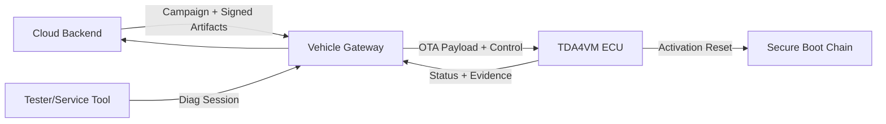
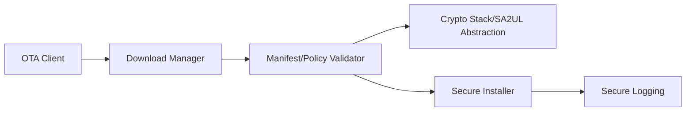
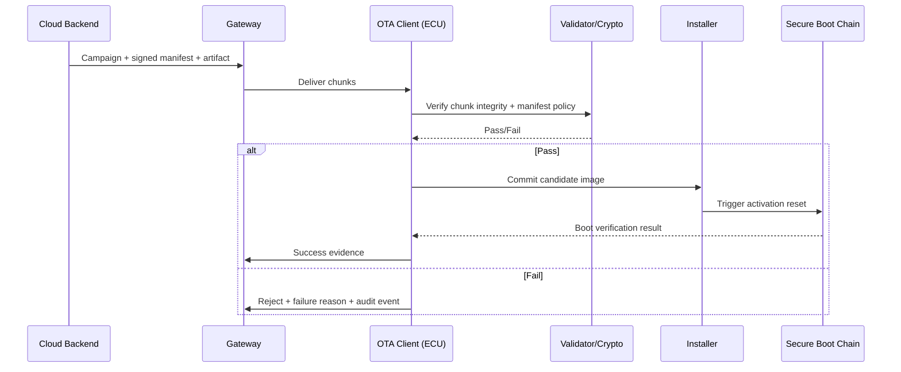

# OTA/FOTA/SOTA Security Architecture Requirements - TDA4VM ADAS ECU

## 1. System Static Architecture

### 1.1 System entities
- Cloud update backend (campaign, policy, signing authority)
- Service technician/tester endpoint
- In-vehicle gateway
- Target ECU (TDA4VM)
- Peer ECUs participating in dependency checks

### 1.2 Trust boundaries and interfaces
- Boundary A: Cloud/backend trust domain to vehicle domain (TLS/mTLS OTA channel)
- Boundary B: Gateway domain to target ECU domain (routed update/control interface)
- Boundary C: Tester domain to ECU diagnostics domain (service session + access control)
- Boundary D: Target ECU secure update manager to boot trust chain (activation boundary)

### 1.3 System-level requirement allocation

**Cybersecurity Requirements (CSR)**
- CSR-OTA-1: Update artifacts shall be signed and campaign-authorized.
- CSR-OTA-2: Transport shall provide endpoint authentication, confidentiality, and integrity.
- CSR-OTA-3: ECU shall verify artifact authenticity and compatibility before installation.
- CSR-OTA-4: Resume/retry logic shall preserve end-to-end integrity guarantees.
- CSR-OTA-5: Update outcomes shall be auditable and reportable.

**Functional Cybersecurity Concept (FCR)**
- FCR-OTA-1: Enforce both secure channel validation and package signature validation.
- FCR-OTA-2: Apply manifest-based policy checks (target identity, dependencies, version bounds).
- FCR-OTA-3: Integrate OTA client with rollback-safe secure reprogramming process.
- FCR-OTA-4: Use resumable chunk transfer with chunk integrity checks.

**Technical Cybersecurity Concept (TCR)**
- TCR-OTA-1: Use TLS with device credentials and approved cipher/policy profile.
- TCR-OTA-2: Verify package signature before handoff to installer.
- TCR-OTA-3: Activation path shall converge to secure boot + anti-rollback checks.
- TCR-OTA-4: Record campaign/install state changes in secure logging.

## 2. Hardware Static Architecture

### 2.1 Hardware elements
- TDA4VM (J721E) compute domain: Cortex-A72 (HLOS), Cortex-R5F (SBL/real-time), DMSC (Cortex-M3 running System Firmware/TIFS)
- SA2UL crypto accelerator for signature/hash operations
- DMSC immutable BootROM + eFuse-held SMPK/BMPK key hash and SWREV anti-rollback counter
- Non-volatile flash (active image, candidate image, metadata)
- JTAG/Sec-AP debug interface (locked per device security type, see Secure JTAG doc)
- Communication peripherals (CAN/Ethernet)

### 2.2 Hardware responsibility mapping
- HWR-OTA-1: eFuse-anchored device identity/root keys back backend trust establishment
- HWR-OTA-2: SA2UL throughput sufficient for signature/hash verification at OTA scale
- TCR-OTA-2/TCR-OTA-3: Verification and activation depend on the DMSC BootROM -> TIFS -> SBL secure boot chain (see Secure Boot doc)

## 3. Software Static Architecture

### 3.1 Software blocks
- OTA client and campaign handler
- Download/chunk manager
- Manifest and policy validator
- Crypto abstraction (SA2UL-backed)
- Secure reprogramming installer
- Secure logging client

### 3.2 Software requirement allocation
- SWR-OTA-1: Manifest applicability checks
- SWR-OTA-2: Resumable integrity-checked chunk transfer
- SWR-OTA-3: Block installer handoff on failed checks
- SWR-OTA-4: Auditable campaign outcome telemetry

## 4. Dynamic / Behavioral Views

### 4.1 OTA secure update sequence

### 4.2 Behavioral requirement focus
- Secure transport + artifact signing are both mandatory (CSR-OTA-1, CSR-OTA-2, FCR-OTA-1)
- Activation always re-enters secure boot and rollback policy (TCR-OTA-3)
- Every transition is logged for campaign traceability (CSR-OTA-5, TCR-OTA-4)
