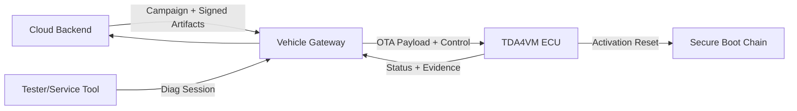
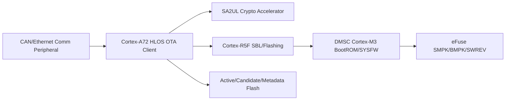
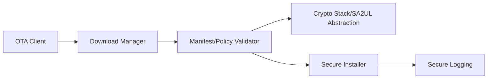
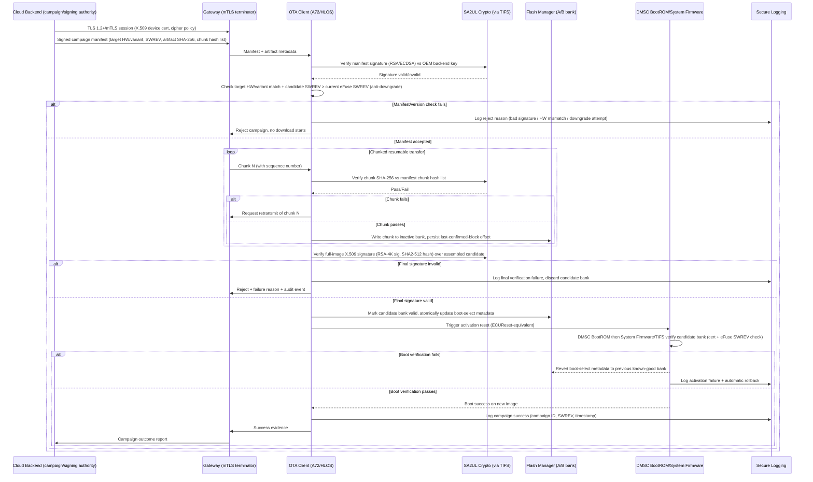

# OTA/FOTA/SOTA Security Architecture Requirements - TDA4VM ADAS ECU

## 1. Functional Security Concept

### 1.1 Cybersecurity Requirements (CSR)
- CSR-OTA-1: Update artifacts shall be signed and campaign-authorized.
- CSR-OTA-2: Transport shall provide endpoint authentication, confidentiality, and integrity.
- CSR-OTA-3: ECU shall verify artifact authenticity and compatibility before installation.
- CSR-OTA-4: Resume/retry logic shall preserve end-to-end integrity guarantees.
- CSR-OTA-5: Update outcomes shall be auditable and reportable.

### 1.2 Functional Security Concept (FSC)
- FSC-OTA-1: Realize update trust through two independent, layered checks - channel-level trust (who you're talking to) and content-level trust (what was delivered) - so compromise of either alone is insufficient to install unauthorized code.
- FSC-OTA-2: Treat an update campaign as a policy-gated workflow (authorization, compatibility, resumability) rather than a bare file transfer, so partial/interrupted delivery cannot degrade end-to-end guarantees.
- FSC-OTA-3: Make every campaign decision and outcome observable and auditable after the fact.

### 1.3 Functional Security Requirements (FSR)
- FSR-OTA-1: The update client shall reject any artifact whose signature or campaign authorization cannot be validated, before any part of it is applied.
- FSR-OTA-2: The transport session shall be mutually authenticated and shall detect any tampering or eavesdropping attempt on transferred data.
- FSR-OTA-3: Installation shall be preceded by an explicit compatibility/version check against the target ECU's identity and current state.
- FSR-OTA-4: A resumed or retried transfer shall re-validate integrity of already-received and newly-received chunks rather than trusting prior partial progress unconditionally.
- FSR-OTA-5: Every campaign decision (accepted, rejected, deferred) and installation outcome shall be recorded in a form retrievable for later audit.

## 2. System Requirements and System Static Architecture

### 2.1 System entities
- Cloud update backend (campaign, policy, signing authority)
- Service technician/tester endpoint
- In-vehicle gateway
- Target ECU (TDA4VM)
- Peer ECUs participating in dependency checks

### 2.2 Trust boundaries and interfaces
- Boundary A: Cloud/backend trust domain to vehicle domain (TLS/mTLS OTA channel)
- Boundary B: Gateway domain to target ECU domain (routed update/control interface)
- Boundary C: Tester domain to ECU diagnostics domain (service session + access control)
- Boundary D: Target ECU secure update manager to boot trust chain (activation boundary)

### 2.3 System Requirements (SYSR)
- SYSR-OTA-1: The Gateway domain shall be the sole path between the Cloud Backend and the Target ECU (Boundary A/B), so no direct cloud-to-ECU channel bypasses gateway-mediated policy.
- SYSR-OTA-2: The Target ECU's Secure Update Manager shall be the only system entity permitted to invoke the Activation boundary (Boundary D) into the secure boot chain.
- SYSR-OTA-3: Peer ECU dependency data used in CheckProgrammingDependencies-equivalent checks shall be sourced consistently by all ECUs in a campaign, avoiding split-brain compatibility decisions.

## 3. Technical Security Concept

### 3.1 Technical Security Concept (TSC)
- TSC-OTA-1: Enforce both secure channel validation and package signature validation.
- TSC-OTA-2: Apply manifest-based policy checks (target identity, dependencies, version bounds).
- TSC-OTA-3: Integrate OTA client with rollback-safe secure reprogramming process.
- TSC-OTA-4: Use resumable chunk transfer with chunk integrity checks.

### 3.2 Technical Security Requirements (TSR)
- TSR-OTA-1: Use TLS with device credentials and approved cipher/policy profile.
- TSR-OTA-2: Verify package signature before handoff to installer.
- TSR-OTA-3: Activation path shall converge to secure boot + anti-rollback checks.
- TSR-OTA-4: Record campaign/install state changes in secure logging.

## 4. Hardware Requirements and Hardware Static Architecture

### 4.1 Hardware elements
- TDA4VM (J721E) compute domain: Cortex-A72 (HLOS), Cortex-R5F (SBL/real-time), DMSC (Cortex-M3 running System Firmware/TIFS)
- SA2UL crypto accelerator for signature/hash operations
- DMSC immutable BootROM + eFuse-held SMPK/BMPK key hash and SWREV anti-rollback counter
- Non-volatile flash (active image, candidate image, metadata)
- JTAG/Sec-AP debug interface (locked per device security type, see Secure JTAG doc)
- Communication peripherals (CAN/Ethernet)

### 4.2 Hardware Requirements (HWR)
- HWR-OTA-1: eFuse-anchored device identity/root keys back backend trust establishment
- HWR-OTA-2: SA2UL throughput sufficient for signature/hash verification at OTA scale
- HWR-OTA-3: Verification and activation depend on the DMSC BootROM -> System Firmware/TIFS -> R5F SBL secure boot chain (see Secure Boot doc) (TSR-OTA-2, TSR-OTA-3)

## 5. Software Requirements and Software Static & Dynamic Architecture

### 5.1 Software blocks
- OTA client and campaign handler
- Download/chunk manager
- Manifest and policy validator
- Crypto abstraction (SA2UL-backed)
- Secure reprogramming installer
- Secure logging client

### 5.2 Software Requirements (SWR)
- SWR-OTA-1: Manifest applicability checks
- SWR-OTA-2: Resumable integrity-checked chunk transfer
- SWR-OTA-3: Block installer handoff on failed checks
- SWR-OTA-4: Auditable campaign outcome telemetry

### 5.3 OTA secure update sequence

  

Mermaid source (for editing/regeneration)

### 5.4 Behavioral requirement focus
- Mutual-TLS transport and manifest/artifact signature checks are both mandatory before any bytes are written to flash (CSR-OTA-1, CSR-OTA-2, TSC-OTA-1)
- Candidate images are written only to the inactive A/B bank; the active bank is never touched until the candidate is fully verified (TSC-OTA-3, TSR-OTA-2)
- Anti-downgrade is checked twice: once against the manifest SWREV before download starts, and again by System Firmware against the eFuse SWREV counter during activation (CSR-OTA-3, TSR-OTA-3)
- Activation failure triggers an automatic bank revert, not an undefined or partially-flashed state (CSR-OTA-4)
- Every decision point (reject, retransmit, commit, activation result) is logged with campaign correlation for fleet-level audit (CSR-OTA-5, TSR-OTA-4)

## 6. Hardware-Software Interface (HSI)

### 6.1 HSI elements
- SA2UL signature/hash register interface (manifest and chunk verification)
- Flash controller A/B bank register interface
- DMSC BootROM/System Firmware activation-trigger interface (ECUReset-equivalent)

### 6.2 HSI Requirements (HSI)
- HSI-OTA-1: The flash controller interface shall expose only the inactive bank for write operations during an active campaign, with the active bank's write-enable held off at the hardware level.
- HSI-OTA-2: The SA2UL chunk-hash interface shall be invoked per chunk before the flash controller commits that chunk, not batched after the full transfer.
- HSI-OTA-3: The activation-trigger interface (reset-equivalent) shall unconditionally re-enter the DMSC BootROM chain, with no software-selectable path that skips BootROM verification for OTA-originated resets.

## Interview Appendix: Expert Q&A (20 Questions)

The following expert-level Q&A set is intended for interview practice and design review on this topic.

| # | Question | Difficulty | Detailed answer | Evidence |
|---|---|---|---|---|
| 1 | Why does OTA update trust require both channel-level and content-level validation rather than just a secure transport? | L1 | A secure transport such as mTLS proves you are talking to the legitimate backend and protects data from eavesdropping or tampering in transit, but it says nothing about whether the payload itself was authorized as part of a legitimate campaign or whether it has been altered before it entered the channel. Content-level signature validation of the manifest and artifact ensures that even if the channel were somehow compromised or a malicious insider had transport access, the artifact itself still cannot be installed without a valid signature. Layering both means compromising either one alone is insufficient to get unauthorized code installed. | FSC-OTA-1, CSR-OTA-1, CSR-OTA-2, TSC-OTA-1 |
| 2 | Why is the campaign manifest signed separately from the artifact itself? | L2 | The manifest carries policy-level information such as target hardware/variant, SWREV, and chunk hash lists, which must be trustworthy before any download even begins, so it needs independent verification before the ECU commits any bandwidth or storage to the transfer. If only the final artifact were checked, an attacker could potentially manipulate manifest metadata to target the wrong ECU variant or attempt a downgrade, and this would only be caught after the full transfer, wasting resources and creating unnecessary attack surface during the download itself. | CSR-OTA-1, FSR-OTA-1, TSR-OTA-2 |
| 3 | Why does the update client check candidate SWREV against the eFuse SWREV counter before download even starts, and again later during activation? | L3 | The early manifest-level check is an efficiency and early-rejection mechanism: there is no reason to spend bandwidth and flash writes downloading an image that will ultimately fail the anti-rollback policy anyway. The later check at DMSC BootROM/System Firmware activation is the authoritative, hardware-anchored enforcement point that cannot be bypassed by any software-level shortcut, since it uses the same trust chain as ordinary power-on. Having both means the early check is an efficiency optimization, while the boot-time check is the actual security guarantee. | CSR-OTA-3, TSR-OTA-3, 5.3 sequence diagram |
| 4 | Why is the update written only to the inactive A/B bank rather than the currently running bank? | L2 | Writing only to the inactive bank guarantees that the currently active, known-good image remains untouched and bootable throughout the entire download and verification process, no matter what happens during transfer. If a chunk fails, gets corrupted, or the connection drops mid-transfer, the vehicle can still boot normally on the unaffected active bank. This design converts what could be a bricking failure mode into a simple retry-the-download scenario. | TSC-OTA-3, TSR-OTA-2, HSI-OTA-1 |
| 5 | Why is each chunk verified against a manifest hash list during transfer, rather than only verifying the fully assembled image at the end? | L3 | Per-chunk verification allows corruption or tampering to be detected and retransmitted immediately, rather than discovering a problem only after the entire potentially large image has been downloaded, which would waste significant bandwidth and time. It also limits the amount of unverified data that is ever staged in the inactive bank at any point in time. The full-image signature check at the end still exists because chunk hashes alone don't prove the chunks were assembled in the authorized order or that the whole set constitutes an authorized image; both checks serve distinct purposes. | SWR-OTA-2, HSI-OTA-2, 5.3 sequence diagram |
| 6 | What is the security purpose of hardware-enforced write protection on the active bank during OTA, rather than relying on the OTA client's own logic? | L3 | If the guarantee that the active bank cannot be written during a campaign relied only on the update client's software logic, then a bug or a compromise in that software could allow the active bank to be overwritten by mistake or maliciously. Enforcing this at the hardware level, with the active bank's write-enable held off, means the guarantee holds even if the OTA client software itself is fully compromised, which is a much stronger security property than a software-only convention. | HSI-OTA-1 |
| 7 | Why does the design require the Gateway to be the sole path between the cloud backend and the target ECU? | L2 | If a direct cloud-to-ECU channel existed alongside the gateway path, it would create a second route that might not be subject to the same policy enforcement, logging, and mediation that the gateway provides. Funneling all OTA traffic through the gateway ensures a single, consistently-enforced policy chokepoint, making it much easier to reason about and audit the trust boundary between the vehicle and the outside world. | SYSR-OTA-1 |
| 8 | Why is the Secure Update Manager the only entity permitted to invoke the activation boundary into the secure boot chain? | L3 | Activation is the single most consequential action in the whole OTA flow, since it is the moment an unverified candidate becomes the running image. If any other component, such as the OTA client's networking stack or the gateway relay, could independently trigger activation, it would create additional paths that might not have properly checked all the validation gates. Restricting this capability to one specific, auditable component ensures activation can only happen through a single well-understood code path with all its associated checks. | SYSR-OTA-2 |
| 9 | Why must peer ECU dependency data be sourced consistently across all ECUs in a campaign? | L2 | If different ECUs used inconsistent or stale dependency data to make compatibility decisions, one ECU might approve activation of a version combination that another ECU considers unsafe or incompatible, creating a split-brain situation where the fleet's actual state disagrees with what each ECU believes about its peers. Ensuring consistent sourcing prevents this kind of divergence, which could otherwise lead to a vehicle running a set of ECU software versions that were never validated together. | SYSR-OTA-3 |
| 10 | Why does a failed activation trigger an automatic revert instead of leaving the ECU to retry booting the new image? | L2 | If the ECU kept attempting to boot a newly-activated image that fails boot verification, it risks becoming stuck in a non-functional or unpredictable state, especially in a safety-relevant vehicle context where the ECU needs to be operational. Automatically reverting to the last known-good bank restores a working, previously-verified image, ensuring the vehicle remains operable even when an update ultimately fails at the very last step. | CSR-OTA-4, 5.3 sequence diagram |
| 11 | Why is every campaign decision, including rejections, required to be logged and reportable? | L2 | A pattern of rejected campaigns, whether due to bad signatures, hardware mismatches, or downgrade attempts, is valuable security telemetry that could indicate a targeted attack against the update mechanism across a fleet, not just a single vehicle. If only successful updates were logged, an attacker's repeated probing attempts across many vehicles would be invisible to the backend's security monitoring, making it much harder to detect and respond to an ongoing attack campaign. | CSR-OTA-5, FSR-OTA-5, TSR-OTA-4 |
| 12 | Why does a resumed or retried transfer re-validate both already-received and newly-received chunks rather than trusting prior progress? | L3 | If a resumed transfer implicitly trusted previously-received chunks without re-validation, an attacker who could tamper with data at rest between transfer sessions, for example through a storage-level attack during a long resume window, could inject corrupted or malicious content that would never be re-checked. Re-validating on resume closes this gap and ensures that the integrity guarantee holds across the entire multi-session transfer lifecycle, not just within a single uninterrupted session. | CSR-OTA-4, FSR-OTA-4 |
| 13 | What is the difference in trust model between the mTLS session and the artifact signature, and why are both necessary? | L2 | The mTLS session establishes a trusted, encrypted channel between the vehicle and a specific backend endpoint, authenticating the identity of the communicating parties for that session. The artifact signature, by contrast, is a property of the content itself, verifiable independently of how or when it was transported, meaning it remains valid even if copied, cached, or delivered through an alternate path such as a USB update tool. Both are necessary because the channel-level check protects the transport, while the content-level check protects the payload regardless of transport, and neither can substitute for the other. | TSR-OTA-1, TSR-OTA-2, FSC-OTA-1 |
| 14 | Why does the ECU verify hardware/variant match as part of the manifest check rather than assuming the backend always sends the correct target? | L3 | Even a fully legitimate, correctly-signed backend campaign could accidentally target the wrong hardware variant due to a fleet management error, and separately, a compromised or spoofed component earlier in the chain might attempt to deliver an image intended for a different ECU variant. Performing an independent hardware/variant match check on the ECU side, rather than trusting the backend's targeting logic implicitly, adds a defense-in-depth layer against both accidental misconfiguration and deliberate targeting attacks. | FSR-OTA-3, 5.3 sequence diagram |
| 15 | Why is it important that the OTA client integrates with the same rollback-safe secure reprogramming process rather than implementing its own separate installer? | L3 | If OTA had its own bespoke installation and activation logic separate from the standard secure reprogramming process, the system would effectively have two different code paths capable of replacing the running firmware, each needing to be independently audited and each representing a potential inconsistency in security guarantees. Reusing the same rollback-safe secure reprogramming installer ensures there is exactly one trusted mechanism for changing what code runs on the ECU, regardless of whether the update originated from OTA, a tester, or a service tool. | TSC-OTA-3, shared installer with Secure Reprogramming doc |
| 16 | What is the risk of allowing a software-selectable path that skips BootROM verification for OTA-originated resets? | L2 | If such a path existed, even for legitimate performance or convenience reasons, it would become the most attractive target for an attacker, since achieving an OTA-triggered reset would be sufficient to bypass the device's entire secure boot trust chain. Removing any such selectable bypass ensures that regardless of what triggered the reset, whether normal power-on, OTA activation, or a tester-initiated reset, the exact same immutable verification sequence is enforced every time. | HSI-OTA-3, TSR-OTA-3 |
| 17 | Why does the design require SA2UL throughput sufficient for signature/hash verification at OTA scale? | L2 | OTA updates can involve significantly larger images and more frequent chunk-level verification operations than a typical diagnostic reprogramming session, so the cryptographic hardware must be able to keep up without becoming a bottleneck that either slows down updates unacceptably or creates pressure to skip or batch verification steps. Explicitly sizing the hardware requirement to OTA-scale ensures that performance constraints never become a reason to weaken the per-chunk and full-image verification model. | HWR-OTA-2 |
| 18 | How would you explain to a skeptical stakeholder why OTA needs so many layered checks instead of just downloading and installing the update? | L3 | Each check in this design closes a specific, distinct risk: mTLS prevents eavesdropping and channel spoofing, manifest signature prevents unauthorized campaigns, chunk hashing catches corruption or tampering early, full-image signature catches assembly-level tampering, anti-rollback prevents reintroducing known vulnerabilities, dependency checks prevent unsafe cross-ECU combinations, and activation reuse of the boot chain prevents any of the above from being bypassed at the last step. Removing any single layer would leave a specific, exploitable gap, since no single check covers all these distinct threat categories simultaneously. | Whole-doc synthesis, CSR-OTA-1 through CSR-OTA-5 |
| 19 | What would a realistic attack against a weaker OTA design look like, and which control in this design specifically defeats it? | L3 | An attacker might attempt to intercept and replace an update package in transit, which is defeated by mTLS plus artifact signature verification; or attempt to replay an older, vulnerable but validly-signed image, which is defeated by the dual anti-rollback checks; or attempt to corrupt a chunk mid-transfer hoping it goes undetected until activation, which is defeated by per-chunk hash verification; or attempt to trigger activation through a non-standard reset path hoping to skip boot verification, which is defeated by the hardware-enforced unconditional BootROM re-entry. Each of these realistic attack patterns maps directly to a specific control in the design. | CSR-OTA-1 through CSR-OTA-4, HSI-OTA-1 through HSI-OTA-3 |
| 20 | If you had to summarize the OTA/FOTA/SOTA security principle in one sentence, what would it be? | L1 | An OTA update must be authenticated at both the channel and content level, staged so no unverified data ever threatens the active image, and activated only through the same unconditional, hardware-anchored boot trust chain used at ordinary power-on. | FSC-OTA-1, CSR-OTA-1 through CSR-OTA-4, TSC-OTA-1, TSC-OTA-3 |

