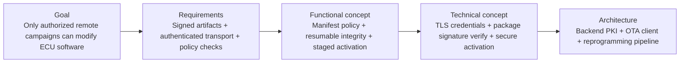
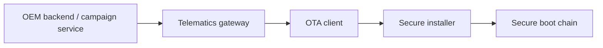
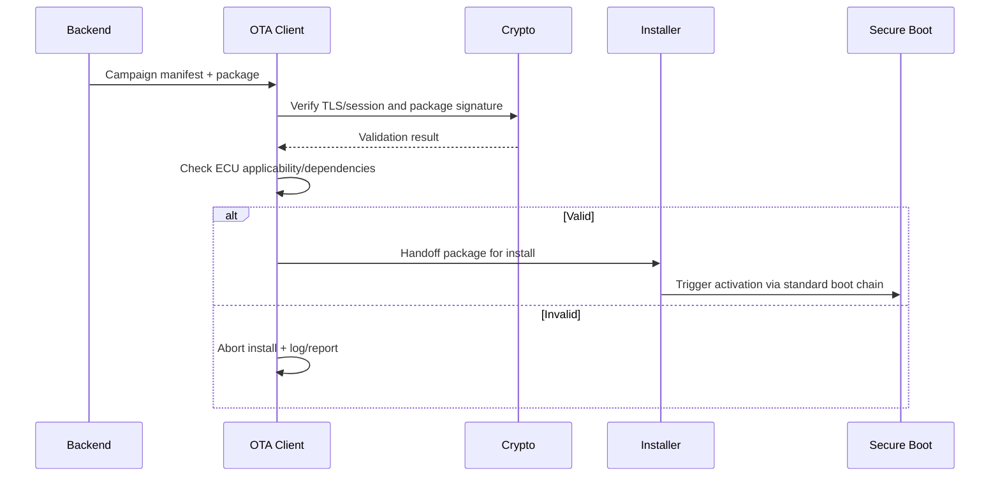
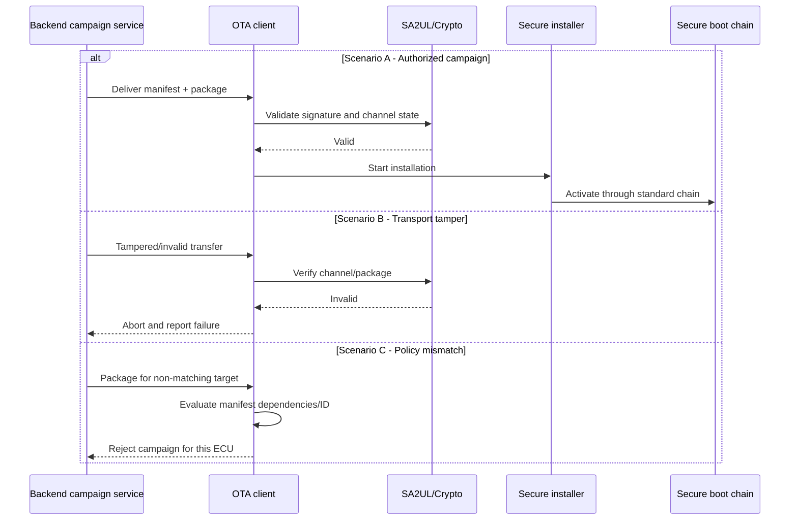

# OTA / FOTA / SOTA Security — TDA4VM ADAS ECU

## Scope and terminology note

This document defines requirement traceability for remote software delivery security (OTA/FOTA/SOTA), including backend campaign control, secure transport, package validation, and activation.

## 0. Conceptual primer

Secure transport alone is insufficient: TLS protects transmission, but artifact authenticity must still be verified independently. OTA security is strongest when transport trust and artifact trust are decoupled and both mandatory.

## 1. Cybersecurity engineering flow

## 2. Cybersecurity Goal

Protect remote update distribution, transfer, storage, and activation against tampering, replay, and unauthorized campaign execution.

## 3. Cybersecurity Requirements (item level)

CSR-OTA-1: Update artifacts shall be signed and campaign-authorized.
CSR-OTA-2: Transport shall provide endpoint authentication, confidentiality, and integrity.
CSR-OTA-3: ECU shall verify artifact authenticity and compatibility before installation.
CSR-OTA-4: Resume/retry logic shall preserve end-to-end integrity guarantees.
CSR-OTA-5: Update outcomes shall be auditable and reportable.

## 4. Cybersecurity Concept

### 4.1 Functional Cybersecurity Concept & Requirements

FCR-OTA-1: Enforce both secure channel validation and package signature validation.
FCR-OTA-2: Apply manifest-based policy checks (target identity, dependencies, version bounds).
FCR-OTA-3: Integrate OTA client with rollback-safe secure reprogramming process.
FCR-OTA-4: Use resumable chunk transfer with chunk integrity checks.

### 4.2 Technical Cybersecurity Concept & Requirements (TDA4VM-oriented)

TCR-OTA-1: Use TLS with device credentials and approved cipher/policy profile.
TCR-OTA-2: Verify package signature before handoff to installer.
TCR-OTA-3: Activation path shall converge to secure boot + anti-rollback checks.
TCR-OTA-4: Record campaign/install state changes in secure logging.

## 5. System Cybersecurity Architecture

## 6. SW Requirements & HW Requirements (allocated)

### 6.1 Software requirements

SWR-OTA-1: OTA client shall verify manifest applicability (ECU ID, dependency, version policy).
SWR-OTA-2: Download manager shall support resumable, integrity-checked chunks.
SWR-OTA-3: Installer handoff shall be blocked if transport or artifact checks fail.
SWR-OTA-4: Campaign outcome telemetry shall include verifiable status and failure reasons.

### 6.2 Hardware requirements

HWR-OTA-1: Hardware-backed device identity and credential protection shall anchor backend trust.
HWR-OTA-2: Crypto resources shall meet OTA verification throughput without disabling controls.

## 7. Software Architecture

## 8. Hardware Architecture and scenarios

### 8.1 Hardware dynamic sequence diagram

- Scenario A: Authorized campaign and valid package; installation proceeds.
- Scenario B: Transport attack/tamper; channel validation fails and update aborts.
- Scenario C: Wrong target/dependency mismatch; manifest policy blocks install.

## 9. Verification focus

- MITM/tamper test: Channel compromise attempt must be rejected.
- Artifact test: Unsigned/wrongly signed package must fail.
- Applicability test: Manifest mismatch must prevent installation.
