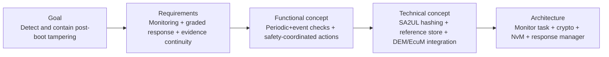
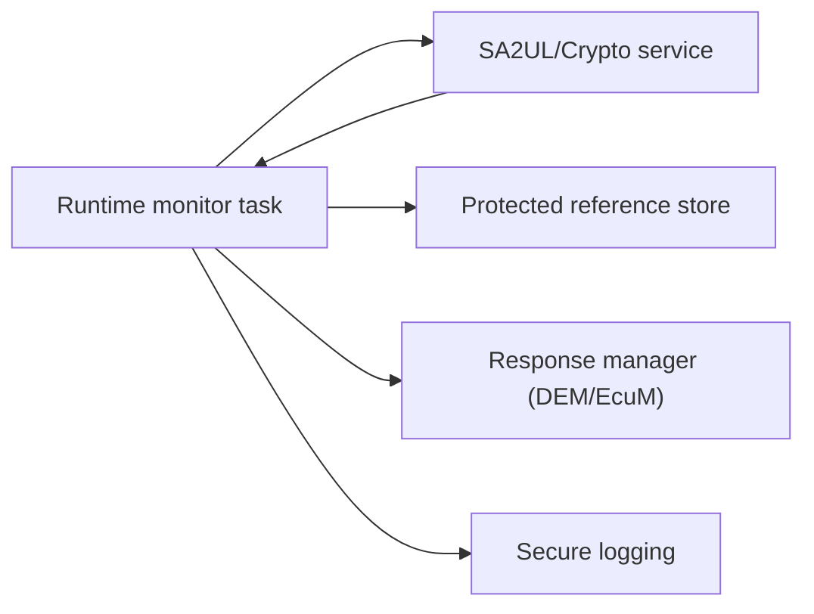
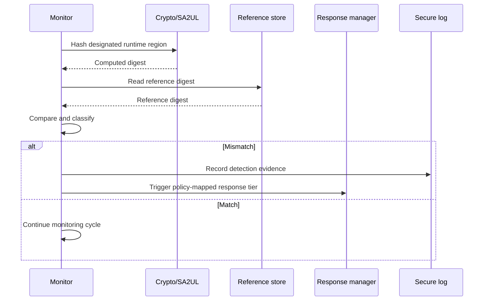
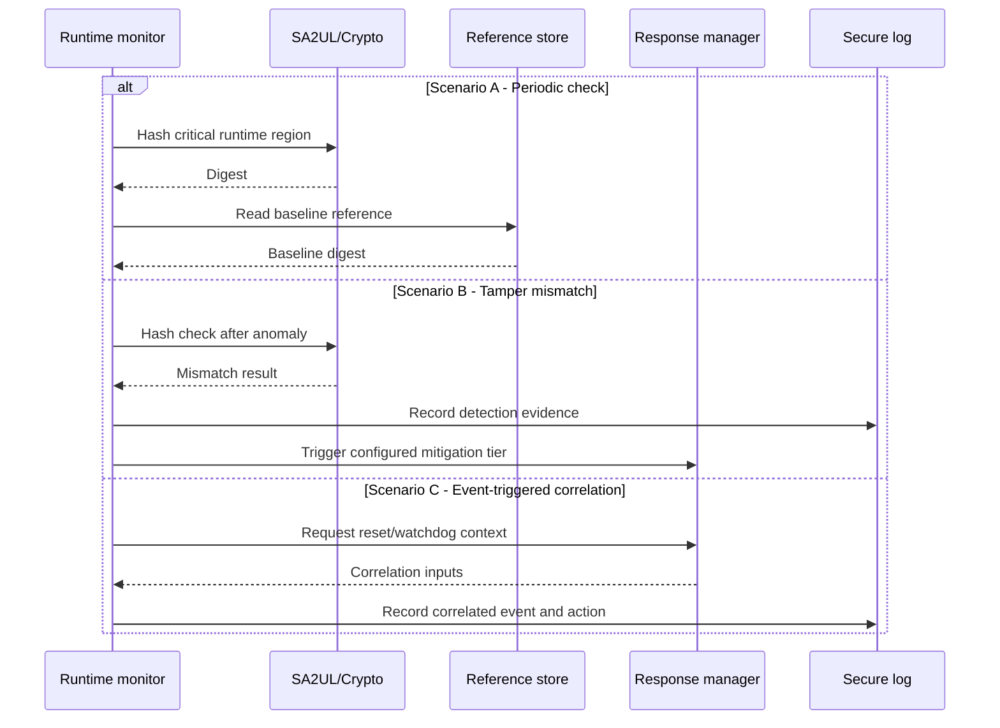

# RTMD (Runtime Tamper Monitoring and Detection) — TDA4VM ADAS ECU

## Scope and terminology note

This document defines requirement traceability for runtime tamper monitoring and response orchestration. RTMD is used here as an operational extension of runtime integrity checking: detect, classify, respond, and preserve evidence.

## 0. Conceptual primer

Boot-time trust checks cannot detect tampering that happens after the system is already running. RTMD closes this gap by continuously or event-triggeredly checking critical runtime assets and coordinating graded response policies.

## 1. Cybersecurity engineering flow

## 2. Cybersecurity Goal

Detect and respond to runtime tampering quickly enough to keep ADAS behavior within defined safe operational bounds while preserving incident evidence.

## 3. Cybersecurity Requirements (item level)

CSR-RTMD-1: Selected code/data/control indicators shall be monitored during runtime.
CSR-RTMD-2: Detection events shall trigger graded response actions by severity/confidence.
CSR-RTMD-3: Evidence for detections and actions shall be preserved for post-incident analysis.
CSR-RTMD-4: Monitoring shall combine periodic checks and event-triggered checks.
CSR-RTMD-5: Response actions shall be coordinated with safety management logic.

## 4. Cybersecurity Concept

### 4.1 Functional Cybersecurity Concept & Requirements

FCR-RTMD-1: Combine periodic integrity checks with trigger-based checks (reset anomalies, debug-state changes, repeated auth anomalies).
FCR-RTMD-2: Apply deterministic policy mapping from detection class to response tier.
FCR-RTMD-3: Coordinate security reactions with safety state manager to avoid unsafe abrupt transitions.
FCR-RTMD-4: Keep forensic continuity from detection through mitigation.

### 4.2 Technical Cybersecurity Concept & Requirements (TDA4VM-oriented)

TCR-RTMD-1: Use SA2UL-assisted hashing for runtime integrity computation.
TCR-RTMD-2: Compare against protected reference values from secure storage/NvM design.
TCR-RTMD-3: Integrate outcomes with DEM/EcuM response logic and secure logging path.
TCR-RTMD-4: Correlate watchdog/reset/status context for diagnosis and controlled recovery.

## 5. System Cybersecurity Architecture

## 6. SW Requirements & HW Requirements (allocated)

### 6.1 Software requirements

SWR-RTMD-1: Monitor shall implement response tiers (warn, degrade, reset) with configurable thresholds.
SWR-RTMD-2: Monitor scheduling shall support periodic and event-triggered execution.
SWR-RTMD-3: Detection records shall include region identifier, timestamp/counter, and action taken.
SWR-RTMD-4: Response execution shall be safety-coordinated and deterministic.

### 6.2 Hardware requirements

HWR-RTMD-1: Hardware crypto support shall sustain periodic runtime hash workloads.
HWR-RTMD-2: Reset/watchdog/status telemetry shall be available for correlation.
HWR-RTMD-3: Storage path for references/evidence shall be power-loss resilient.

## 7. Software Architecture

## 8. Hardware Architecture and scenarios

### 8.1 Hardware dynamic sequence diagram

- Scenario A: Periodic checks during normal operation, no violation.
- Scenario B: Runtime tamper mismatch detected; system enters configured mitigation tier.
- Scenario C: Event-triggered check after anomaly/reset; correlation context influences response.

## 9. Verification focus

- Detection latency test: Controlled tamper is detected inside configured time window.
- Response policy test: Severity class maps to expected mitigation tier.
- Forensic test: Evidence chain remains intact through response and reboot/recovery.
