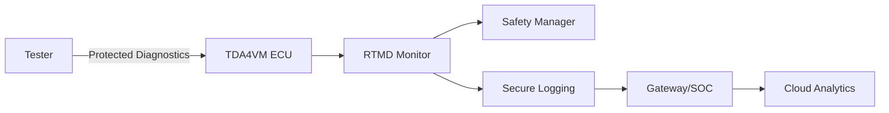
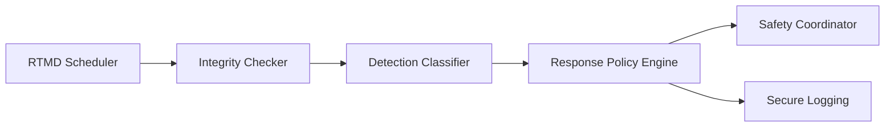
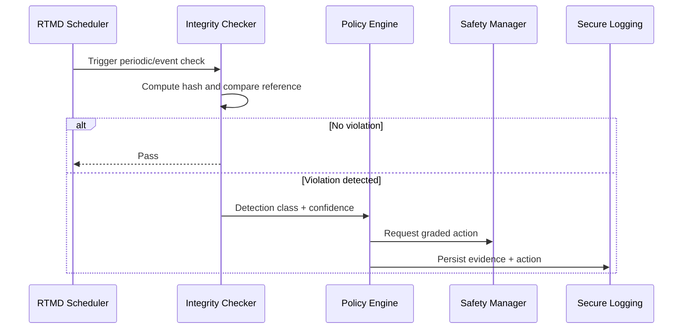

# Runtime Tamper Monitoring and Detection (RTMD) Security Architecture Requirements - TDA4VM ADAS ECU

## 1. System Static Architecture

### 1.1 System entities
- Runtime-monitored ECU (TDA4VM)
- Safety manager/supervisor
- Gateway or SOC for event collection
- Cloud/backend for fleet incident analytics
- Service/tester endpoint for diagnostics

### 1.2 Trust boundaries and interfaces
- Boundary A: ECU security monitor to safety manager (graded-response contract)
- Boundary B: ECU to gateway/backend telemetry path (forensic evidence export)
- Boundary C: Tester diagnostics interface to protected monitoring status
- Boundary D: Monitor policy/configuration boundary (only authorized updates)

### 1.3 System-level requirement allocation
- CSR-RTMD-1 to CSR-RTMD-5
- FCR-RTMD-1 to FCR-RTMD-4
- TCR-RTMD-1 to TCR-RTMD-4

## 2. Hardware Static Architecture

### 2.1 Hardware elements
- TDA4VM (J721E) execution domains: Cortex-A72, Cortex-R5F, DMSC (System Firmware/TIFS)
- SA2UL hash/crypto accelerator used for runtime re-hashing
- DMSC BootROM and secure boot chain as the trust anchor the monitor extends at runtime
- Flash/NvM for reference values and evidence persistence
- Reset/watchdog/status peripherals
- JTAG/Sec-AP debug interface state indicators

### 2.2 Hardware responsibility mapping
- HWR-RTMD-1: Hardware crypto supports periodic integrity checks
- HWR-RTMD-2: Reset/watchdog telemetry available for correlation
- HWR-RTMD-3: Evidence storage survives power interruption

## 3. Software Static Architecture

### 3.1 Software blocks
- RTMD scheduler (periodic + event-triggered)
- Integrity checker (hash/reference comparator)
- Detection classifier and policy engine
- Safety response coordinator
- Secure logging adapter

### 3.2 Software requirement allocation
- SWR-RTMD-1: Tiered responses (warn/degrade/reset)
- SWR-RTMD-2: Periodic and triggered execution modes
- SWR-RTMD-3: Evidence structure with region/time/action metadata
- SWR-RTMD-4: Deterministic safety-coordinated response

## 4. Dynamic / Behavioral Views

### 4.1 Runtime tamper detection sequence

### 4.2 Behavioral requirement focus
- Monitoring combines periodic and trigger conditions (CSR-RTMD-4, FCR-RTMD-1)
- Response is policy-based and safety-coordinated (CSR-RTMD-2, CSR-RTMD-5)
- Detection evidence is preserved for forensics (CSR-RTMD-3, TCR-RTMD-3)
