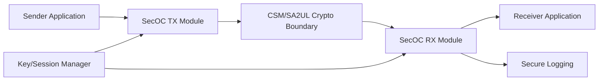
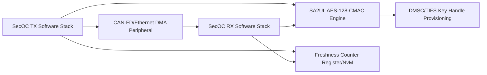
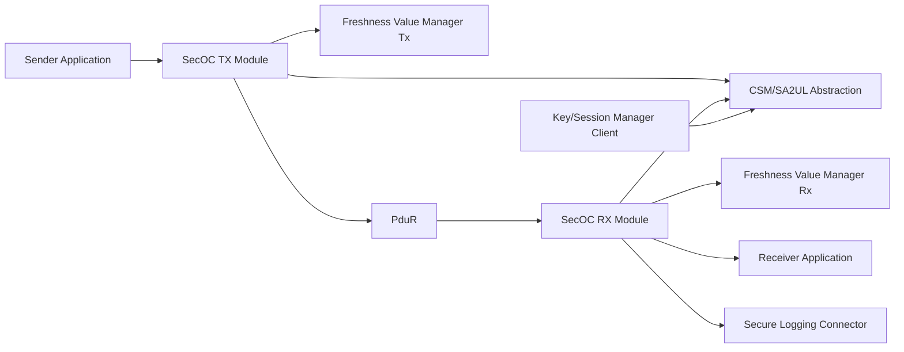
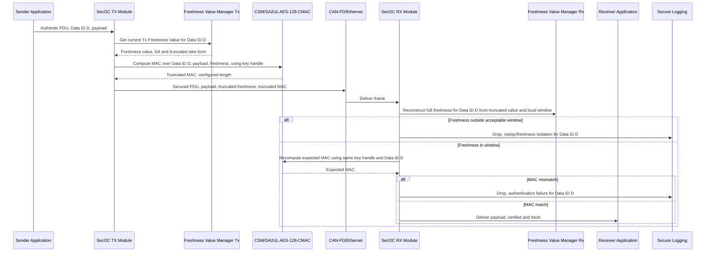

# Secure Onboard Communication (AUTOSAR SecOC) Requirements - TDA4VM ADAS ECU

This doc covers the AUTOSAR SecOC pattern specifically: per-PDU authenticity and freshness
protection for in-vehicle bus traffic (truncated freshness value + MAC appended to an Authentic
PDU to form a Secured PDU). Confidentiality-protected channels, key/policy management shared across
the communication stack, and off-board (cloud/backend) sessions are covered by
[TDA4VM_Secure_Communication_Requirements.md](TDA4VM_Secure_Communication_Requirements.md) - this
doc is the dedicated deep-dive on the SecOC authentication/freshness mechanism itself.

## 1. Functional Security Concept

### 1.1 Cybersecurity Requirements (CSR)
- CSR-SECOC-1: Every Authentic PDU broadcast on the in-vehicle bus that is security-relevant (control-relevant, safety-adjacent, or diagnostic-triggering) shall carry a cryptographic MAC binding its payload to a specific sender-known symmetric key.
- CSR-SECOC-2: Every protected PDU shall carry a freshness indicator that is verified independently of the MAC, so a replayed-but-authentic frame is still rejected.
- CSR-SECOC-3: The MAC computation shall bind the PDU's identity (Data ID) into the authenticated data, so a valid MAC computed for one PDU cannot be replayed as if it belonged to a different PDU using the same key.
- CSR-SECOC-4: A verification failure (freshness out-of-window or MAC mismatch) on a protected PDU shall result in the Secured PDU being dropped before delivery to the receiving application, with the outcome recorded as a security event.
- CSR-SECOC-5: The pre-shared symmetric key material used for MAC generation/verification shall never be exposed to application software in the clear, and shall be reachable only through the TDA4VM hardware crypto accelerator.

### 1.2 Functional Security Concept (FSC)
- FSC-SECOC-1: Realize per-PDU authenticity via the AUTOSAR SecOC-pattern framing: prepend/append a truncated freshness value and a truncated MAC to each Authentic PDU to form the Secured PDU, verified at the receiver before the payload is released to its application.
- FSC-SECOC-2: Treat freshness verification as a first-class, independent gate ahead of/alongside MAC verification, never inferring freshness validity from MAC validity alone.
- FSC-SECOC-3: Anchor all MAC key material in the TDA4VM hardware crypto/key-management chain (SA2UL + DMSC-provisioned keys), never in application-reachable memory.

### 1.3 Functional Security Requirements (FSR)
- FSR-SECOC-1: The SecOC TX module shall retrieve the current Tx Freshness Value for a given PDU's Data ID from the Freshness Value Manager immediately before MAC computation, not from a cached/stale value.
- FSR-SECOC-2: The SecOC RX module shall reconstruct the full freshness value from the truncated wire value and a locally tracked freshness window per Data ID, rejecting any value outside that window.
- FSR-SECOC-3: MAC verification shall use the same Data ID and key reference that were used at the sender, and any mismatch (key, Data ID, or MAC value) shall be treated as a verification failure, not a partial-trust condition.
- FSR-SECOC-4: On verification failure, the Secured PDU shall not be forwarded to PduR/application layer under any configuration, and the failure shall be reported to secure logging with the PDU's Data ID and failure reason.
- FSR-SECOC-5: Key material provisioning/rotation for SecOC-protected PDUs shall be coordinated through the same key/session manager used elsewhere in the ECU's secure communication stack, never a SecOC-private key store.

## 2. System Requirements and System Static Architecture

### 2.1 System entities
- Sender application (Authentic PDU producer)
- SecOC TX module (freshness retrieval, MAC request, Secured PDU assembly)
- SecOC RX module (freshness reconstruction, MAC verification, Secured PDU disassembly)
- Freshness Value Manager (Tx and Rx instances, tracked per Data ID)
- CSM (Crypto Service Manager) abstraction over SA2UL
- Key/session manager (shared with the Secure Communication stack)
- CAN-FD/Ethernet bus transport
- Receiver application (Authentic PDU consumer)
- Secure logging

### 2.2 Trust boundaries and interfaces
- Boundary A: Sender application to SecOC TX module (Authentic PDU handoff)
- Boundary B: SecOC TX/RX to CSM/SA2UL crypto boundary (key handle only, never raw key)
- Boundary C: SecOC RX to receiver application (only after verification pass)
- Boundary D: SecOC to Key/Session Manager (key provisioning/rotation)
- Boundary E: SecOC RX to secure logging (verification failure telemetry)

### 2.3 System Requirements (SYSR)
- SYSR-SECOC-1: The SecOC TX module shall be the only system entity permitted to submit a PDU for MAC computation via the CSM/SA2UL boundary (Boundary B), so no other module can request a signed frame using SecOC key material.
- SYSR-SECOC-2: The system's Freshness Value Manager instances (Tx and Rx) shall track freshness state independently per Data ID, so a freshness fault on one PDU class does not affect verification of another.
- SYSR-SECOC-3: The SecOC RX module shall be the only path through which a Secured PDU reaches the receiver application (Boundary C), so no bypass path can deliver an unverified payload.
- SYSR-SECOC-4: The Key/Session Manager boundary (Boundary D) shall serve identical key state to both the SecOC stack and the confidentiality-channel stack in the Secure Communication doc, so both use consistent revocation/rotation state.

## 3. Technical Security Concept

### 3.1 Technical Security Concept (TSC)
- TSC-SECOC-1: Compute the MAC using SA2UL AES-128-CMAC (or the configured equivalent primitive) over the Authentic PDU payload plus Data ID plus freshness value.
- TSC-SECOC-2: Track and verify freshness per Data ID using a monotonic counter reconstructed from a truncated wire value plus a locally maintained window.
- TSC-SECOC-3: Fail closed - any freshness or MAC verification failure discards the Secured PDU and raises a security event, never a degraded-trust delivery.
- TSC-SECOC-4: Source SecOC key material exclusively from the shared Key/Session Manager (Secure Storage-backed), never a SecOC-local key store.

### 3.2 Technical Security Requirements (TSR)
- TSR-SECOC-1: SecOC TX/RX MAC generate/verify operations shall be performed via SA2UL AES-128-CMAC (or the configured equivalent primitive), never a software-only MAC implementation.
- TSR-SECOC-2: The freshness counter used per Data ID shall be persisted in a register/NvM location that survives ECU reset, so a reset cannot be used to reset freshness state to a replay-exploitable value.
- TSR-SECOC-3: The truncated freshness length and truncated MAC length transmitted on the wire shall be configured per PDU class based on bus bandwidth and required forgery-resistance margin, not a single fixed global value.
- TSR-SECOC-4: Verification failures shall be reported to secure logging with Data ID, failure class (freshness vs MAC), and a rate/velocity indicator suitable for RTMD correlation.
- TSR-SECOC-5: SecOC key material shall be obtained as a key handle from the Key/Session Manager (backed by TDA4VM Secure Storage KEK/DKEK-derived keys), never provisioned as a SecOC-private raw key blob.

## 4. Hardware Requirements and Hardware Static Architecture

### 4.1 Hardware elements
- SA2UL crypto engine: AES-128-CMAC (or configured MAC primitive) generate/verify path used by SecOC TX/RX
- DMSC/TIFS-provisioned symmetric key material (via keyring/DKEK, shared with the Secure Storage doc), reachable only as key handles
- Freshness counter register/NvM storage, persistent across resets, tracked per Data ID
- CAN-FD/Ethernet peripheral DMA path carrying Secured PDUs to/from the SecOC stack
- TDA4VM A72/R5F application cores hosting the SecOC TX/RX software stack

### 4.2 Hardware Requirements (HWR)
- HWR-SECOC-1: SA2UL provides the MAC generate/verify hardware path for every SecOC-protected PDU, with no software-only fallback in production configuration.
- HWR-SECOC-2: The freshness counter register/NvM location is hardware/NvM-backed so its value survives a warm or cold reset without external rewrite.
- HWR-SECOC-3: Key handles delivered to SA2UL for SecOC MAC operations originate only from the DMSC/TIFS-provisioned key chain, never a value written directly by application software.
- HWR-SECOC-4: The CAN-FD/Ethernet DMA path delivers frames to the SecOC RX stack without exposing the Secured PDU to the application-facing buffer ahead of verification.

## 5. Software Requirements and Software Static & Dynamic Architecture

### 5.1 Software blocks
- SecOC TX module (Authentic PDU to Secured PDU assembly)
- SecOC RX module (Secured PDU verification and disassembly)
- Freshness Value Manager (Tx and Rx instances, per Data ID)
- CSM (Crypto Service Manager) abstraction over SA2UL
- PduR routing to/from the upper application layer and lower CanIf/EthIf
- Key/session manager client (shared with the Secure Communication stack)
- Secure logging connector

### 5.2 Software Requirements (SWR)
- SWR-SECOC-1: SecOC TX module shall request the current Tx Freshness Value from the Freshness Value Manager for the PDU's Data ID before every MAC computation call to CSM.
- SWR-SECOC-2: SecOC RX module shall reject a Secured PDU whose reconstructed freshness value falls outside the configured window for its Data ID, before invoking MAC verification.
- SWR-SECOC-3: CSM abstraction shall only accept a key handle reference for MAC generate/verify calls, never a raw key value passed from PduR or application code.
- SWR-SECOC-4: On any verification failure, SecOC RX shall not invoke PduR's forwarding call for that PDU, and shall instead invoke the secure logging connector with Data ID and failure class.
- SWR-SECOC-5: Freshness Value Manager instances shall persist their per-Data-ID window/counter promptly enough that a controlled reset (e.g. secure reprogramming activation reset) does not itself trigger a false replay rejection at the next verified frame.

### 5.3 SecOC-protected Authentic PDU authentication and freshness verification flow

### 5.4 Behavioral requirement focus
- SecOC frames carry a truncated freshness value plus an AES-128-CMAC-class MAC computed via SA2UL, bound to the PDU's Data ID (CSR-SECOC-1, CSR-SECOC-3, TSR-SECOC-1)
- Freshness is checked independently of, and before, MAC verification, so an authentic-but-replayed frame is rejected before spending a MAC computation cycle (CSR-SECOC-2, FSR-SECOC-2)
- Any verification failure is fail-closed: the Secured PDU never reaches the receiver application, and the failure is reported to secure logging with Data ID and failure class (CSR-SECOC-4, SWR-SECOC-4)
- The per-Data-ID freshness counter survives ECU reset, so a controlled reset (e.g. secure reprogramming activation) cannot be exploited to reset freshness state to a replay-exploitable value (TSR-SECOC-2, HWR-SECOC-2)
- SecOC key material is always referenced by handle from the shared Key/Session Manager, never a SecOC-private raw key (CSR-SECOC-5, TSR-SECOC-5, SWR-SECOC-3)

## 6. Hardware-Software Interface (HSI)

### 6.1 HSI elements
- SA2UL AES-128-CMAC MAC generate/verify register interface (key-handle input only)
- Freshness counter register/NvM interface per Data ID
- CAN-FD/Ethernet DMA-to-SecOC-stack interface

### 6.2 HSI Requirements (HSI)
- HSI-SECOC-1: The SA2UL MAC generate/verify interface shall accept only a pre-validated key handle from the Key/Session Manager, never a raw key value passed directly from the SecOC software stack.
- HSI-SECOC-2: The freshness counter register/NvM interface shall expose per-Data-ID read/increment operations that persist across reset without requiring re-provisioning by software.
- HSI-SECOC-3: The CAN-FD/Ethernet DMA interface delivering frames to SecOC RX shall not release the Secured PDU payload to the application-facing buffer until the SA2UL verification interface returns a pass status for both freshness and MAC.
