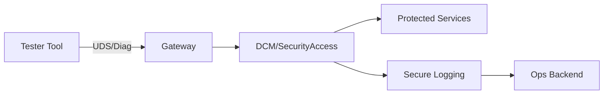
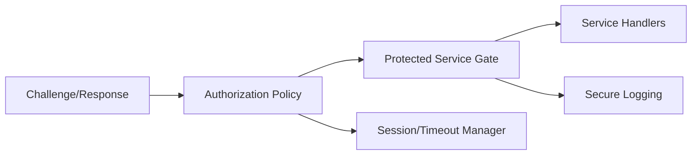
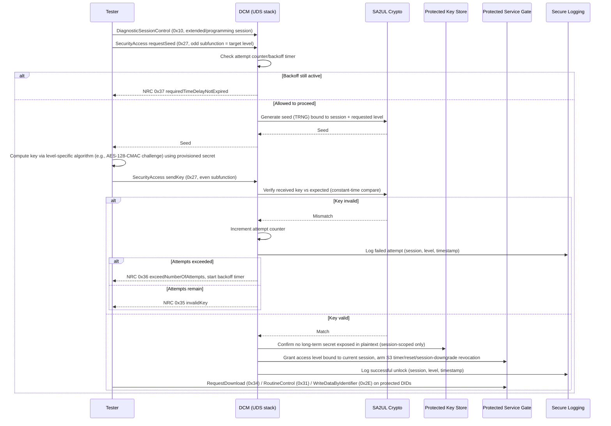

# Secure Access (Diagnostics and Protected Services) Architecture Requirements - TDA4VM ADAS ECU

## 1. System Static Architecture

### 1.1 System entities
- Authorized tester/service tool
- Vehicle gateway
- Target ECU diagnostics endpoint (DCM)
- Security policy authority/provisioning backend
- Fleet operations backend for audit telemetry

### 1.2 Trust boundaries and interfaces
- Boundary A: Tester to gateway/ECU diagnostic interface
- Boundary B: DCM service layer to protected ECU services
- Boundary C: Access-state management to session manager boundary
- Boundary D: ECU logging path to backend audit domain

### 1.3 System-level requirement allocation

**Cybersecurity Requirements (CSR)**
- CSR-SA-1: Protected services shall require successful security access before execution.
- CSR-SA-2: Challenge-response shall include freshness/nonce and anti-replay protection.
- CSR-SA-3: Failed attempts shall trigger lockout/backoff and audit logging.
- CSR-SA-4: Access rights shall be role/session specific.
- CSR-SA-5: Elevated access shall expire automatically and require re-authentication.

**Functional Cybersecurity Concept (FCR)**
- FCR-SA-1: Separate authentication (identity proof) from authorization (service scope).
- FCR-SA-2: Enforce deny-by-default for protected services when access state is invalid.
- FCR-SA-3: Invalidate access state on timeout, reset, and session downgrade.
- FCR-SA-4: Apply graded delay/lockout policy for brute-force resistance.

**Technical Cybersecurity Concept (TCR)**
- TCR-SA-1: Implement challenge-response using hardware-assisted crypto (SA2UL where applicable).
- TCR-SA-2: Keep long-term secrets in secure storage/provisioning flow and prevent plaintext export.
- TCR-SA-3: Bind decisions to lifecycle state and policy configuration.
- TCR-SA-4: Emit security events to protected logging path for forensic continuity.

## 2. Hardware Static Architecture

### 2.1 Hardware elements
- TDA4VM (J721E) processing domain: Cortex-A72/R5F application cores plus DMSC (System Firmware/TIFS)
- SA2UL crypto acceleration support for challenge-response operations
- eFuse-anchored key storage (SMPK/BMPK) via System Firmware provisioning services
- DMSC BootROM + device security type (GP/HS-FS/HS-SE) constrain which access levels are possible
- JTAG/Sec-AP debug state controls affecting access policy (see Secure JTAG doc)

### 2.2 Hardware responsibility mapping
- HWR-SA-1: Auth timing targets met through crypto acceleration
- HWR-SA-2: Hardware-backed credential handling and key protection
- HWR-SA-3: Device security type (GP/HS-FS/HS-SE) and lifecycle state bound which access levels are reachable (TCR-SA-3)

## 3. Software Static Architecture

### 3.1 Software blocks
- DCM SecurityAccess state machine
- Authentication challenge/response module
- Authorization policy evaluator
- Protected service gates (RequestDownload, RoutineControl, WriteData)
- Session timeout/revocation manager
- Secure logging emitter

### 3.2 Software requirement allocation
- SWR-SA-1: DCM gates protected UDS services by access level
- SWR-SA-2: Enforce timeout, retry counter, lockout windows
- SWR-SA-3: Validate access state per protected request
- SWR-SA-4: Log and expose security failures

## 4. Dynamic / Behavioral Views

### 4.1 Secure access challenge-response flow (ISO 14229-1 SecurityAccess, service 0x27)

### 4.2 Behavioral requirement focus
- Access is deny-by-default: no protected service gate opens until a `sendKey` verification succeeds for the matching session and level (CSR-SA-1, FCR-SA-2)
- Seeds are single-use, TRNG-generated, and bound to the current session and requested level, preventing replay of a previously observed seed/key pair (CSR-SA-2)
- Failure handling follows ISO 14229-1 NRCs explicitly: 0x35 invalidKey, 0x36 exceedNumberOfAttempts, 0x37 requiredTimeDelayNotExpired drive the retry/backoff state machine rather than a generic "deny" (CSR-SA-3)
- Granted access is automatically revoked on S3 timer expiry, ECU reset, or session downgrade to default session - there is no persistent unlock across power cycles (CSR-SA-5, SWR-SA-2)
- The shared secret/key derivation material never leaves protected key storage in plaintext; only the computed key/seed values cross the tester interface (TCR-SA-2)
