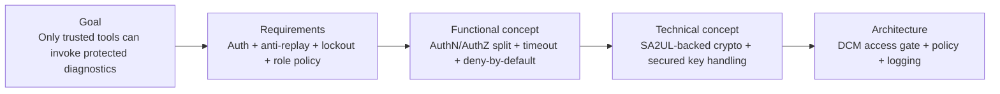
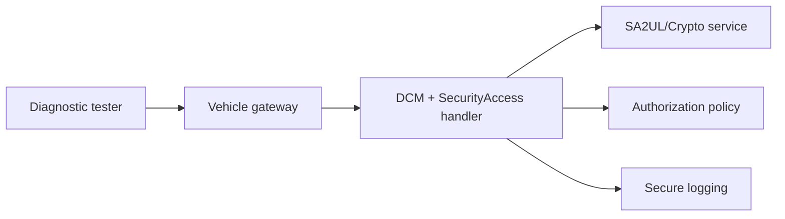
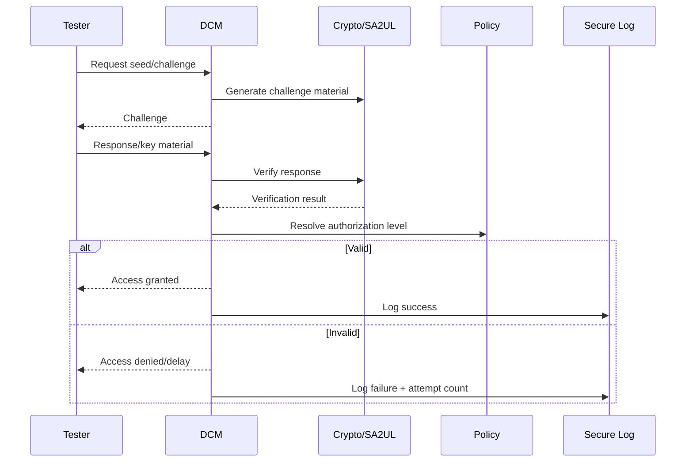
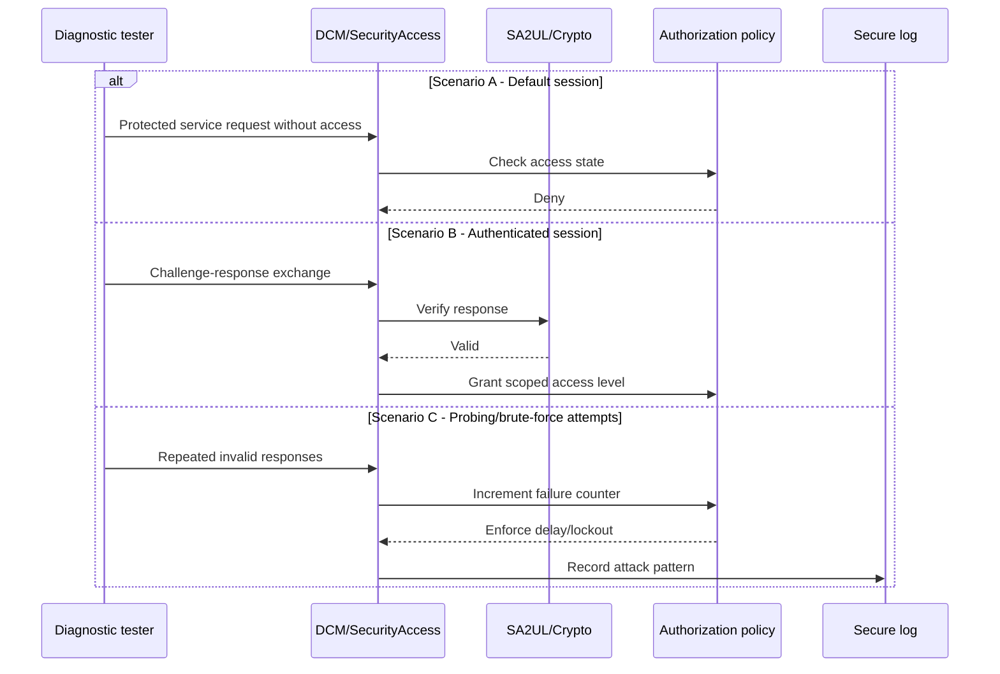

# SecureAccess (Diagnostic Authentication and Authorization) — TDA4VM ADAS ECU

## Scope and terminology note

This document defines requirement traceability for protected diagnostic access (for example UDS SecurityAccess and authorization-gated services). "SecureAccess" here means both authentication and fine-grained authorization enforcement.

## 0. Conceptual primer

Diagnostic connectivity is necessary for service and manufacturing, but protected services can alter ECU behavior or software state. SecureAccess therefore must prevent unauthorized invocation, replay, brute-force probing, and stale-session abuse.

## 1. Cybersecurity engineering flow

## 2. Cybersecurity Goal

Ensure only authenticated and authorized diagnostic entities can execute protected services, and ensure abuse attempts are rate-limited and observable.

## 3. Cybersecurity Requirements (item level)

CSR-SA-1: Protected services shall require successful security access before execution.
CSR-SA-2: Challenge-response shall include freshness/nonce and anti-replay protection.
CSR-SA-3: Failed attempts shall trigger lockout/backoff and audit logging.
CSR-SA-4: Access rights shall be role/session specific.
CSR-SA-5: Elevated access shall expire automatically and require re-authentication.

## 4. Cybersecurity Concept

### 4.1 Functional Cybersecurity Concept & Requirements

FCR-SA-1: Separate authentication (identity proof) from authorization (service scope).
FCR-SA-2: Enforce deny-by-default for protected services when access state is invalid.
FCR-SA-3: Invalidate access state on timeout, reset, and session downgrade.
FCR-SA-4: Apply graded delay/lockout policy for brute-force resistance.

### 4.2 Technical Cybersecurity Concept & Requirements (TDA4VM-oriented)

TCR-SA-1: Implement challenge-response using hardware-assisted crypto (SA2UL where applicable).
TCR-SA-2: Keep long-term secrets in secure storage/provisioning flow and prevent plaintext export.
TCR-SA-3: Bind decisions to lifecycle state and policy configuration.
TCR-SA-4: Emit security events to protected logging path for forensic continuity.

## 5. System Cybersecurity Architecture

## 6. SW Requirements & HW Requirements (allocated)

### 6.1 Software requirements

SWR-SA-1: DCM shall gate RequestDownload, RoutineControl, and protected WriteData services by access level.
SWR-SA-2: SecurityAccess state machine shall enforce timeout, retry counters, and lockout windows.
SWR-SA-3: Service handlers shall validate access token/state at each protected request.
SWR-SA-4: Security failures shall be logged and exposed to diagnostics monitoring.

### 6.2 Hardware requirements

HWR-SA-1: Crypto hardware support shall meet authentication timing constraints.
HWR-SA-2: Hardware-backed key protection primitives shall be available for credential handling.

## 7. Software Architecture

## 8. Hardware Architecture and scenarios

### 8.1 Hardware dynamic sequence diagram

- Scenario A: Normal diagnostics in default session with protected services denied.
- Scenario B: Authenticated service session with bounded privileges and expiry.
- Scenario C: Attack/probing attempts with delay escalation and lockout.

## 9. Verification focus

- Replay test: Reused response must fail.
- Privilege test: Protected service call without valid state must be rejected.
- Abuse test: Repeated failures must enforce delay/lockout and log evidence.
