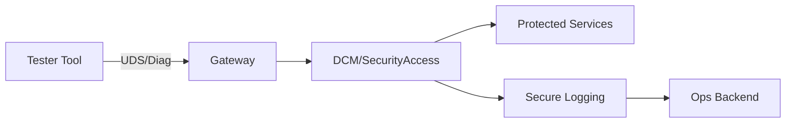
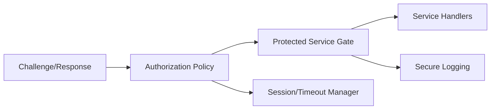
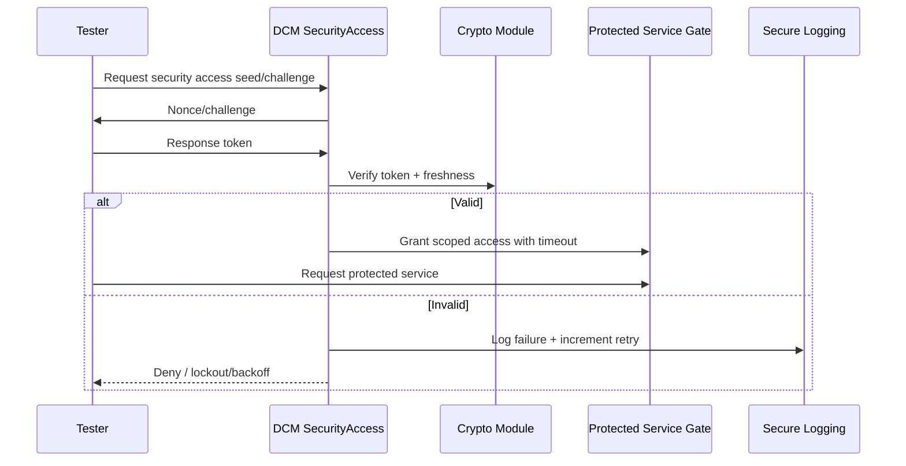

# Secure Access (Diagnostics and Protected Services) Architecture Requirements - TDA4VM ADAS ECU

## 1. System Static Architecture

### 1.1 System entities
- Authorized tester/service tool
- Vehicle gateway
- Target ECU diagnostics endpoint (DCM)
- Security policy authority/provisioning backend
- Fleet operations backend for audit telemetry

### 1.2 Trust boundaries and interfaces
- Boundary A: Tester to gateway/ECU diagnostic interface
- Boundary B: DCM service layer to protected ECU services
- Boundary C: Access-state management to session manager boundary
- Boundary D: ECU logging path to backend audit domain

### 1.3 System-level requirement allocation
- CSR-SA-1 to CSR-SA-5
- FCR-SA-1 to FCR-SA-4
- TCR-SA-1 to TCR-SA-4

## 2. Hardware Static Architecture

### 2.1 Hardware elements
- TDA4VM (J721E) processing domain: Cortex-A72/R5F application cores plus DMSC (System Firmware/TIFS)
- SA2UL crypto acceleration support for challenge-response operations
- eFuse-anchored key storage (SMPK/BMPK) via System Firmware provisioning services
- DMSC BootROM + device security type (GP/HS-FS/HS-SE) constrain which access levels are possible
- JTAG/Sec-AP debug state controls affecting access policy (see Secure JTAG doc)

### 2.2 Hardware responsibility mapping
- HWR-SA-1: Auth timing targets met through crypto acceleration
- HWR-SA-2: Hardware-backed credential handling and key protection
- TCR-SA-3: Lifecycle state contributes to trust decisions

## 3. Software Static Architecture

### 3.1 Software blocks
- DCM SecurityAccess state machine
- Authentication challenge/response module
- Authorization policy evaluator
- Protected service gates (RequestDownload, RoutineControl, WriteData)
- Session timeout/revocation manager
- Secure logging emitter

### 3.2 Software requirement allocation
- SWR-SA-1: DCM gates protected UDS services by access level
- SWR-SA-2: Enforce timeout, retry counter, lockout windows
- SWR-SA-3: Validate access state per protected request
- SWR-SA-4: Log and expose security failures

## 4. Dynamic / Behavioral Views

### 4.1 Secure access challenge-response flow

### 4.2 Behavioral requirement focus
- Deny-by-default unless access state is valid (CSR-SA-1, FCR-SA-2)
- Anti-replay and freshness are mandatory in challenge-response (CSR-SA-2)
- Retries, lockout, timeout, and automatic revocation are enforced (CSR-SA-3, CSR-SA-5, SWR-SA-2)
