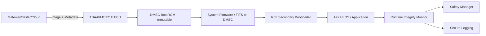
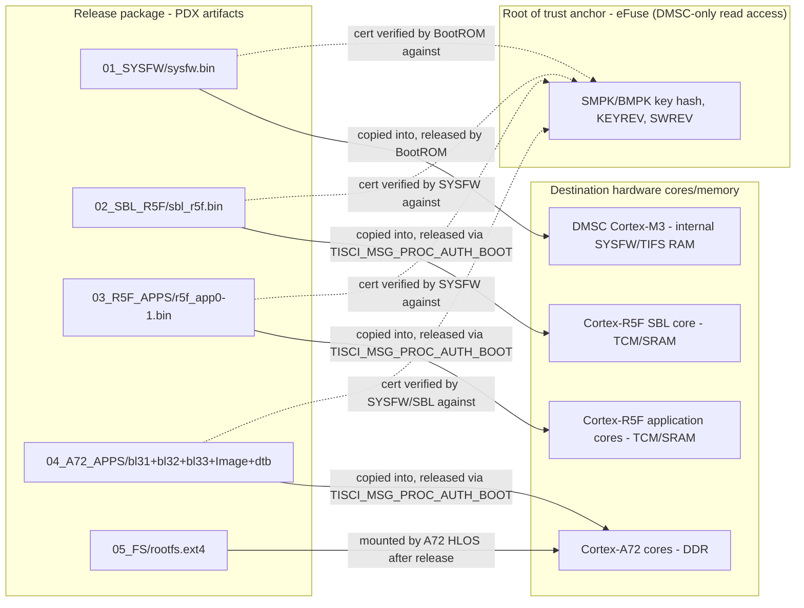
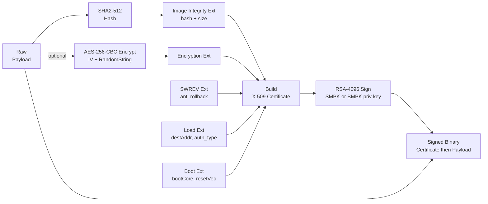
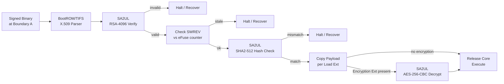
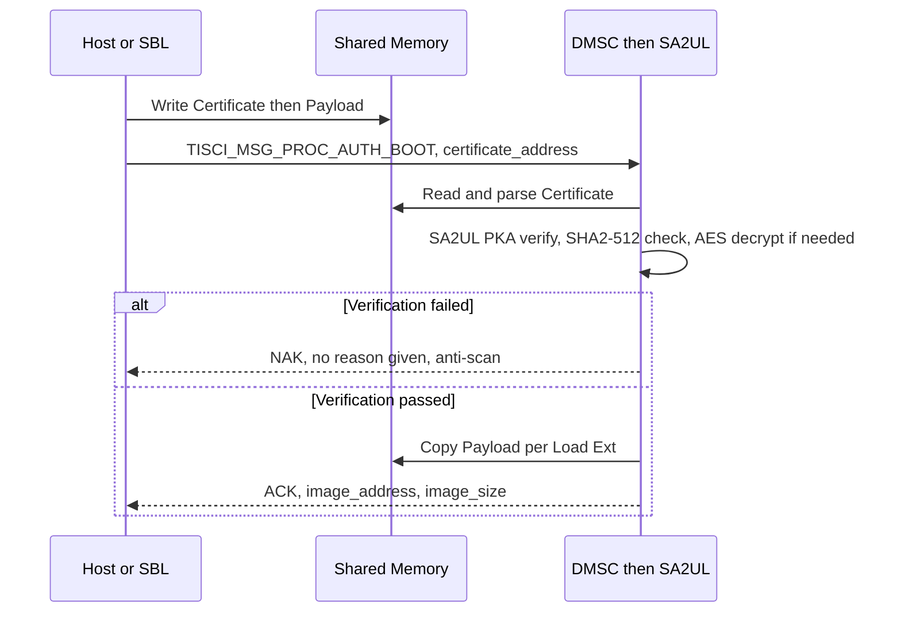
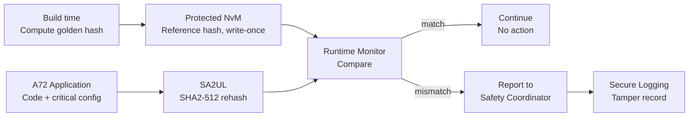
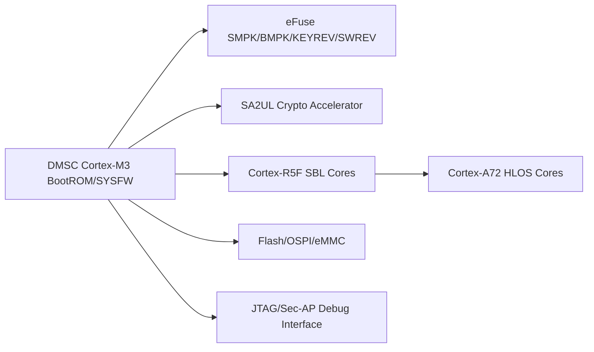
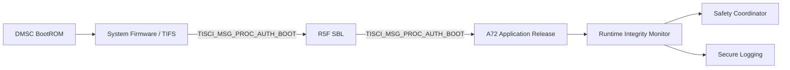
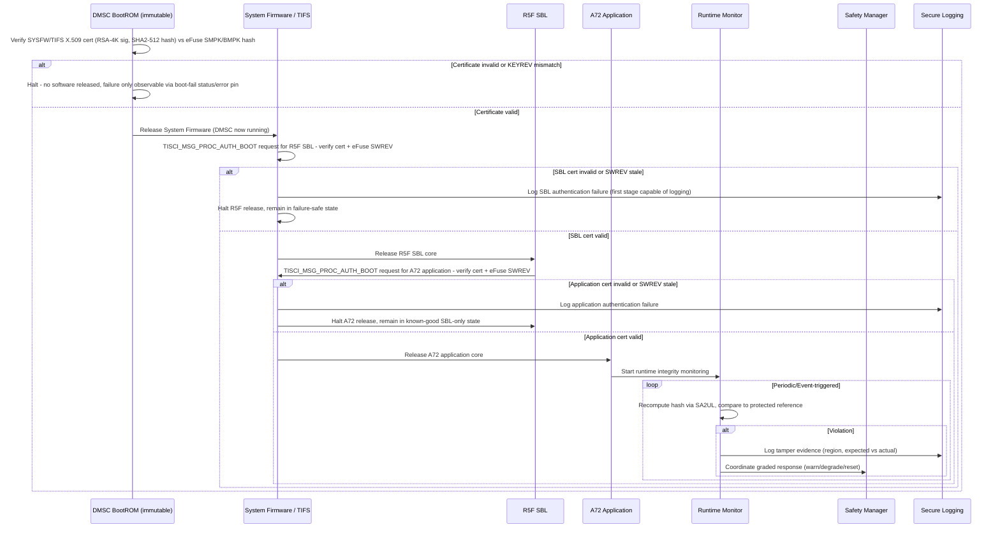

# Secure and Authentic Boot with Runtime Integrity Architecture Requirements - TDA4VM ADAS ECU

> Grounded in TI Jacinto 7 / TDA4VM (J721E) documentation: TISCI User Guide (System Firmware
> Authentication and Decryption Requests, Secure Debug User Guide, SoC-specific docs) and the
> TDA4VM product security feature list (secure boot, device attestation, hardware-enforced
> isolation). Where the public TI documentation does not name a mechanism explicitly, this is
> called out rather than invented.

## 1. Functional Security Concept

### 1.1 Cybersecurity Requirements (CSR)
- CSR-1: Verify integrity and authenticity of every boot-stage image before executing it.
- CSR-2: Detect tampering of running code/critical data after boot has already completed.
- CSR-3: Anchor verification in an immutable hardware root of trust, not a software-only check.
- CSR-4: Perform boot verification on every power-on/reset, independent of any prior flashing session.
- CSR-5: Gate post-reprogramming activation on the same trust chain used for ordinary power-on.
- CSR-6: Cover runtime integrity monitoring across power-on, post-reprogramming, and other operational scenarios.

### 1.2 Functional Security Concept (FSC)
- FSC-1: Root every verification decision in a hardware-anchored, immutable first step, then propagate trust forward one stage at a time.
- FSC-2: Treat boot-time verification and post-boot runtime verification as two distinct, complementary concepts rather than a single one-time gate.
- FSC-3: Apply the identical trust chain regardless of whether the system is powering on normally or resuming after reprogramming.

### 1.3 Functional Security Requirements (FSR)
- FSR-1: Each boot stage shall verify the authenticity and integrity of the next stage's image before transferring control to it.
- FSR-2: A verification failure at any boot stage shall be handled per that stage's defined strategy (halt/fallback for secure boot, measured-and-logged for authentic boot) rather than an ad hoc reaction.
- FSR-3: The first verification step in the chain shall execute from immutable, hardware-resident code that cannot be altered by any software update.
- FSR-4: Runtime integrity checks shall re-evaluate code/critical data after boot completes, independent of the boot-time result.
- FSR-5: Activation following reprogramming shall invoke the same verification chain used at ordinary power-on, with no reduced-check shortcut.
- FSR-6: Runtime monitoring shall remain active across power-on, post-reprogramming, and other operational scenarios without a coverage gap.

## 2. System Requirements and System Static Architecture

### 2.1 System entities
- TDA4VM (J721E) ECU boot and runtime security domain
- Reprogramming/update source domain (gateway/tester/cloud)
- Safety manager and vehicle control domain
- Logging and backend forensic domain

### 2.2 Trust boundaries and interfaces
- Boundary A: External update domain to ECU activation boundary (candidate image handoff)
- Boundary B: DMSC immutable BootROM (hardware root of trust) to loaded/mutable firmware chain
- Boundary C: Runtime monitor (application core) to safety response boundary
- Boundary D: Security event export to backend forensic boundary



### 2.3 System Requirements (SYSR)
- SYSR-1: The system shall ensure the update-source domain, ECU boot domain, safety domain, and logging domain each interact with the trust chain only at their defined boundary (A-D), never directly modifying boot-stage verification state.
- SYSR-2: System entities (Safety Manager, Logging domain) shall receive runtime integrity outcomes only through the Runtime Integrity Monitor's defined interface, not by inspecting boot-chain internals directly.
- SYSR-3: The System Static Architecture shall guarantee that the R5F SBL and A72 Application domains cannot be released except through the DMSC System Firmware authentication boundary (Boundary B).
- SYSR-4: Every image crossing Boundary A (release package handoff to the ECU) shall carry, per stage, its signed payload plus that stage's X.509 certificate and RSA-4096 signature, so the DMSC/System-Firmware verification chain (TSR-1, TSR-2) can authenticate the package without any out-of-band trust input.

### 2.4 Release package (PDX) structure - image handoff artifact at Boundary A

> "PDX" here is a project-level release-package convention (the shippable archive handed across
> Boundary A), not a TI-published TDA4VM/TISCI term - called out per this doc's grounding rule.
> The per-stage X.509 certificate/RSA-4096 signature/SHA2-512 hash contents shown below are the
> real TI-documented structure (Ch.6 "Signing binaries for Secure Boot on HS Devices"); only the
> surrounding folder/manifest layout is a packaging convention layered on top of it.

```text
ECU_PDX/
├── 00_BOOTROM/                     (Immutable, inside SoC - no files in PDX, burned in silicon)
├── 01_SYSFW/                       (System Firmware / TIFS)
│   ├── sysfw.bin
│   │   ├── Payload (SYSFW code)
│   │   ├── X.509 Certificate (Public Key SMPK/BMPK, SHA2-512 hash, KEYREV, SWREV,
│   │   │                       load address, optional AES encryption extension)
│   │   └── RSA-4096 Signature
│   └── manifest_sysfw.json
├── 02_SBL_R5F/                     (Secondary bootloader)
│   ├── sbl_r5f.bin (Payload, X.509 cert w/ BMPK, SHA2-512 hash, KEYREV, SWREV, RSA-4096 sig)
│   └── manifest_sbl.json
├── 03_R5F_APPS/
│   ├── r5f_app0.bin, r5f_app1.bin (Payload, X.509 cert w/ OEM key, SHA2-512 hash,
│   │                                KEYREV, SWREV, RSA-4096 sig)
│   └── manifest_r5f.json
├── 04_A72_APPS/
│   ├── bl31.bin (ATF), bl32.bin (OP-TEE), bl33.bin (U-Boot), Image (Linux kernel), dtb
│   └── manifest_a72.json
├── 05_FS/                          (RootFS, optionally encrypted)
│   ├── rootfs.ext4
│   └── manifest_fs.json
├── 06_KEYS/                        (OEM public key material, for release tooling/traceability)
│   ├── smpk_pub.pem, bmpk_pub.pem, oem_app_pub.pem, key_policy.json
├── 07_CERTS/                       (Extracted certificate bundle, for release tooling/traceability)
│   ├── sysfw_cert.pem, sbl_cert.pem, r5f_app_cert.pem, a72_app_cert.pem, cert_chain.pem
├── 08_LOGS/                        (Bench/build-time secure boot logs, not device-consumed)
│   ├── sysfw_boot_log.bin, sbl_boot_log.bin, app_boot_log.bin
└── 09_MANIFEST/
    └── ecu_manifest.json           (Top-level manifest binding all per-stage manifests/versions)
```

- `00_BOOTROM/` is intentionally empty: the DMSC BootROM (TSR-1's root of trust) is immutable
  silicon and is never part of a shippable package.
- `01_SYSFW/` through `04_A72_APPS/` mirror the chain of trust in 2.2/3.2 one folder per stage:
  each `.bin` carries the same X.509-cert-plus-RSA-4096-signature shape verified in turn by
  `TISCI_MSG_PROC_AUTH_BOOT` (TSR-2), with KEYREV/SWREV fields feeding the anti-rollback check
  in TSR-3.
- `06_KEYS/` and `07_CERTS/` are extracted copies for release/signing tooling and audit
  traceability - the DMSC does not read these paths at boot; it only reads the certificate
  embedded inside each stage's own `.bin`.
- `08_LOGS/` holds bench/build-time boot logs (e.g. from signing-lab validation runs), distinct
  from the on-device Secure Logging domain described in `TDA4VM_Secure_Logging_Requirements.md`.
- `09_MANIFEST/ecu_manifest.json` is the release identity: it binds the per-stage manifests,
  digests, and SWREV/KEYREV versions into one traceable package version (SYSR-4).
- The SMPK/BMPK private keys used to sign every `.bin` above never touch the ECU or this package -
  only their public-key hash is factory-burned into eFuse; see
  `TDA4VM_Secure_Storage_Requirements.md` for the eFuse KEK/DKEK/keyring provisioning mechanics
  that share the same eFuse array.

### 2.5 Binary-to-hardware placement and root-of-trust verification mapping

Two distinct relationships exist between each PDX artifact and the hardware, and they must not be
conflated: **copy/load** (the payload is placed into a core's execution memory) versus **verify**
(the certificate/signature is checked against the eFuse-anchored root of trust before that copy is
allowed to run). The eFuse root of trust is never itself overwritten by a PDX binary - it is
factory/OEM-provisioned once and only ever read for comparison.



| PDX artifact | Copied/loaded into (HW destination) | Verified against (root of trust) | Verifying stage |
|---|---|---|---|
| `01_SYSFW/sysfw.bin` | DMSC Cortex-M3 internal RAM | eFuse SMPK/BMPK key hash + KEYREV/SWREV | DMSC BootROM (TSR-1) |
| `02_SBL_R5F/sbl_r5f.bin` | Cortex-R5F SBL core TCM/SRAM | eFuse SMPK/BMPK key hash + KEYREV/SWREV | System Firmware, via `TISCI_MSG_PROC_AUTH_BOOT` (TSR-2) |
| `03_R5F_APPS/r5f_app*.bin` | Cortex-R5F application core(s) TCM/SRAM | eFuse SMPK/BMPK key hash + KEYREV/SWREV | System Firmware, via `TISCI_MSG_PROC_AUTH_BOOT` (TSR-2) |
| `04_A72_APPS/bl31.bin`, `bl32.bin`, `bl33.bin`, `Image`, `dtb` | Cortex-A72 core DDR | eFuse SMPK/BMPK key hash + KEYREV/SWREV | System Firmware/SBL stage, via `TISCI_MSG_PROC_AUTH_BOOT` (TSR-2) |
| `05_FS/rootfs.ext4` | Cortex-A72 DDR (mounted by HLOS) | Not independently signature-checked by the boot chain itself - integrity depends on the already-verified A72 bootloader/kernel that mounts it | n/a (post-boot mount) |

- The eFuse row (`EFUSE`) is only ever a **read/compare** target, never a write target, from any
  PDX binary - it is the one component in this mapping that is not "copied to" (CSR-3, TSR-1).
- Every copy edge in the diagram is gated by the matching dashed verify edge: a payload is placed
  into its destination core's memory only after its certificate has already passed the eFuse
  comparison for that stage - restating TSC-1's chain-of-trust ordering in placement terms.

### 2.6 Signed binary layout - add (build) side vs. verify (HSM/crypto-accelerator) side

> Grounded in TI TISCI Ch.6 "Signing binaries for Secure Boot on HS Devices" and the X.509
> extension OIDs (`1.3.6.1.4.1.294.1.x`). TDA4VM has no separate "HSM chip" - **SA2UL** is the
> hardware crypto accelerator that plays that role, driven by DMSC BootROM/System Firmware.

**Build side (offline signing tool) - example: `sysfw.bin`**



**Verify side (on-target, at every boot stage) - SA2UL does the actual crypto math**



- Same two diagrams apply to `sbl_r5f.bin`, only the Boot Ext becomes mandatory (it releases the
  next core) and the verifier is System Firmware (via `TISCI_MSG_PROC_AUTH_BOOT`), not the BootROM.
- GP devices skip both diagrams entirely - no X.509 parser exists on GP silicon.

### 2.7 Crypto algorithm detail - hashing, certificate/signature, encryption

| Operation | Algorithm | Key / material | Runs on | Carried in |
|---|---|---|---|---|
| Hash | SHA2-512 (unkeyed) | none | SA2UL SHA engine | Image Integrity ext `shaValue` (64B) |
| Signature | RSASSA-PKCS1-v1_5 (RFC 8017), RSA-4096 | Sign: SMPK/BMPK private key (offline). Verify: SMPK/BMPK public-key hash, from eFuse (KEYREV-selected) | SA2UL PKA (public-key accelerator) | Certificate's own signature field, over `TBSCertificate` |
| Encryption (optional) | AES-256-CBC | 16B IV + 32B random-string trailer (decrypt-success proof), key = active MEK | SA2UL AES engine | Encryption ext `initialVector`, `randomString` |

**Message-level mechanic** - `TISCI_MSG_PROC_AUTH_BOOT` never carries the binary itself, only a
pointer to it:



- **HS-FS vs HS-SE nuance**: on HS-FS device type, `TISCI_MSG_PROC_AUTH_BOOT` only performs the
  image integrity (hash) check - the root-of-trust key/signature comparison is skipped. Full
  RSA-4096/PKA signature verification against the eFuse key hash only happens on HS-SE. Don't
  assume every HS device does the full PKA verify - it is HS-SE only.
- **Streaming variant** (`am275x` only): large images too big to verify in one shot use
  `TISCI_MSG_MCELF_PROC_AUTH_BOOT_INIT` (validate the certificate/signature alone) ->
  `..._UPDATE` (feed segments into the running SHA2-512, max 4MB-16B unencrypted or 62KB
  encrypted, must be a multiple of 16B if encrypted) -> `..._FINISH` (compare final hash, run any
  streaming AES-256-CBC decrypt, then configure/release the core).

**Certificate removal** - governed by the Load Ext's `auth_type` byte, not a separate delete step:

| `auth_type` | What happens to the certificate bytes |
|---|---|
| `0` normal | Payload copied to `destAddr`; cert left behind, unused |
| `1` in-place | Cert + payload both stay put |
| `2` in-place variant | Payload shifted down, overwriting the cert's own bytes |

- HSI-4 (see 6.2): the certificate-plus-payload concatenation and the Load-extension `auth_type`
  copy/strip semantics above are the register/API-level contract between hardware (BootROM/DMSC
  parsing and copy-and-hash logic) and software (the signing tool that built the file) - formalized
  as an HSI requirement rather than left as narrative only.

### 2.8 Runtime integrity monitoring detail - what is re-hashed, where the reference lives, trigger model

> FSR-4/TSR-4 establish that runtime re-checking exists, but TI does not publish a named
> "runtime attestation" feature for TDA4VM. This section documents it as an architectural pattern
> built only from already-grounded primitives: the SA2UL SHA2-512 engine (2.7) and the Protected
> NvM partition (`TDA4VM_Secure_Storage_Requirements.md`, TSR-STO-5/HWR-STO-4) reused as
> reference-hash storage - not a separate TI-named mechanism.



| Trigger | Region covered | Action on mismatch |
|---|---|---|
| Periodic (watchdog-tied interval) | A72 application code segments | Escalate per graded response (warn/degrade/reset), same as 5.3's loop |
| Event (before a safety-critical mode transition) | Calibration/critical config data | Block the transition, escalate to Safety Coordinator |
| First boot after reprogramming | Full application image | Treated as a boot-time check, not this monitor - falls back to TSR-2/TSR-5 |

- Cadence and exact region boundaries are this doc's architectural choice (SWR-2), not a
  TI-mandated value - TI's contribution is the SA2UL hashing primitive and Protected NvM's
  crash-consistent write path, not the monitoring policy itself.
- A runtime mismatch does not re-enter the boot chain by itself: the Runtime Monitor escalates a
  graded response (warn/degrade/reset, per 5.3's loop) to the Safety Coordinator - only an explicit
  reset re-enters DMSC BootROM (TSR-5); this is not an automatic fallback-image swap.

## 3. Technical Security Concept

### 3.1 Technical Security Concept (TSC)
- TSC-1: Each boot stage cryptographically verifies the next stage before it executes (chain of trust).
- TSC-2: Boot failures halt/fall back (secure boot) or are measured and logged for deferred judgment (authentic boot) - the strategy is a deliberate choice, not interchangeable defaults.
- TSC-3: An immutable, hardware-anchored first-stage verifier initiates the entire chain.
- TSC-4: Runtime monitoring re-validates code integrity independent of and after boot-time checks.
- TSC-5: Post-flash activation reuses the same chain-of-trust verification as normal boot, not a shortcut.

### 3.2 Technical Security Requirements (TSR) - corrected against TI TISCI documentation
- TSR-1: The DMSC immutable BootROM authenticates the System Firmware/TIFS image via X.509 certificate (RSA-4K signature, SHA2-512 hash) and halts/recovers on failure.
- TSR-2: System Firmware (TIFS) authenticates the R5F SBL and A72 application images before releasing each core, via `TISCI_MSG_PROC_AUTH_BOOT`.
- TSR-3: The eFuse SWREV monotonic counter is checked as part of certificate validation at every stage of this same chain, not only at flashing time.
- TSR-4: Runtime integrity re-checking is built from SA2UL hashing plus protected NvM reference storage (architectural pattern consistent with TI's documented SA2UL/TISCI crypto services, not a separately named TI feature).
- TSR-5: Reprogramming's post-flash activation reset re-runs the identical DMSC BootROM -> System Firmware/TIFS -> R5F SBL chain - no separate path.
- TSR-6: A boot-time authentication failure (TSR-1/TSR-2/TSR-3) at ordinary power-on shall halt with
  no fallback image at that stage; an automatic image revert exists only on the OTA/reprogramming
  activation path (`TDA4VM_OTA_FOTA_SOTA_Requirements.md` CSR-OTA-4), never as an implicit behavior
  of a normal power-on failure.

## 4. Hardware Requirements and Hardware Static Architecture

### 4.1 Hardware elements (TDA4VM/J721E specific)
- DMSC (Device Management and Security Controller): a dedicated Cortex-M3 core that executes the
  immutable BootROM at power-on and subsequently hosts System Firmware (SYSFW, also referred to
  as TIFS in newer TI SDKs)
- Dual Cortex-A72 (HLOS: Linux/QNX), 6x Cortex-R5F (real-time/safety, incl. secondary bootloader)
- SA2UL: hardware crypto accelerator used for signature verification and hashing, access-controlled
  by firewalls configured through TISCI
- eFuse array: holds the hash of the customer root-of-trust public keys (SMPK/BMPK), plus the
  KEYREV and SWREV monotonic counters used for anti-rollback
- Flash/OSPI/eMMC for bootloader and application images
- JTAG/Sec-AP debug interface, gated by device security configuration (GP / HS-FS / HS-SE) - see
  `TDA4VM_Secure_JTAG_Requirements.md` for the per-type default-open/closed table and unlock flow



### 4.2 Hardware Requirements (HWR)
- HWR-1: DMSC BootROM is the immutable root of trust that starts every boot (CSR-3, TSC-3, TSR-1)
- HWR-2: eFuse-held SMPK/BMPK key hash anchors all signature verification; KEYREV selects which of
  the two customer keys is active (TSR-1, TSR-2)
- HWR-3: eFuse SWREV enforces monotonic anti-rollback policy, checked by System Firmware as part of
  certificate validation (TSR-3)
- HWR-4: SA2UL performs the SHA-2/RSA operations used for both boot-time authentication and runtime
  integrity hashing (TSR-4)

## 5. Software Requirements and Software Static & Dynamic Architecture

### 5.1 Software blocks
- DMSC BootROM (immutable, authenticates System Firmware/TIFS image)
- System Firmware (SYSFW/TIFS) running on DMSC: exposes the TISCI service interface, including
  `TISCI_MSG_PROC_AUTH_BOOT` used to authenticate and release other processor cores
- R5F secondary bootloader (SBL), authenticated and released by System Firmware
- A72 HLOS bootloader/kernel (Linux/QNX), authenticated and released by the R5F SBL stage
- Runtime integrity monitor task (application core)
- Safety coordination interface and secure logging adapter



### 5.2 Software Requirements (SWR)
- SWR-1: Each stage is authenticated before release using an X.509 certificate carrying an
  RSA-4K signature (RSASSA-PKCS1-v1_5) over a SHA2-512 payload hash, verified by System Firmware
  against the eFuse SMPK/BMPK key hash (TSC-1, TSR-1, TSR-2)
- SWR-2: Runtime re-checking is independent of boot-time verification and re-uses SA2UL hashing (TSC-4)
- SWR-3: Post-flash activation reuses the identical DMSC BootROM -> SYSFW -> SBL -> Application
  authentication sequence; there is no separate/shortcut activation path (CSR-5, TSR-5)

### 5.3 Secure boot and runtime integrity sequence

<p align="center">
  <a href="{{ '/assets/diagrams/TDA4VM_Secure_Authentic_Boot_Runtime_Integrity_Requirements-sequence.png' | relative_url }}" target="_blank" rel="noopener">
    
  </a>
</p>
<details markdown="1">
<summary>Mermaid source (for editing/regeneration)</summary>



</details>


### 5.4 Behavioral requirement focus
- No bypass path: BootROM authentication of System Firmware runs on every power-on/reset with no
  disable option on HS-SE devices (CSR-1, CSR-4, CSR-5)
- A BootROM-stage failure cannot be logged through the normal secure logging path since no software
  has been released yet; it is only observable as a boot-fail status/error indication, which is why
  System Firmware becomes the first stage capable of recording an authentication failure (TSC-2)
- Each stage's authentication failure halts release of the next core rather than falling through to
  a partially-initialized state - the chain fails closed, one stage at a time (CSR-1, TSC-1)
- Runtime detection continues after boot completion, independent of the boot-time chain (CSR-2, CSR-6)
- SWREV-based anti-rollback is checked at every stage of the chain, not only at flashing time (TSR-3)
- Boot/authentication failure handling (halt vs. logged/measured continuation) is a deliberate,
  documented policy choice per stage, not an assumed default (TSC-2)
- Authentication-failure and runtime-tamper log entries referenced above use the chained-HMAC
  record format defined in `TDA4VM_Secure_Logging_Requirements.md` (event ID, severity, module ID,
  SA2UL HMAC chain) - this doc defines only *when* a record is emitted, not its on-disk shape

## 6. Hardware-Software Interface (HSI)

### 6.1 HSI elements
- DMSC BootROM-to-eFuse register read interface (SMPK/BMPK hash, KEYREV, SWREV)
- `TISCI_MSG_PROC_AUTH_BOOT` message interface between System Firmware and R5F/A72 core-release control registers
- SA2UL hash/signature register interface used by the boot chain and the runtime integrity monitor
- DMSC BootROM/System Firmware X.509 DER parser and Load-extension copy engine that consumes the
  cert-plus-payload binary layout defined in 2.6 (HS devices only - no such parser exists on GP
  silicon)
- Runtime Integrity Monitor-to-Protected-NvM reference-hash read interface (write-once at
  provisioning, a distinct logical region within the same physical partition described in
  `TDA4VM_Secure_Storage_Requirements.md`)

### 6.2 HSI Requirements (HSI)
- HSI-1: The eFuse SMPK/BMPK/KEYREV/SWREV register interface shall be readable only by DMSC BootROM and System Firmware, never directly mapped into A72/R5F address space.
- HSI-2: The `TISCI_MSG_PROC_AUTH_BOOT` interface shall be the sole software-visible mechanism to request release of the R5F SBL or A72 application core; no other register write shall bring a core out of reset.
- HSI-3: The SA2UL hashing register interface used by the Runtime Integrity Monitor shall report a distinguishable hardware-fault status separate from an integrity-mismatch status, so software can distinguish an accelerator failure from a real tamper detection.
- HSI-4: The BootROM/System Firmware X.509 parser shall treat the Image Integrity extension's `imageSize`/`shaValue` fields as the sole authority for where the payload begins/ends and what hash it must match, and shall treat the Load extension's `auth_type` field as the sole authority for whether/where the payload is copied - no other offset or length shall be inferred from the file itself.
- HSI-5: The Protected NvM partition holding runtime-integrity reference hashes shall be writable only by the build/provisioning flow that computed them, and readable only by the Runtime Integrity Monitor for comparison - no runtime code path may overwrite a reference hash after provisioning.

## Interview Appendix: Expert Q&A (20 Questions)

The following expert-level Q&A set is intended for interview practice and design review on this topic.

| # | Question | Difficulty | Detailed answer | Evidence |
|---|---|---|---|---|
| 1 | Why is the immutable BootROM the correct root of trust for the entire secure-boot chain? | L1 | The root of trust must be immutable because any software that can be modified after manufacturing is not suitable for validating a system expected to resist tampering. In TI TDA4VM, the DMSC BootROM is the first code executed at power-on and it authenticates System Firmware before any mutable software is allowed to run. That creates a trusted starting point independent of application or host state. If the first verifier were mutable, an attacker could substitute a malicious validation routine and bypass the entire chain. | CSR-3, FSC-1, TSC-3, TSR-1, HWR-1 |
| 2 | Walk through the secure-boot chain from DMSC BootROM to A72 application release. | L2 | The chain begins when BootROM authenticates the System Firmware/TIFS image against the eFuse-backed public key hash and X.509 certificate. Once accepted, System Firmware releases the next stage and uses `TISCI_MSG_PROC_AUTH_BOOT` to authenticate the R5F secondary bootloader and then the A72 application. Each stage verifies the next stage before the core is released, and SWREV is used to block rollback. Any failure causes the next release to stop, keeping the system in a fail-closed state. | CSR-1, FSR-1, TSC-1, TSR-1, TSR-2, TSR-3 |
| 3 | What is the practical significance of SWREV in TI secure boot? | L2 | SWREV is the monotonic software revision used to prevent rollback to older, potentially vulnerable images. The certificate includes the software revision, and the verifier compares it against the eFuse value at each stage. This matters because a stale but still correctly signed image could otherwise be accepted and used to reintroduce a known weakness. The anti-rollback check therefore closes the window between valid signatures and valid-but-old firmware. | TSR-3, HWR-3, SWR-1, HSI-4 |
| 4 | How is runtime integrity different from boot-time integrity? | L2 | Boot-time integrity proves a stage was valid when it was accepted; runtime integrity proves code or critical data has not changed after startup. The repo treats the two as complementary because an image can be authentic at boot and still be modified later in memory or flash. Runtime re-checking recomputes hashes of critical regions and compares them to a protected reference in NvM. This closes the post-boot attack window that secure boot alone cannot see. | CSR-2, CSR-6, FSR-4, FSR-6, TSC-4, TSR-4 |
| 5 | Why must post-flash activation reuse the same verification chain as normal boot? | L3 | Reprogramming is a high-risk transition because attackers often target firmware update flows. If a post-flash activation path skipped the normal root-of-trust validation, the device would create a bypass that undermines the whole secure-boot model. The repo therefore requires the same DMSC BootROM → SYSFW/TIFS → SBL verification sequence after programming as during ordinary power-on. This keeps update activation aligned with the same trust assumptions and prevents reduced-trust activation windows. | CSR-5, FSR-5, TSC-5, TSR-5, SWR-3 |
| 6 | Why do TI images use a certificate-plus-payload artifact rather than only a raw signature? | L2 | The verifier needs the signed metadata as well as the payload because the certificate encodes the hash, load address, SWREV, and boot instructions that define how the image is authorized and where it is placed. A bare signature without the certificate is insufficient because the hardware still needs the image integrity and load semantics to decide whether the payload is valid and where to copy it. In TI secure boot, the signed artifact is literally “certificate then payload,” with the certificate containing the signature and the extension values used in verification. | TSR-1, TSR-2, HSI-4, 2.6 Signing flow |
| 7 | What is the role of `TISCI_MSG_PROC_AUTH_BOOT` in the secure-boot path? | L1 | `TISCI_MSG_PROC_AUTH_BOOT` is the TISCI interface used to authenticate a binary and configure or release the target core. The message does not carry the binary itself; it carries the pointer to a memory region containing the signed certificate and payload, and the DMSC/System Firmware performs validation. This makes the trust decision a privileged system action rather than an application-controlled memory operation. | TSR-2, HWR-2, SWR-1, HSI-2 |
| 8 | Why does an authentication failure at one boot stage halt the next release instead of continuing partially? | L2 | The purpose of the chain is to ensure trust is established step-by-step. If a stage fails validation, the system cannot safely assume the next stage is trustworthy, because the next stage would be executing code that was never accepted through the trust anchor. Continuing would turn a closed chain into a partially trusted state with an unbounded blast radius. The design therefore fails closed: the chain stops at the failed stage and leaves the system in a known-good or safe condition. | CSR-1, TSC-1, TSR-6, 5.4 Behavioral focus |
| 9 | Why can a BootROM-stage failure not be recorded through the normal secure logging path? | L3 | The secure logging path requires a running software stack that has already passed early boot authentication. At the BootROM stage, no software has yet been released, so there is no trusted logger or software context to emit a chained record. The repo therefore treats early boot failures as status/error indications rather than ordinary secure logging records. This is a design constraint of the trust chain, not a reporting gap. | TSC-2, 5.4 Behavioral focus, secure logging traceability |
| 10 | What is the difference between HS-FS and HS-SE behavior in the TI boot path? | L2 | On HS-FS devices, the secure boot path may perform only the image integrity hash check, while the full public-key signature verification against the eFuse key hash is skipped. On HS-SE devices, the full RSA-4096 signature verification is enforced as part of the trusted chain. This matters because device security posture differs by silicon variant, and using the wrong assumption about verification depth can lead to a false sense of security. | 2.7 HS-FS vs HS-SE nuance, TSR-1, TSR-2 |
| 11 | Why are the eFuse values for SMPK/BMPK, KEYREV, and SWREV so important? | L3 | These values provide the persistent, hardware-anchored trust anchor for the whole chain. The public key hash binds the certificate to a trusted root, KEYREV selects the active customer key set, and SWREV prevents rollback to stale images. Without these fields, the system would rely on software-controlled values that could be modified or bypassed by an attacker. The result is a hardware-enforced trust anchor that remains stable across resets and reboots. | HWR-2, HWR-3, TSR-1, TSR-3 |
| 12 | What is the security reason for requiring a reset during reprogramming activation? | L2 | A reset guarantees the device re-enters the authenticated power-on flow rather than continuing with software that may have been partially or incorrectly updated. If reprogramming activation did not force a full trust-chain re-entry, a malicious or malformed update could become active without undergoing the normal chain-of-trust checks. The repo specifically requires the same verification path at activation reset to preserve the security model across normal and update-driven restarts. | CSR-5, FSR-5, TSC-5, TSR-5 |
| 13 | Why does runtime monitoring rely on a protected NvM reference rather than a software-held golden value? | L3 | A software-held golden hash is vulnerable to tampering because the same software execution environment that checks the code is also capable of modifying the reference. A protected NvM region makes the reference persistently stored in a higher-assurance location and reduces the chance of a runtime attacker rewriting the expected value. This preserves the integrity of the verification target by keeping the reference outside the ordinary application execution path. | TSR-4, HSI-5, Secure Storage requirements |
| 14 | What is the real effect of a runtime mismatch? | L2 | A runtime mismatch does not automatically re-enter the boot chain. Instead, the runtime monitor escalates a graded response such as warn, degrade, or reset to the Safety Coordinator and records the evidence in secure logging. This is intentional: the monitor is a safety and integrity control, not a self-healing firmware swap mechanism. It treats a mismatch as a security event and acts according to the vehicle’s safety policy rather than silently trying to recover by itself. | FSR-4, TSC-4, TSR-4, 2.8 Runtime integrity monitoring detail |
| 15 | Why do the certificate and payload need to be copied in a specific order during verification? | L3 | The on-target parser relies on the certificate to provide the exact image size, hash, destination address, and auth_type behavior before it copies and verifies the payload. If the order were not defined, the system would not know where the payload starts or whether it should be copied in place or moved. TI defines this contract formally to prevent parser ambiguity and to eliminate “file layout inference” attacks or implementation mismatches between signing tools and hardware. | HSI-4, 2.6 Signed binary layout, 2.7 certificate removal |
| 16 | What does the `auth_type` field actually control? | L1 | The `auth_type` field controls whether and how the payload is copied after verification. TI documents values for normal copy, in-place copy, and in-place variant move semantics, and these determine whether the certificate bytes remain or are overwritten as the payload is moved. This is hardware-level behavior and is not a separate app-layer concern. | HSI-4, 2.7 Certificate removal table |
| 17 | Why is protected NvM storage considered a runtime-integrity reference and not a boot-time trust anchor? | L2 | The protected NvM reference is used to compare live runtime state against a trusted expected value after startup. It is not the initial source of trust for the boot chain because the boot chain must already be rooted in immutable BootROM and eFuse values before any runtime comparison is meaningful. In other words, the protected reference protects the runtime state, while the BootROM/eFuse combination protects the initial chain-of-trust. | TSR-4, HWR-4, HSI-5 |
| 18 | What would be the risk if the BootROM were software-updatable? | L3 | If the BootROM were mutable, an attacker might replace the initial verifier with a malicious implementation that approves unauthorized firmware. That would reduce the whole device to a software-defined trust model and destroy the hardware root-of-trust assumption. The design purpose of the immutable BootROM is precisely to avoid this class of attack by making the first trust decision impossible to modify through ordinary software or firmware updates. | CSR-3, FSC-1, TSC-3, HWR-1 |
| 19 | Why does the repo emphasize that failure handling is a policy choice rather than an assumed default? | L2 | Different stages have different security implications and operational constraints. A boot-time failure cannot always be treated the same as a runtime integrity failure, because the device may not yet have a valid software stack or may not be able to log through the regular path. The design therefore deliberately differentiates between halt, fallback, and logged-measured behavior depending on stage and policy. This prevents accidental interoperability between boot-stage and runtime-stage decisions. | TSC-2, TSR-6, 5.4 Behavioral focus |
| 20 | If you had to summarize the single most important principle of this architecture in one sentence, what would it be? | L1 | The most important principle is: verify before release, keep the trust anchor immutable, and treat every stage of execution as a separate trust decision under a hardware-rooted chain of verification. This is the thread tying secure boot, runtime checks, key storage, and reprogramming together. It is why the architecture is fail-closed rather than permissive and why every stage is validated before the next one can proceed. | CSR-1, CSR-2, CSR-3, FSC-1, TSC-1, TSC-4 |
| 21 | How is an X.509 certificate used when signing automotive binaries, per TI's actual TDA4VM signing flow? | L2 | Corrected from a generic PKI assumption: on TDA4VM the X.509 certificate is not kept separate from the binary - the signed artifact is literally "certificate then payload" (2.6), and the certificate travels with the image into flash and into shared memory at every boot stage. What is provisioned once, at manufacturing, is not the certificate itself but the eFuse-held hash of the SMPK/BMPK public keys plus the KEYREV/SWREV counters (HWR-2, HWR-3); the certificate's embedded public key is only trusted after its hash is checked against that eFuse value. So the certificate does bind key material to signed metadata (image hash, SWREV, load address), but that binding is re-verified on every single boot, not established once during a separate provisioning ceremony. | 2.6, 2.7, HWR-2, HWR-3 |
| 22 | Does TDA4VM use a discrete HSM to obtain the public key from the certificate and cache it for later verification? | L3 | Corrected: TDA4VM has no separate HSM chip; SA2UL is the hardware crypto accelerator that performs the actual RSA/SHA math, driven by DMSC BootROM/System Firmware (2.6 note). There is no persistent "stored public key object" the way a discrete HSM key slot works - at every single boot, the certificate embedded in that stage's binary is parsed fresh, its public key is hashed and compared against the eFuse SMPK/BMPK hash (HWR-2), and only then is that just-extracted key used by SA2UL's PKA engine to verify the signature. This re-derivation on every boot, rather than a one-time extract-and-cache model, is what makes a compromised or substituted certificate detectable at every stage, not just at first provisioning. | 2.6, 2.7, HWR-2, TSR-1, TSR-2 |
| 23 | How does the verification hardware check a binary signed by the private key corresponding to the certificate? | L2 | SA2UL, invoked by DMSC BootROM/System Firmware, performs an isolated verification sequence: its SHA2-512 engine hashes the payload, and its PKA engine performs the RSA-4096/RSASSA-PKCS1-v1_5 signature check over the certificate's TBSCertificate structure, which itself embeds the expected image hash, size, SWREV, and load metadata (2.7). The private key never exists on the ECU at all - it only ever exists in the offline signing tool used to build the release package. Unlike a generic boolean-only HSM response, the TISCI reply is an ACK carrying the released image_address/image_size or a NAK with no further detail, deliberately withholding failure-reason detail to resist scanning/oracle attacks (2.7 message-level mechanic). | 2.7, TSR-1, TSR-2 |
| 24 | Why is the full X.509 certificate not embedded inside the binary? | L2 | This premise does not hold for TDA4VM: the certificate is embedded, concatenated directly before the payload in the shipped signed binary (2.6), because every verifying stage needs the certificate's Image Integrity, SWREV, Load, and Boot extensions to know how to check and place that specific payload - there is no separate persistent record of any one binary's certificate kept elsewhere on the device to consult instead. What TI does avoid embedding as a persistent trust anchor is the actual permitted public key value; only its hash is fused into eFuse (HWR-2), so a forged certificate carrying a different key simply fails the hash comparison regardless of whether it is bundled with the payload. The security property comes from the eFuse hash check, not from omitting the certificate from the binary. | 2.6, HWR-2, HSI-4 |
| 25 | Does the verifier validate the certificate once during provisioning and then discard it? | L2 | No - corrected: TDA4VM performs full certificate validation (signature, image hash, SWREV) at every single boot and at every reprogramming activation, not once during a manufacturing-time provisioning step (TSR-1, TSR-2, TSR-5). The certificate is never discarded; it is re-parsed by BootROM/System Firmware from shared memory each time that stage's image needs to be authenticated, and depending on the Load extension's `auth_type`, it may even remain resident in flash alongside the payload after copy (2.7 certificate removal table). Treating validation as a one-time provisioning event would reintroduce exactly the persistent-trust risk the per-boot re-verification design is meant to avoid. | TSR-1, TSR-2, TSR-5, 2.7 |
| 26 | How should certificate/key lifecycle management (rotation, revocation, anti-rollback, end-of-life) be handled for this ECU per ISO 21434? | L2 | This is a generally valid ISO 21434 expectation, and this document only partially covers it: SWREV gives monotonic anti-rollback (TSR-3, HWR-3) and KEYREV allows switching between two customer keys (HWR-2), but this document does not itself define a certificate revocation-list or OCSP-style mechanism, since the boot chain runs without network connectivity or a trusted clock at the earliest stages. Rotation in practice means burning a new KEYREV value and re-signing future images with the new key, while the old key hash remains in eFuse to validate already-deployed images until they are phased out. Anything beyond SWREV/KEYREV (e.g., a formal revocation service) would need to be implemented at the backend/OTA layer, not the immutable boot chain, and should be called out as an extension rather than assumed present. | TSR-3, HWR-2, HWR-3 |
| 27 | How are X.509 certificates used by Secure Boot on this ECU, at runtime? | L2 | Corrected: contrary to a model where only a previously-extracted public key is used at runtime and the certificate itself is discarded after provisioning, TDA4VM's BootROM and System Firmware parse the actual certificate embedded in each stage's binary at every boot (2.6, 2.7). What is stored in ROM/eFuse is not the certificate and not even the full public key - it is only the SMPK/BMPK public key hash plus KEYREV/SWREV counters (HWR-1, HWR-2, HWR-3), used purely as a comparison anchor. So the certificate is very much used at runtime, every time; the hardware-protected value is the minimal hash needed to detect a substituted key, not a cached copy of the key or certificate itself. | HWR-1, HWR-2, TSR-1, TSR-2 |
| 28 | What happens if the certificate used to sign firmware expires? | L2 | This is a generic PKI concern that is not a documented TDA4VM mechanism: TI's public TISCI documentation does not describe the boot chain evaluating an X.509 NotAfter/expiry field, and the boot flow generally runs before any trusted time source is established, which makes calendar-based expiry enforcement impractical at the earliest stages. The anti-rollback protection this platform actually implements is the SWREV monotonic counter, not certificate expiry (TSR-3, HWR-3) - an old but still correctly signed image is rejected because its SWREV is stale, regardless of any certificate validity dates. Backend/OTA-level systems may still choose to enforce certificate expiry policy for campaign management, but that would be a layer above this immutable boot chain, and should be documented as such rather than assumed to be enforced by BootROM/System Firmware. | TSR-3, HWR-3, FSC-1 |
| 29 | How is the public key from an X.509 certificate securely provisioned into this ECU? | L2 | Corrected: TI's manufacturing flow does not provision the full public key into a non-exportable HSM slot on this device - it provisions only the hash of the SMPK/BMPK public key(s), plus the KEYREV/SWREV counters, into the one-time-programmable eFuse array (HWR-2, HWR-3). The actual public key value is never resident in the ECU outside of the certificates that accompany each signed binary; it is extracted fresh from the certificate at every verification and validated only by comparing its hash to the eFuse-held value. This hash-only anchor is deliberately minimal compared to a discrete-HSM key-object model, since it removes the need to protect a full key value in hardware and instead only needs to protect a small, fixed comparison value. | HWR-2, HWR-3, 2.6 |
| 30 | How does the verification hardware enforce key/certificate usage policy during binary verification? | L2 | Corrected: TDA4VM does not document X.509 key-usage/extended-key-usage extension enforcement (e.g., digitalSignature-only, codeSigning) as the access-control mechanism; instead, access to SA2UL's verification functions is gated by TISCI firewall/PrivID configuration, meaning only System Firmware acting on behalf of an authorized caller can invoke `TISCI_MSG_PROC_AUTH_BOOT` to trigger verification and core release (HWR-4, TSR-2, HSI-2). Anti-rollback policy is enforced structurally through the SWREV eFuse counter check rather than through a certificate extension flag (TSR-3). So the enforcement model here is privilege-and-firewall based at the message-interface level, not X.509-extension-based, and any additional key-usage-extension checks would need to be explicitly documented if TI's tooling adds them, rather than assumed. | HWR-4, TSR-2, TSR-3, HSI-2 |
