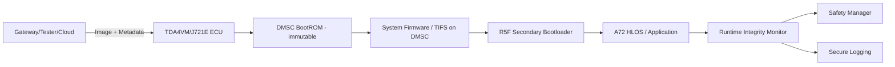
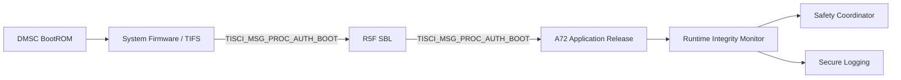
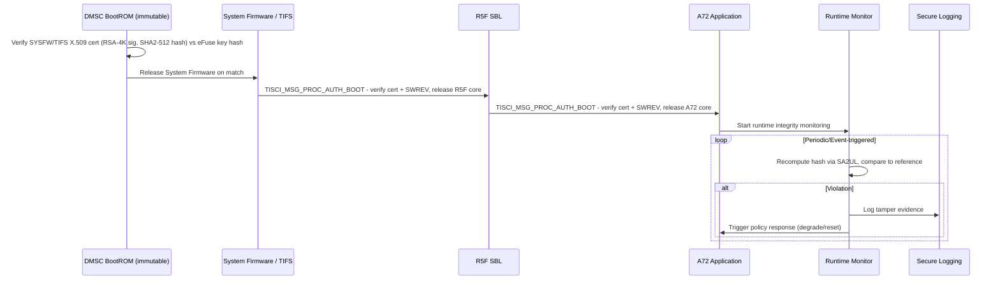

# Secure and Authentic Boot with Runtime Integrity Architecture Requirements - TDA4VM ADAS ECU

> Grounded in TI Jacinto 7 / TDA4VM (J721E) documentation: TISCI User Guide (System Firmware
> Authentication and Decryption Requests, Secure Debug User Guide, SoC-specific docs) and the
> TDA4VM product security feature list (secure boot, device attestation, hardware-enforced
> isolation). Where the public TI documentation does not name a mechanism explicitly, this is
> called out rather than invented.

## 1. System Static Architecture

### 1.1 System entities
- TDA4VM (J721E) ECU boot and runtime security domain
- Reprogramming/update source domain (gateway/tester/cloud)
- Safety manager and vehicle control domain
- Logging and backend forensic domain

### 1.2 Trust boundaries and interfaces
- Boundary A: External update domain to ECU activation boundary (candidate image handoff)
- Boundary B: DMSC immutable BootROM (hardware root of trust) to loaded/mutable firmware chain
- Boundary C: Runtime monitor (application core) to safety response boundary
- Boundary D: Security event export to backend forensic boundary

### 1.3 System-level requirement allocation
- CSR-1 to CSR-6
- FCR-1 to FCR-5
- TCR-1 to TCR-5

## 2. Hardware Static Architecture

### 2.1 Hardware elements (TDA4VM/J721E specific)
- DMSC (Device Management and Security Controller): a dedicated Cortex-M3 core that executes the
  immutable BootROM at power-on and subsequently hosts System Firmware (SYSFW, also referred to
  as TIFS in newer TI SDKs)
- Dual Cortex-A72 (HLOS: Linux/QNX), 6x Cortex-R5F (real-time/safety, incl. secondary bootloader)
- SA2UL: hardware crypto accelerator used for signature verification and hashing, access-controlled
  by firewalls configured through TISCI
- eFuse array: holds the hash of the customer root-of-trust public keys (SMPK/BMPK), plus the
  KEYREV and SWREV monotonic counters used for anti-rollback
- Flash/OSPI/eMMC for bootloader and application images
- JTAG/Sec-AP debug interface, gated by device security configuration (GP / HS-FS / HS-SE)

### 2.2 Hardware responsibility mapping
- DMSC BootROM is the immutable root of trust that starts every boot (CSR-3, FCR-3, TCR-1)
- eFuse-held SMPK/BMPK key hash anchors all signature verification; KEYREV selects which of the
  two customer keys is active (TCR-1, TCR-2)
- eFuse SWREV enforces monotonic anti-rollback policy, checked by System Firmware as part of
  certificate validation (TCR-3)
- SA2UL performs the SHA-2/RSA operations used for both boot-time authentication and runtime
  integrity hashing (TCR-4)

## 3. Software Static Architecture

### 3.1 Software blocks
- DMSC BootROM (immutable, authenticates System Firmware/TIFS image)
- System Firmware (SYSFW/TIFS) running on DMSC: exposes the TISCI service interface, including
  `TISCI_MSG_PROC_AUTH_BOOT` used to authenticate and release other processor cores
- R5F secondary bootloader (SBL), authenticated and released by System Firmware
- A72 HLOS bootloader/kernel (Linux/QNX), authenticated and released by the R5F SBL stage
- Runtime integrity monitor task (application core)
- Safety coordination interface and secure logging adapter

### 3.2 Software requirement allocation
- Each stage is authenticated before release using an X.509 certificate carrying an
  RSA-4K signature (RSASSA-PKCS1-v1_5) over a SHA2-512 payload hash, verified by System Firmware
  against the eFuse SMPK/BMPK key hash (FCR-1, TCR-1, TCR-2)
- Runtime re-checking is independent of boot-time verification and re-uses SA2UL hashing (FCR-4)
- Post-flash activation reuses the identical DMSC BootROM -> SYSFW -> SBL -> Application
  authentication sequence; there is no separate/shortcut activation path (CSR-5, TCR-5)

## 4. Dynamic / Behavioral Views

### 4.1 Secure boot and runtime integrity sequence

### 4.2 Behavioral requirement focus
- No bypass path: BootROM authentication of System Firmware runs on every power-on/reset with no
  disable option on HS-SE devices (CSR-1, CSR-4, CSR-5)
- Runtime detection continues after boot completion, independent of the boot-time chain (CSR-2, CSR-6)
- SWREV-based anti-rollback is checked at every stage of the chain, not only at flashing time (TCR-3)
- Boot/authentication failure handling (halt vs. logged/measured continuation) is a deliberate,
  documented policy choice per stage, not an assumed default (FCR-2)
