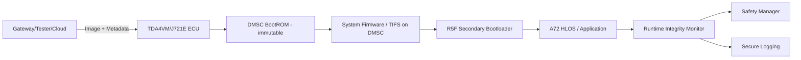
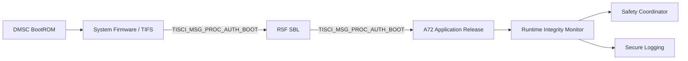
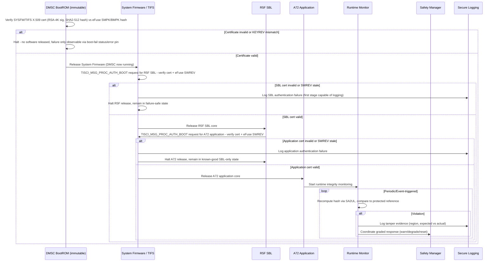

# Secure and Authentic Boot with Runtime Integrity Architecture Requirements - TDA4VM ADAS ECU

> Grounded in TI Jacinto 7 / TDA4VM (J721E) documentation: TISCI User Guide (System Firmware
> Authentication and Decryption Requests, Secure Debug User Guide, SoC-specific docs) and the
> TDA4VM product security feature list (secure boot, device attestation, hardware-enforced
> isolation). Where the public TI documentation does not name a mechanism explicitly, this is
> called out rather than invented.

## 1. Functional Security Concept

### 1.1 Cybersecurity Requirements (CSR)
- CSR-1: Verify integrity and authenticity of every boot-stage image before executing it.
- CSR-2: Detect tampering of running code/critical data after boot has already completed.
- CSR-3: Anchor verification in an immutable hardware root of trust, not a software-only check.
- CSR-4: Perform boot verification on every power-on/reset, independent of any prior flashing session.
- CSR-5: Gate post-reprogramming activation on the same trust chain used for ordinary power-on.
- CSR-6: Cover runtime integrity monitoring across power-on, post-reprogramming, and other operational scenarios.

### 1.2 Functional Security Concept (FSC)
- FSC-1: Root every verification decision in a hardware-anchored, immutable first step, then propagate trust forward one stage at a time.
- FSC-2: Treat boot-time verification and post-boot runtime verification as two distinct, complementary concepts rather than a single one-time gate.
- FSC-3: Apply the identical trust chain regardless of whether the system is powering on normally or resuming after reprogramming.

### 1.3 Functional Security Requirements (FSR)
- FSR-1: Each boot stage shall verify the authenticity and integrity of the next stage's image before transferring control to it.
- FSR-2: A verification failure at any boot stage shall be handled per that stage's defined strategy (halt/fallback for secure boot, measured-and-logged for authentic boot) rather than an ad hoc reaction.
- FSR-3: The first verification step in the chain shall execute from immutable, hardware-resident code that cannot be altered by any software update.
- FSR-4: Runtime integrity checks shall re-evaluate code/critical data after boot completes, independent of the boot-time result.
- FSR-5: Activation following reprogramming shall invoke the same verification chain used at ordinary power-on, with no reduced-check shortcut.
- FSR-6: Runtime monitoring shall remain active across power-on, post-reprogramming, and other operational scenarios without a coverage gap.

## 2. System Requirements and System Static Architecture

### 2.1 System entities
- TDA4VM (J721E) ECU boot and runtime security domain
- Reprogramming/update source domain (gateway/tester/cloud)
- Safety manager and vehicle control domain
- Logging and backend forensic domain

### 2.2 Trust boundaries and interfaces
- Boundary A: External update domain to ECU activation boundary (candidate image handoff)
- Boundary B: DMSC immutable BootROM (hardware root of trust) to loaded/mutable firmware chain
- Boundary C: Runtime monitor (application core) to safety response boundary
- Boundary D: Security event export to backend forensic boundary

### 2.3 System Requirements (SYSR)
- SYSR-1: The system shall ensure the update-source domain, ECU boot domain, safety domain, and logging domain each interact with the trust chain only at their defined boundary (A-D), never directly modifying boot-stage verification state.
- SYSR-2: System entities (Safety Manager, Logging domain) shall receive runtime integrity outcomes only through the Runtime Integrity Monitor's defined interface, not by inspecting boot-chain internals directly.
- SYSR-3: The System Static Architecture shall guarantee that the R5F SBL and A72 Application domains cannot be released except through the DMSC System Firmware authentication boundary (Boundary B).

## 3. Technical Security Concept

### 3.1 Technical Security Concept (TSC)
- TSC-1: Each boot stage cryptographically verifies the next stage before it executes (chain of trust).
- TSC-2: Boot failures halt/fall back (secure boot) or are measured and logged for deferred judgment (authentic boot) - the strategy is a deliberate choice, not interchangeable defaults.
- TSC-3: An immutable, hardware-anchored first-stage verifier initiates the entire chain.
- TSC-4: Runtime monitoring re-validates code integrity independent of and after boot-time checks.
- TSC-5: Post-flash activation reuses the same chain-of-trust verification as normal boot, not a shortcut.

### 3.2 Technical Security Requirements (TSR) - corrected against TI TISCI documentation
- TSR-1: The DMSC immutable BootROM authenticates the System Firmware/TIFS image via X.509 certificate (RSA-4K signature, SHA2-512 hash) and halts/recovers on failure.
- TSR-2: System Firmware (TIFS) authenticates the R5F SBL and A72 application images before releasing each core, via `TISCI_MSG_PROC_AUTH_BOOT`.
- TSR-3: The eFuse SWREV monotonic counter is checked as part of certificate validation at every stage of this same chain, not only at flashing time.
- TSR-4: Runtime integrity re-checking is built from SA2UL hashing plus protected NvM reference storage (architectural pattern consistent with TI's documented SA2UL/TISCI crypto services, not a separately named TI feature).
- TSR-5: Reprogramming's post-flash activation reset re-runs the identical DMSC BootROM -> System Firmware/TIFS -> R5F SBL chain - no separate path.

## 4. Hardware Requirements and Hardware Static Architecture

### 4.1 Hardware elements (TDA4VM/J721E specific)
- DMSC (Device Management and Security Controller): a dedicated Cortex-M3 core that executes the
  immutable BootROM at power-on and subsequently hosts System Firmware (SYSFW, also referred to
  as TIFS in newer TI SDKs)
- Dual Cortex-A72 (HLOS: Linux/QNX), 6x Cortex-R5F (real-time/safety, incl. secondary bootloader)
- SA2UL: hardware crypto accelerator used for signature verification and hashing, access-controlled
  by firewalls configured through TISCI
- eFuse array: holds the hash of the customer root-of-trust public keys (SMPK/BMPK), plus the
  KEYREV and SWREV monotonic counters used for anti-rollback
- Flash/OSPI/eMMC for bootloader and application images
- JTAG/Sec-AP debug interface, gated by device security configuration (GP / HS-FS / HS-SE)

### 4.2 Hardware Requirements (HWR)
- HWR-1: DMSC BootROM is the immutable root of trust that starts every boot (CSR-3, TSC-3, TSR-1)
- HWR-2: eFuse-held SMPK/BMPK key hash anchors all signature verification; KEYREV selects which of
  the two customer keys is active (TSR-1, TSR-2)
- HWR-3: eFuse SWREV enforces monotonic anti-rollback policy, checked by System Firmware as part of
  certificate validation (TSR-3)
- HWR-4: SA2UL performs the SHA-2/RSA operations used for both boot-time authentication and runtime
  integrity hashing (TSR-4)

## 5. Software Requirements and Software Static & Dynamic Architecture

### 5.1 Software blocks
- DMSC BootROM (immutable, authenticates System Firmware/TIFS image)
- System Firmware (SYSFW/TIFS) running on DMSC: exposes the TISCI service interface, including
  `TISCI_MSG_PROC_AUTH_BOOT` used to authenticate and release other processor cores
- R5F secondary bootloader (SBL), authenticated and released by System Firmware
- A72 HLOS bootloader/kernel (Linux/QNX), authenticated and released by the R5F SBL stage
- Runtime integrity monitor task (application core)
- Safety coordination interface and secure logging adapter

### 5.2 Software Requirements (SWR)
- SWR-1: Each stage is authenticated before release using an X.509 certificate carrying an
  RSA-4K signature (RSASSA-PKCS1-v1_5) over a SHA2-512 payload hash, verified by System Firmware
  against the eFuse SMPK/BMPK key hash (TSC-1, TSR-1, TSR-2)
- SWR-2: Runtime re-checking is independent of boot-time verification and re-uses SA2UL hashing (TSC-4)
- SWR-3: Post-flash activation reuses the identical DMSC BootROM -> SYSFW -> SBL -> Application
  authentication sequence; there is no separate/shortcut activation path (CSR-5, TSR-5)

### 5.3 Secure boot and runtime integrity sequence

### 5.4 Behavioral requirement focus
- No bypass path: BootROM authentication of System Firmware runs on every power-on/reset with no
  disable option on HS-SE devices (CSR-1, CSR-4, CSR-5)
- A BootROM-stage failure cannot be logged through the normal secure logging path since no software
  has been released yet; it is only observable as a boot-fail status/error indication, which is why
  System Firmware becomes the first stage capable of recording an authentication failure (TSC-2)
- Each stage's authentication failure halts release of the next core rather than falling through to
  a partially-initialized state - the chain fails closed, one stage at a time (CSR-1, TSC-1)
- Runtime detection continues after boot completion, independent of the boot-time chain (CSR-2, CSR-6)
- SWREV-based anti-rollback is checked at every stage of the chain, not only at flashing time (TSR-3)
- Boot/authentication failure handling (halt vs. logged/measured continuation) is a deliberate,
  documented policy choice per stage, not an assumed default (TSC-2)

## 6. Hardware-Software Interface (HSI)

### 6.1 HSI elements
- DMSC BootROM-to-eFuse register read interface (SMPK/BMPK hash, KEYREV, SWREV)
- `TISCI_MSG_PROC_AUTH_BOOT` message interface between System Firmware and R5F/A72 core-release control registers
- SA2UL hash/signature register interface used by the boot chain and the runtime integrity monitor

### 6.2 HSI Requirements (HSI)
- HSI-1: The eFuse SMPK/BMPK/KEYREV/SWREV register interface shall be readable only by DMSC BootROM and System Firmware, never directly mapped into A72/R5F address space.
- HSI-2: The `TISCI_MSG_PROC_AUTH_BOOT` interface shall be the sole software-visible mechanism to request release of the R5F SBL or A72 application core; no other register write shall bring a core out of reset.
- HSI-3: The SA2UL hashing register interface used by the Runtime Integrity Monitor shall report a distinguishable hardware-fault status separate from an integrity-mismatch status, so software can distinguish an accelerator failure from a real tamper detection.
