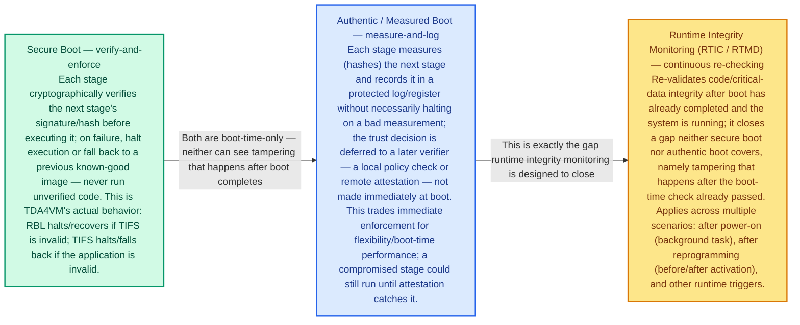
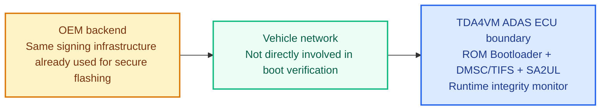
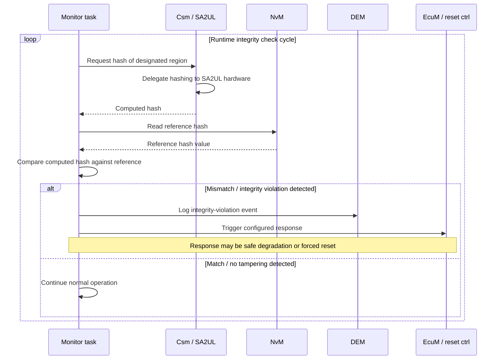
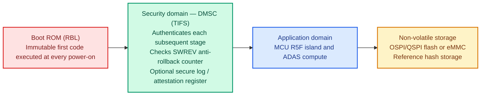
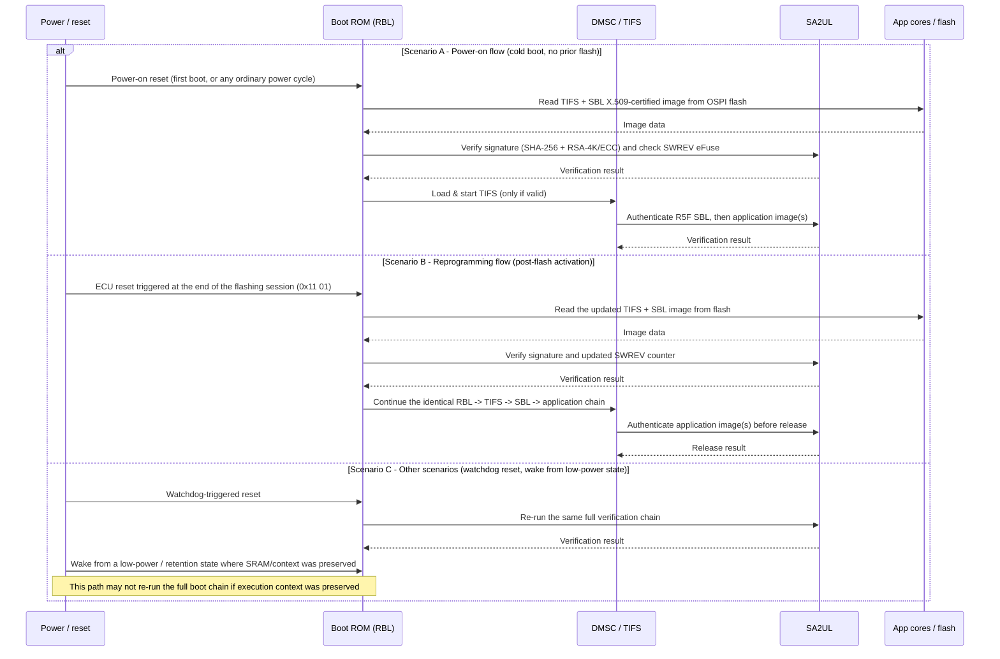

# Secure boot, authentic boot & runtime integrity — TDA4VM ADAS ECU

## Scope and terminology note

Scope and terminology note: this document covers three related but distinct controls — Secure Boot (verify-and-enforce), Authentic/Measured Boot (measure-and-log), and Runtime Integrity Monitoring (continuous re-checking after boot, referred to here as "RTIC/RTMD"). "RTMD" is not a term verifiable against TI's public documentation the way DMSC/TIFS/SA2UL were — it is treated here as the industry-standard Runtime Integrity Checking (RTIC) concept, built from TDA4VM's known primitives (SA2UL hashing, NvM storage), not as a confirmed named TI silicon feature. Please correct the term if your course defines it differently.

## 0. Conceptual primer: three different controls, three different jobs

Before the formal cybersecurity engineering flow, it helps to be clear on what each control actually does, since they're easy to conflate:

Secure Boot verifies each boot stage's signature/hash and halts or falls back immediately if verification fails. This is what TDA4VM actually implements (RBL -> TIFS -> SBL -> application).
Authentic (Measured) Boot verifies each stage too, but instead of halting on failure, it measures and records the result for a later verifier (local policy or remote attestation) to judge — trading immediate enforcement for flexibility.
Runtime Integrity Monitoring (RTIC) is not a boot-time control at all — it runs after boot has already completed, periodically re-checking that code/critical data hasn't been tampered with while the system was running. Neither of the other two controls can see this class of tampering, because they only run once, at boot.

## 1. Cybersecurity engineering flow

```mermaid
flowchart LR
  Goal["Cybersecurity Goal (from TARA)<br/>Prevent execution of unauthorized or tampered code on the ADAS ECU at any point in its operational lifecycle — at power-on, immediately after reprogramming, and continuously during runtime — since compromised code could cause unsafe ADAS behavior"]
  Req["Cybersecurity Requirements (item level)<br/>CSR-1: Verify integrity + authenticity of every boot-stage image before executing it<br/>CSR-2: Detect tampering of running code/critical data after boot has already completed<br/>CSR-3: Anchor verification in an immutable hardware root of trust, not a software-only check<br/>CSR-4: Perform boot verification on every power-on/reset, independent of any prior flash session<br/>CSR-5: Gate post-reprogramming activation on the same trust chain as ordinary power-on<br/>CSR-6: Cover runtime integrity monitoring across power-on, post-reprogramming, and other scenarios"]
  FCR["Functional Cybersecurity Concept & Requirements (solution-independent)<br/>FCR-1: Each boot stage cryptographically verifies the next stage before it executes (chain of trust)<br/>FCR-2: Boot failures halt/fall back (secure boot) or are measured and logged for deferred judgment (authentic boot)<br/>FCR-3: An immutable, hardware-anchored first-stage verifier initiates the entire chain<br/>FCR-4: Runtime monitoring re-validates code integrity independent of and after boot-time checks<br/>FCR-5: Post-flash activation reuses the same chain-of-trust verification as normal boot, not a shortcut"]
  TCR["Technical Cybersecurity Concept & Requirements (TDA4VM-specific)<br/>TCR-1: RBL (ROM, immutable) authenticates TIFS — halt/recover on failure (secure boot model, not measured)<br/>TCR-2: TIFS authenticates R5F SBL and application images before release — same halt/fallback model<br/>TCR-3: SWREV eFuse anti-rollback checked as part of this same chain, at every stage<br/>TCR-4: Runtime integrity re-checking built from SA2UL hashing + NvM reference storage (architectural pattern, not a confirmed named TI feature)<br/>TCR-5: Reprogramming's post-flash reset re-runs the identical RBL -> TIFS -> SBL chain — no separate path"]
  Arch["System / Hardware Cybersecurity Architecture (static & dynamic)<br/>Allocates TCR-1..5 mainly to ROM/firmware and hardware — boot verification happens below the application/AUTOSAR layer; runtime monitoring is the one part with a software-scheduled component"]

  Goal -->|Decomposed into concrete, testable requirements| Req
  Req -->|Split into abstract and solution-specific layers| FCR
  FCR -->|Technical concept is what gets architected and allocated| TCR
  TCR -->|Architecture is where requirements become components and interactions| Arch

  classDef goal fill:#FEF3C7,stroke:#D97706,color:#78350F,stroke-width:2px;
  classDef req fill:#FCE7F3,stroke:#DB2777,color:#9D174D,stroke-width:2px;
  classDef fcr fill:#DBEAFE,stroke:#2563EB,color:#1E3A8A,stroke-width:2px;
  classDef tcr fill:#EDE9FE,stroke:#7C3AED,color:#4C1D95,stroke-width:2px;
  classDef arch fill:#D1FAE5,stroke:#059669,color:#064E3B,stroke-width:2px;
  class Goal goal;
  class Req req;
  class FCR fcr;
  class TCR tcr;
  class Arch arch;
```

## 2. Cybersecurity Goal

Prevent execution of unauthorized or tampered code on the ADAS ECU at any point in its operational lifecycle — at power-on, immediately after reprogramming, and continuously during runtime — since compromised perception/planning code could cause unsafe ADAS behavior. This goal spans a wider time horizon than secure flashing alone: flashing protects the moment an image is installed, this goal protects every moment the ECU is powered.

## 3. Cybersecurity Requirements (item level)

CSR-1: Verify integrity and authenticity of every boot-stage image before executing it.
CSR-2: Detect tampering of running code/critical data after boot has already completed.
CSR-3: Anchor verification in an immutable hardware root of trust, not a software-only check.
CSR-4: Perform boot verification on every power-on/reset, independent of any prior flashing session.
CSR-5: Gate post-reprogramming activation on the same trust chain used for ordinary power-on.
CSR-6: Cover runtime integrity monitoring across power-on, post-reprogramming, and other operational scenarios.

## 4. Cybersecurity Concept

### 4.1 Functional Cybersecurity Concept & Requirements

FCR-1: Each boot stage cryptographically verifies the next stage before it executes (chain of trust).
FCR-2: Boot failures halt/fall back (secure boot) or are measured and logged for deferred judgment (authentic boot) — the strategy is a deliberate choice, not interchangeable defaults.
FCR-3: An immutable, hardware-anchored first-stage verifier initiates the entire chain.
FCR-4: Runtime monitoring re-validates code integrity independent of and after boot-time checks.
FCR-5: Post-flash activation reuses the same chain-of-trust verification as normal boot, not a shortcut.

### 4.2 Technical Cybersecurity Concept & Requirements (TDA4VM-specific)

TCR-1: RBL (ROM, immutable) authenticates TIFS and halts/recover on failure.
TCR-2: TIFS authenticates R5F SBL and application images before release.
TCR-3: SWREV eFuse anti-rollback checked as part of this same chain, at every stage.
TCR-4: Runtime integrity re-checking built from SA2UL hashing + NvM reference storage (architectural pattern, not a confirmed named TI feature).
TCR-5: Reprogramming's post-flash reset re-runs the identical RBL -> TIFS -> SBL chain — no separate path.

## 5. System Cybersecurity Architecture

This topic is almost entirely on-chip: unlike secure flashing or diagnostics, no tester or vehicle-network interaction is involved in boot verification itself — it completes before any diagnostic session is even possible. The OEM backend's role is limited to having already signed the images (the same signing infrastructure covered in the secure flashing document); there is no separate system-level dynamic flow to diagram here beyond that reuse.

## 6. SW Requirements & HW Requirements (allocated)

### 6.1 Software requirements

A runtime monitor task shall be scheduled (periodically and/or on wake-from-low-power) to re-check the integrity of designated code/critical-data regions.
The monitor shall not perform its own cryptographic operations directly — hashing shall be delegated to SA2UL, consistent with the delegation pattern used for flashing and diagnostics.
The response to a detected integrity violation shall be a configured policy decision (safe degradation vs. forced reset), coordinated with the safety concept — not a default hard-coded action.

### 6.2 Hardware requirements

The ROM Bootloader shall authenticate TIFS via X.509 signature on every power-on cycle, with no bypass path on HS-SE devices.
TIFS shall authenticate each subsequent boot stage (SBL, application images) before releasing the corresponding core, and shall check the SWREV anti-rollback counter at each stage.
SA2UL shall support both boot-time signature verification and lightweight runtime hash computation using the same hardware engine.
No reset source (power-on, watchdog, software-triggered) shall bypass the boot verification chain; only a preserved-context low-power wake may not trigger a full re-verification, and this must be explicitly confirmed per low-power mode.

## 7. Software Architecture

As with the JTAG/debug topic, there is limited application-software architecture for secure/authentic boot itself — that verification happens in ROM/TIFS, below the AUTOSAR layer. The one genuine software-architecture component this topic introduces is the runtime integrity monitor, covered below.

Note the asymmetry deliberately built into this flow: the monitor performs a cheap hash comparison against an already-established reference, not a full signature re-verification. That's not a shortcut — it's correct given what's actually needed here (see Section 8.2). It's also why the response to a violation is a policy decision rather than an automatic hard halt: unlike a boot-time failure (where nothing is running yet, so halting is safe), a runtime violation means an ADAS function is already active, and abruptly stopping it can itself create a safety hazard. This is a genuine security/safety trade-off, not a purely security-driven choice.

## 8. Hardware Architecture

### 8.1 Hardware static architecture

### 8.2 Hardware dynamic architecture: three scenarios

Figure 5 — Hardware dynamic architecture across power-on, reprogramming, and other scenarios

Scenario A and Scenario B are architecturally identical — the second is not a special case of the first, it IS the first, triggered by a different event. This is deliberate: giving reprogramming a distinct, possibly weaker verification path would be a real vulnerability, since it would mean the one moment attackers most want to compromise (right after a flash) is checked less rigorously than every other boot.

Scenario C is where this document earns its keep beyond restating the flashing document's boot chain: a watchdog reset behaves identically to any other reset (full re-verification, no exceptions) — but a wake from a low-power/retention state, where execution context was preserved rather than fully reset, may not re-run the boot chain at all. That gap is not a flaw to be silently accepted or a reason to distrust the architecture — it's the specific, concrete reason Section 7's runtime integrity monitoring exists as a separate control rather than being redundant with secure boot.