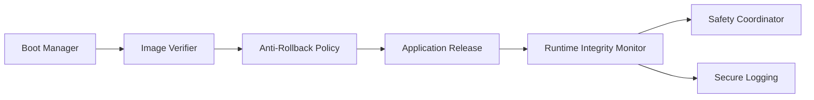
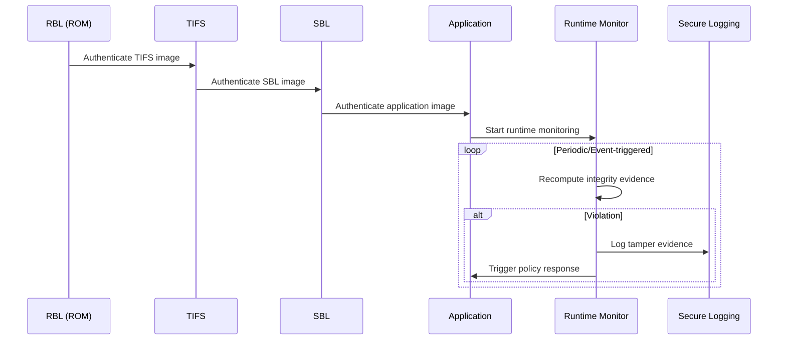

# Secure and Authentic Boot with Runtime Integrity Architecture Requirements - TDA4VM ADAS ECU

## 1. System Static Architecture

### 1.1 System entities
- TDA4VM ECU boot and runtime security domain
- Reprogramming/update source domain (gateway/tester/cloud)
- Safety manager and vehicle control domain
- Logging and backend forensic domain

### 1.2 Trust boundaries and interfaces
- Boundary A: External update domain to ECU activation boundary
- Boundary B: Boot ROM immutable trust anchor to mutable firmware chain
- Boundary C: Runtime monitor to safety response boundary
- Boundary D: Security event export to backend forensic boundary

```mermaid
graph LR
  Upd[Gateway/Tester/Cloud] -->|Image + Metadata| ECU[TDA4VM ECU]
  ECU --> RBL[Boot ROM (RBL)] --> TIFS[TIFS] --> SBL[SBL] --> APP[Application]
  APP --> RT[Runtime Integrity Monitor]
  RT --> SAFE[Safety Manager]
  RT --> LOG[Secure Logging]
```

### 1.3 System-level requirement allocation
- CSR-1 to CSR-6
- FCR-1 to FCR-5
- TCR-1 to TCR-5

## 2. Hardware Static Architecture

### 2.1 Hardware elements
- Boot ROM (immutable root verifier)
- SA2UL/HSM-assisted crypto engine
- eFuse/SWREV monotonic anti-rollback anchor
- Flash partitions for bootloader/application images
- Reset/watchdog/peripheral status sources
- JTAG/debug interface with lifecycle policy constraints

### 2.2 Hardware responsibility mapping
- Immutable root-of-trust originates verification (CSR-3, FCR-3, TCR-1)
- Anti-rollback enforces monotonic policy (TCR-3)
- Runtime integrity hashing uses hardware crypto path (TCR-4)

## 3. Software Static Architecture

### 3.1 Software blocks
- Boot manager and stage verifiers (TIFS/SBL)
- Image authentication and anti-rollback policy checks
- Runtime integrity monitor task
- Safety coordination interface
- Secure logging adapter
- Reprogramming activation controller



### 3.2 Software requirement allocation
- Boot chain verifies every stage before execution (FCR-1, TCR-1, TCR-2)
- Runtime re-checking is independent of boot-time verification (FCR-4)
- Post-flash activation reuses identical trust chain (CSR-5, TCR-5)

## 4. Dynamic / Behavioral Views

### 4.1 Secure boot and runtime integrity sequence



### 4.2 Behavioral requirement focus
- No bypass path: every reset or activation follows chain of trust (CSR-1, CSR-4, CSR-5)
- Runtime detection continues after boot completion (CSR-2, CSR-6)
- Boot failure handling and event logging follow explicit policy (FCR-2)
