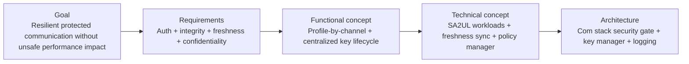
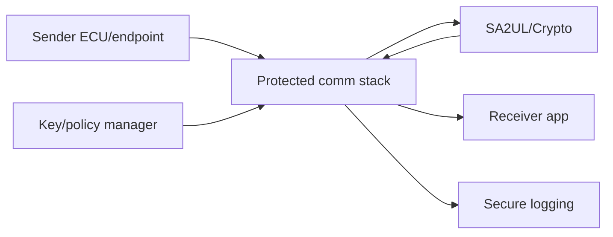
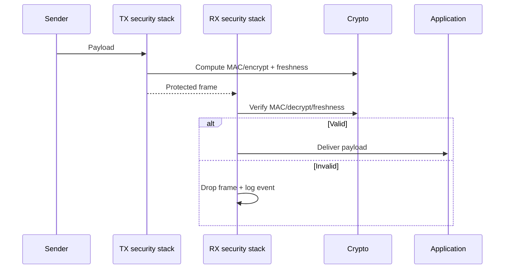
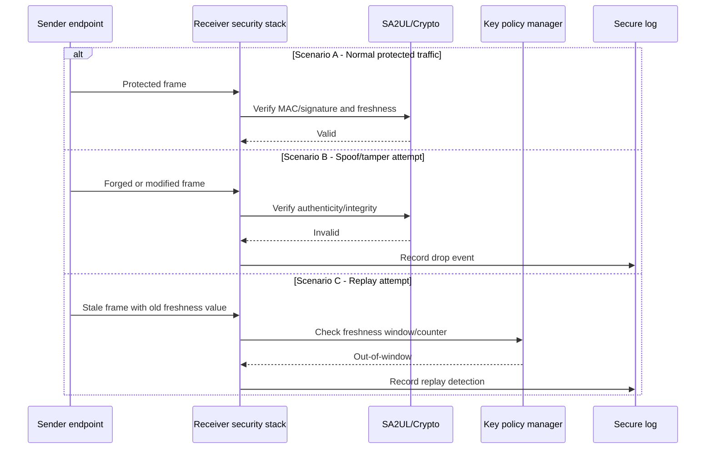

# Secure Communication — TDA4VM ADAS ECU

## Scope and terminology note

This document defines requirement traceability for protected communication on a TDA4VM-based ADAS ECU across in-vehicle and off-board links.

## 0. Conceptual primer

Communication protection is not one mechanism for all links. In-vehicle control traffic and IP/off-board traffic often require different protocol profiles, but both require authentication, integrity, freshness, and policy-driven key lifecycle.

## 1. Cybersecurity engineering flow

## 2. Cybersecurity Goal

Protect communication channels against spoofing, tampering, replay, and unauthorized disclosure while maintaining required timing for ADAS operation.

## 3. Cybersecurity Requirements (item level)

CSR-COM-1: Critical messages shall include source authentication and integrity protection.
CSR-COM-2: Sensitive payloads shall use confidentiality-protected channels.
CSR-COM-3: Freshness/anti-replay checks shall be enforced on protected flows.
CSR-COM-4: Invalid security metadata shall result in fail-closed behavior for critical paths.
CSR-COM-5: Key lifecycle controls shall support rotation/revocation without policy gaps.

## 4. Cybersecurity Concept

### 4.1 Functional Cybersecurity Concept & Requirements

FCR-COM-1: Apply protocol-appropriate protection profile per channel.
FCR-COM-2: Enforce receiver-side verification before handing data to application logic.
FCR-COM-3: Centralize key provisioning, rotation, and revocation policy.
FCR-COM-4: Provide security violation telemetry for operations and forensics.

### 4.2 Technical Cybersecurity Concept & Requirements (TDA4VM-oriented)

TCR-COM-1: Use SA2UL-assisted crypto for MAC/signature/encryption operations.
TCR-COM-2: Bind trust decisions to lifecycle state and key state policy.
TCR-COM-3: Implement synchronized freshness counters/nonces across peers.
TCR-COM-4: Integrate drop/deny outcomes with secure logging.

## 5. System Cybersecurity Architecture

## 6. SW Requirements & HW Requirements (allocated)

### 6.1 Software requirements

SWR-COM-1: Receiver stack shall reject messages with invalid MAC/signature/freshness.
SWR-COM-2: Key state transitions shall be coordinated with policy and session management.
SWR-COM-3: Security violations shall generate auditable events.
SWR-COM-4: Protection configuration shall be deterministic per communication channel class.

### 6.2 Hardware requirements

HWR-COM-1: Crypto hardware path shall meet throughput/latency targets for enabled protections.
HWR-COM-2: Hardware key-protection primitives shall support protected key handling.

## 7. Software Architecture

## 8. Hardware Architecture and scenarios

### 8.1 Hardware dynamic sequence diagram

- Scenario A: Normal protected flow; valid authenticated frames delivered.
- Scenario B: Spoof/tamper frame; rejected before application delivery.
- Scenario C: Replay of stale frame; freshness logic rejects and logs event.

## 9. Verification focus

- Spoofing test: Forged sender identity must be rejected.
- Replay test: Old valid frame must fail freshness check.
- Performance test: Security-enabled channels must meet timing constraints.
