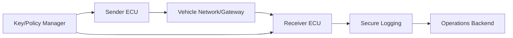
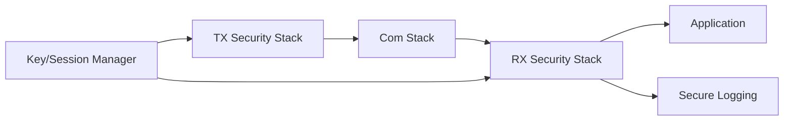
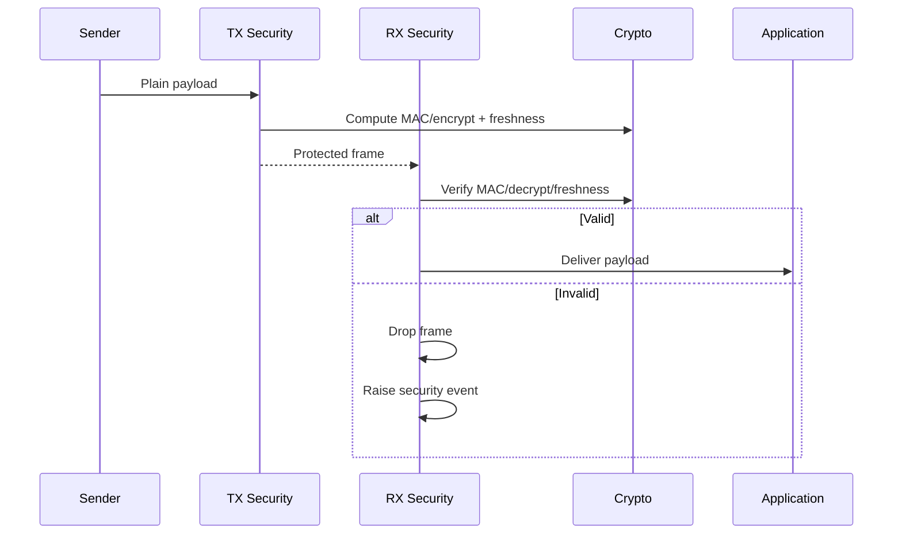

# Secure Communication Architecture Requirements - TDA4VM ADAS ECU

## 1. System Static Architecture

### 1.1 System entities
- Sender ECU/endpoint
- Receiver ECU/application endpoint
- Vehicle gateway/network backbone
- Off-board cloud/service endpoint
- Key and policy management authority

### 1.2 Trust boundaries and interfaces
- Boundary A: Sender trust domain to network transport domain
- Boundary B: Network domain to receiver verification domain
- Boundary C: ECU to key-management/policy domain
- Boundary D: Security event export to logging/operations backend

### 1.3 System-level requirement allocation
- CSR-COM-1 to CSR-COM-5
- FCR-COM-1 to FCR-COM-4
- TCR-COM-1 to TCR-COM-4

## 2. Hardware Static Architecture

### 2.1 Hardware elements
- TDA4VM (J721E) communication and control domains: Cortex-A72/R5F application cores, DMSC (System Firmware/TIFS)
- SA2UL crypto accelerator for MAC/signature/encryption
- eFuse-anchored key material handled via System Firmware provisioning services
- CAN/Ethernet and related communication peripherals
- DMSC BootROM/device security type constrains which trust policy is enforceable

### 2.2 Hardware responsibility mapping
- HWR-COM-1: Throughput/latency supports enabled protections
- HWR-COM-2: Key material handling uses protected hardware path
- TCR-COM-1: Crypto-heavy operations offloaded to SA2UL path

## 3. Software Static Architecture

### 3.1 Software blocks
- TX security wrapper
- RX security verifier
- Freshness manager (counter/nonce sync)
- Key and session state manager
- Communication policy engine
- Secure logging connector

### 3.2 Software requirement allocation
- SWR-COM-1: Reject invalid MAC/signature/freshness
- SWR-COM-2: Coordinate key transitions with sessions/policy
- SWR-COM-3: Emit auditable security violations
- SWR-COM-4: Deterministic channel-class protection configuration

## 4. Dynamic / Behavioral Views

### 4.1 Protected communication flow

### 4.2 Behavioral requirement focus
- Authentication/integrity is mandatory for critical messages (CSR-COM-1)
- Freshness checks prevent replay acceptance (CSR-COM-3, TCR-COM-3)
- Invalid metadata causes fail-closed behavior (CSR-COM-4, SWR-COM-1)
