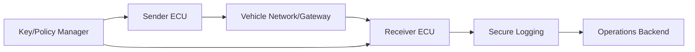
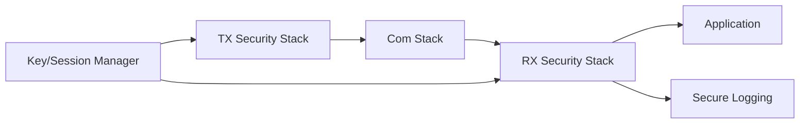
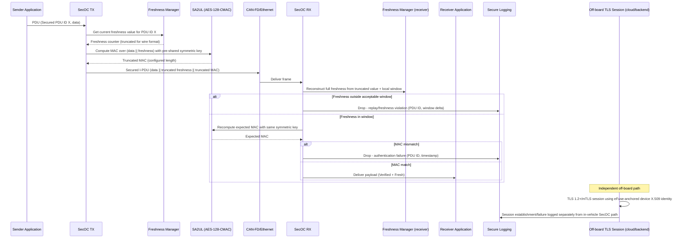

# Secure Communication Architecture Requirements - TDA4VM ADAS ECU

## 1. System Static Architecture

### 1.1 System entities
- Sender ECU/endpoint
- Receiver ECU/application endpoint
- Vehicle gateway/network backbone
- Off-board cloud/service endpoint
- Key and policy management authority

### 1.2 Trust boundaries and interfaces
- Boundary A: Sender trust domain to network transport domain
- Boundary B: Network domain to receiver verification domain
- Boundary C: ECU to key-management/policy domain
- Boundary D: Security event export to logging/operations backend

### 1.3 System-level requirement allocation

**Cybersecurity Requirements (CSR)**
- CSR-COM-1: Critical messages shall include source authentication and integrity protection.
- CSR-COM-2: Sensitive payloads shall use confidentiality-protected channels.
- CSR-COM-3: Freshness/anti-replay checks shall be enforced on protected flows.
- CSR-COM-4: Invalid security metadata shall result in fail-closed behavior for critical paths.
- CSR-COM-5: Key lifecycle controls shall support rotation/revocation without policy gaps.

**Functional Security Concept (FSC)**
- FSC-COM-1: Protect messages using a combination tailored to their exposure - authenticity/integrity for control-relevant traffic, confidentiality additionally for sensitive payloads.
- FSC-COM-2: Treat freshness/replay protection as mandatory alongside authenticity, since a valid-but-replayed message is still an attack.
- FSC-COM-3: Fail closed on any security-metadata anomaly for critical flows rather than degrading silently to unauthenticated behavior.

**Functional Security Requirements (FSR)**
- FSR-COM-1: A critical message shall be rejected by the receiver if its source cannot be authenticated or its integrity cannot be verified.
- FSR-COM-2: A sensitive payload shall only be transmitted over a channel providing confidentiality protection appropriate to its classification.
- FSR-COM-3: Each protected message shall carry a freshness indicator checked independently of its authenticity tag, and stale or reused values shall be rejected.
- FSR-COM-4: Invalid or missing security metadata on a critical flow shall result in the message being discarded, never processed with reduced trust.
- FSR-COM-5: Key rotation or revocation shall take effect without a window in which both old and new keys are simultaneously accepted beyond a defined transition policy.

**Functional Cybersecurity Concept (FCR)**
- FCR-COM-1: Apply protocol-appropriate protection profile per channel.
- FCR-COM-2: Enforce receiver-side verification before handing data to application logic.
- FCR-COM-3: Centralize key provisioning, rotation, and revocation policy.
- FCR-COM-4: Provide security violation telemetry for operations and forensics.

**Technical Cybersecurity Concept (TCR)**
- TCR-COM-1: Use SA2UL-assisted crypto for MAC/signature/encryption operations.
- TCR-COM-2: Bind trust decisions to lifecycle state and key state policy.
- TCR-COM-3: Implement synchronized freshness counters/nonces across peers.
- TCR-COM-4: Integrate drop/deny outcomes with secure logging.

## 2. Hardware Static Architecture

### 2.1 Hardware elements
- TDA4VM (J721E) communication and control domains: Cortex-A72/R5F application cores, DMSC (System Firmware/TIFS)
- SA2UL crypto accelerator for MAC/signature/encryption
- eFuse-anchored key material handled via System Firmware provisioning services
- CAN/Ethernet and related communication peripherals
- DMSC BootROM/device security type constrains which trust policy is enforceable

### 2.2 Hardware responsibility mapping
- HWR-COM-1: Throughput/latency supports enabled protections
- HWR-COM-2: Key material handling uses protected hardware path
- HWR-COM-3: SA2UL provides the hardware crypto path for MAC/signature/encryption operations (TCR-COM-1)

## 3. Software Static Architecture

### 3.1 Software blocks
- TX security wrapper
- RX security verifier
- Freshness manager (counter/nonce sync)
- Key and session state manager
- Communication policy engine
- Secure logging connector

### 3.2 Software requirement allocation
- SWR-COM-1: Reject invalid MAC/signature/freshness
- SWR-COM-2: Coordinate key transitions with sessions/policy
- SWR-COM-3: Emit auditable security violations
- SWR-COM-4: Deterministic channel-class protection configuration

## 4. Dynamic / Behavioral Views

### 4.1 Protected in-vehicle communication flow (AUTOSAR SecOC-style) and off-board channel

### 4.2 Behavioral requirement focus
- In-vehicle protection uses SecOC-style authentication: a truncated freshness value plus an AES-128-CMAC-class MAC (SA2UL-assisted) appended to the payload, not a bare checksum (CSR-COM-1, TCR-COM-1)
- Freshness is checked independently of the MAC - a frame with a valid MAC but out-of-window freshness is still dropped as a replay (CSR-COM-3, TCR-COM-3)
- Any verification failure (freshness or MAC) is fail-closed: the frame is dropped before reaching the receiver application, and a security event is raised rather than silently accepted (CSR-COM-4, SWR-COM-1)
- Off-board (cloud/backend) sessions use a separate TLS/mTLS trust path anchored to the device's eFuse-derived identity, independent from the in-vehicle bus-level MAC/freshness scheme (CSR-COM-2, TCR-COM-2)
- Repeated verification failures on the same Secured PDU ID are correlated across the RTMD/logging boundary for escalation, not treated as isolated drops (CSR-COM-5, TCR-COM-4)
