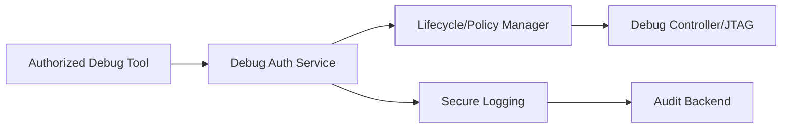
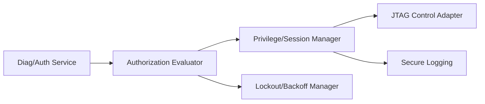
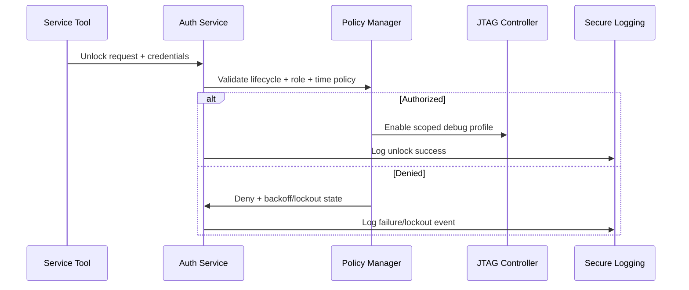

# Secure JTAG and Debug Control Architecture Requirements - TDA4VM ADAS ECU

## 1. System Static Architecture

### 1.1 System entities
- Authorized service/debug tool
- Vehicle gateway or direct service interface
- TDA4VM debug authorization manager
- Device lifecycle/policy authority
- Secure logging and backend audit systems

### 1.2 Trust boundaries and interfaces
- Boundary A: Tool domain to ECU authorization interface
- Boundary B: Authorization manager to hardware debug controller
- Boundary C: Lifecycle/policy domain to runtime unlock decisions
- Boundary D: Debug state transitions to secure logging domain

### 1.3 System-level requirement allocation
- CSR-JTAG-1 to CSR-JTAG-5
- FCR-JTAG-1 to FCR-JTAG-4
- TCR-JTAG-1 to TCR-JTAG-4

## 2. Hardware Static Architecture

### 2.1 Hardware elements
- MCU main processing domain
- Debug/JTAG controller and TAP interface
- Boot ROM and lifecycle-state anchors
- HSM/secure policy enforcement block
- Non-volatile policy/configuration storage

### 2.2 Hardware responsibility mapping
- HWR-JTAG-1: Lifecycle state enforces production debug lock
- HWR-JTAG-2: Debug transitions are policy-gated
- HWR-JTAG-3: Reset defaults to locked/non-invasive mode

## 3. Software Static Architecture

### 3.1 Software blocks
- Diagnostic authentication workflow
- Debug authorization policy evaluator
- Privilege/session scope manager
- Lockout/backoff and retry counter manager
- Secure logging interface for debug events

### 3.2 Software requirement allocation
- SWR-JTAG-1: No raw JTAG enable in normal sessions
- SWR-JTAG-2: Validate credentials/role/expiry before grant
- SWR-JTAG-3: Revoke privileges on timeout/reset
- SWR-JTAG-4: Log unlock, failure, lockout, revoke events

## 4. Dynamic / Behavioral Views

### 4.1 Secure debug unlock sequence

### 4.2 Behavioral requirement focus
- Locked-by-default production posture is always enforced (CSR-JTAG-2, FCR-JTAG-1)
- Authentication and authorization are separate decisions (FCR-JTAG-2)
- Re-authentication and revocation occur on reset/timeout/escalation (FCR-JTAG-4, SWR-JTAG-3)
