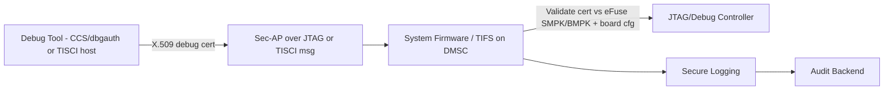
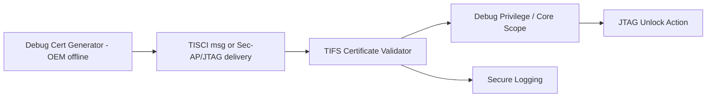
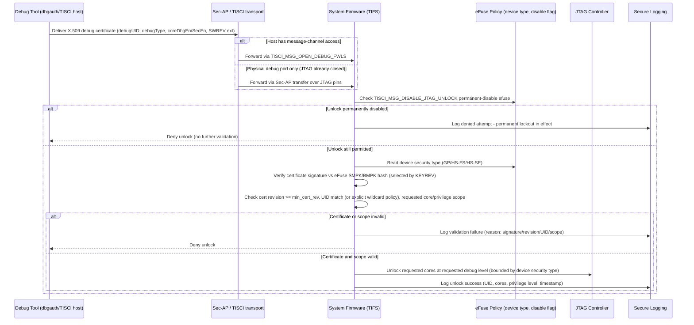

# Secure JTAG and Debug Control Architecture Requirements - TDA4VM ADAS ECU

> Grounded in the TI TISCI "Secure Debug User Guide" for K3 devices (which includes TDA4VM/J721E).
> Key facts used below: JTAG default state depends on device security type (GP / HS-FS / HS-SE),
> unlock requires a distinct X.509 debug certificate (not the boot certificate) validated by
> System Firmware, and unlock can be delivered either via a TISCI message or via the Secure Access
> Point (Sec-AP) over the JTAG pins itself.

## 1. Functional Security Concept

### 1.1 Cybersecurity Requirements (CSR)
- CSR-JTAG-1: Debug unlock shall require cryptographic authorization, not static passwords.
- CSR-JTAG-2: Production lifecycle state shall keep JTAG closed by default per device security type - HS-SE closes all cores by default; HS-FS closes only the M3/DMSC core by default and relies on OEM board configuration/provisioning to lock the remaining cores.
- CSR-JTAG-3: Debug unlock attempts and debug state transitions shall be logged with integrity protection.
- CSR-JTAG-4: Debug privileges shall be bounded by explicit per-certificate core scope and privilege level.
- CSR-JTAG-5: Debug certificates shall enforce a minimum certificate revision (`min_cert_rev`) to prevent replay of older unlock certificates.

### 1.2 Functional Security Concept (FSC)
- FSC-JTAG-1: Require cryptographic proof of authorization for any debug capability, replacing static or shared secrets entirely.
- FSC-JTAG-2: Default to closed debug access in production, opening only the minimum scope and privilege actually requested and justified.
- FSC-JTAG-3: Make every debug-state transition an auditable, integrity-protected event.

### 1.3 Functional Security Requirements (FSR)
- FSR-JTAG-1: A debug session shall not be granted unless a valid, cryptographically verifiable authorization credential is presented for that request.
- FSR-JTAG-2: In production lifecycle state, debug interfaces shall remain closed until explicitly and validly unlocked, consistent with the device's configured security posture.
- FSR-JTAG-3: A debug credential shall grant access only to the specific cores and privilege level it explicitly encodes, never a broader scope.
- FSR-JTAG-4: Debug unlock attempts, successes, failures, and resulting state changes shall be recorded with integrity protection.
- FSR-JTAG-5: A debug credential older than the currently enforced minimum revision shall be rejected, preventing reuse of a superseded authorization.

## 2. System Requirements and System Static Architecture

### 2.1 System entities
- Authorized service/debug tool (e.g., CCS with `dbgauth`, or a TISCI-capable host)
- Vehicle gateway or direct service interface
- TDA4VM System Firmware (SYSFW/TIFS running on DMSC) acting as debug authorization authority
- Device security configuration (efuse-programmed GP / HS-FS / HS-SE type, board configuration)
- Secure logging and backend audit systems

### 2.2 Trust boundaries and interfaces
- Boundary A: Debug tool to Secure Access Point (Sec-AP) or TISCI message interface
- Boundary B: System Firmware certificate validation to physical JTAG unlock action
- Boundary C: eFuse/board-configuration policy to runtime unlock decision (`allow_jtag_unlock`,
  `allow_wildcard_unlock`, `min_cert_rev`, `jtag_unlock_hosts`)
- Boundary D: Debug state transitions to secure logging domain

### 2.3 System Requirements (SYSR)
- SYSR-JTAG-1: The debug tool domain shall interact with System Firmware only via the Sec-AP or TISCI message boundary (Boundary A), never via a direct, unauthenticated JTAG register path.
- SYSR-JTAG-2: The eFuse/board-configuration policy domain (Boundary C) shall be the single system-wide source of `allow_jtag_unlock`/`allow_wildcard_unlock`/`min_cert_rev`/`jtag_unlock_hosts`, consumed identically regardless of delivery path (message vs Sec-AP).
- SYSR-JTAG-3: Debug state transitions crossing Boundary D into secure logging shall be delivered even when the unlock request itself is denied.

## 3. Technical Security Concept

### 3.1 Technical Security Concept (TSC)
- TSC-JTAG-1: Enforce closed-by-default debug posture per device security type in production (see HS-FS/HS-SE table in Section 4.2).
- TSC-JTAG-2: Separate certificate signature/UID validation (authentication) from the encoded debug privilege level and core scope (authorization).
- TSC-JTAG-3: Apply least-privilege debug profiles by encoding only the required cores/privilege level (`coreDbgEn`, `coreDbgSecEn`, `debugType`) per certificate.
- TSC-JTAG-4: Prohibit wildcard UID unlock (`allow_wildcard_unlock`) with production signing keys; permit it only for lab/development use.

### 3.2 Technical Security Requirements (TSR) - corrected against TI TISCI Secure Debug User Guide
- TSR-JTAG-1: Use the device security type (GP/HS-FS/HS-SE) and System Firmware (TIFS) certificate validation to govern debug access, not a generic "lifecycle policy".
- TSR-JTAG-2: Keep debug-unlock signing keys (SMPK/BMPK) in the OEM's offline root-of-trust key management, never in application plaintext.
- TSR-JTAG-3: Route unlock events, validation failures, and `TISCI_MSG_DISABLE_JTAG_UNLOCK` permanent-lockout actions into secure logging.
- TSR-JTAG-4: The M3/DMSC JTAG path can never be opened by software on HS-FS or HS-SE devices, regardless of reset path.

## 4. Hardware Requirements and Hardware Static Architecture

### 4.1 Hardware elements
- JTAG TAP and Secure Access Point (Sec-AP): allows reading/writing System Firmware even while
  the JTAG port itself is locked
- DMSC (Cortex-M3 running System Firmware/TIFS), which owns the debug-unlock decision
- eFuse array: device security type (GP/HS-FS/HS-SE), SMPK/BMPK key hash, JTAG permanently-disabled
  flag (set via `TISCI_MSG_DISABLE_JTAG_UNLOCK`)
- Core-level debug gating for A72/R5F/DSP cores, independent from the M3/DMSC debug gate

### 4.2 Hardware Requirements (HWR)
- Default JTAG state is defined per device security type, not a single fixed default:

| Device type | M3/DMSC JTAG | Other core JTAG |
|---|---|---|
| General Purpose (GP) | Open | Open |
| HS - Field Securable (HS-FS) | Closed | Open |
| HS - Security Enforced (HS-SE) | Closed | Closed |

  (HWR-JTAG-1, HWR-JTAG-3 — corrected: only HS-SE is closed-by-default for all cores; HS-FS
  leaves non-M3 cores open until the customer's own policy locks them down)
- The M3/DMSC JTAG path can never be opened by software on HS-FS or HS-SE devices (HWR-JTAG-2)
- JTAG unlock can be permanently and irreversibly disabled by blowing an efuse via
  `TISCI_MSG_DISABLE_JTAG_UNLOCK` (production end-of-life debug lockout)

## 5. Software Requirements and Software Static & Dynamic Architecture

### 5.1 Software blocks
- Debug certificate generator (offline, OEM-side): builds an X.509 certificate with the
  System Firmware Debug Extension (`debugUID`, `debugType`, `coreDbgEn`, `coreDbgSecEn`) and the
  System Firmware Software Revision Extension, signed with SMPK or BMPK private key
- System Firmware (TIFS) certificate validator: checks signature vs eFuse key hash, certificate
  revision vs `min_cert_rev`, UID match vs actual SoC UID (unless wildcard explicitly allowed),
  and validity/support of requested debug privilege level and core list
- Delivery path: `TISCI_MSG_OPEN_DEBUG_FWLS` (TISCI message) or Sec-AP transfer over JTAG (used by
  CCS `dbgauth` tool)
- Secure logging interface for unlock/deny/lockout events

### 5.2 Software Requirements (SWR)
- SWR-JTAG-1: No raw/unauthenticated JTAG enable path exists in production firmware
- SWR-JTAG-2: Validate signature, certificate revision (`min_cert_rev`), SoC UID (unless
  wildcard allowed for non-production use only), and requested debug scope before unlock
- SWR-JTAG-3: Wildcard UID unlock (skips per-device UID match) must never be enabled with
  production signing keys — development/lab use only
- SWR-JTAG-4: Emit a security event for unlock success, validation failure, and any
  `TISCI_MSG_DISABLE_JTAG_UNLOCK` permanent-lockout action

### 5.3 Secure debug unlock sequence

### 5.4 Behavioral requirement focus
- Debug unlock is always certificate-based (X.509, RSA-signed), never a static password or
  shared secret (CSR-JTAG-1)
- The permanent efuse disable flag (set via `TISCI_MSG_DISABLE_JTAG_UNLOCK`) is checked before any
  certificate validation - once blown, no certificate can re-open debug access (CSR-JTAG-2, TSR-JTAG-3)
- HS-SE production devices are closed-by-default for all cores; HS-FS devices are closed only
  for the M3/DMSC core by default — the OEM's own board configuration and provisioning must
  close the remaining cores for a production posture (CSR-JTAG-2, TSC-JTAG-1)
- Delivery uses either the `TISCI_MSG_OPEN_DEBUG_FWLS` message channel or a Sec-AP transfer directly
  over the JTAG pins, depending on whether the host already has message-channel access or only a
  physical debug port to a closed device (TSC-JTAG-2)
- Debug scope (which cores, which privilege level) is explicitly encoded per-certificate via
  `coreDbgEn`/`coreDbgSecEn`/`debugType`, giving least-privilege debug profiles (TSC-JTAG-3)
- Every unlock attempt, success, or failure is logged; JTAG can be permanently disabled via
  efuse for end-of-life production lockout (CSR-JTAG-3, TSR-JTAG-3)

## 6. Hardware-Software Interface (HSI)

### 6.1 HSI elements
- Sec-AP register/transfer interface over JTAG pins
- `TISCI_MSG_OPEN_DEBUG_FWLS` message interface
- JTAG/debug core-enable register bank (`coreDbgEn`/`coreDbgSecEn`)
- eFuse JTAG-permanently-disabled flag register

### 6.2 HSI Requirements (HSI)
- HSI-JTAG-1: The Sec-AP register interface shall expose only certificate-transfer and status-read operations to the debug tool, never a raw core-enable register write.
- HSI-JTAG-2: The physical JTAG core-enable registers shall be writable only by System Firmware following certificate validation, not directly addressable by the debug tool over either delivery path.
- HSI-JTAG-3: The eFuse JTAG-permanently-disabled flag shall be exposed to System Firmware as a read-only hardware signal that unconditionally gates the core-enable register interface, independent of any certificate validation result.
