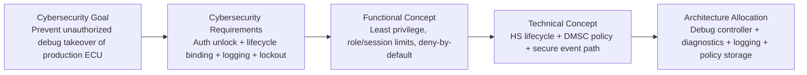
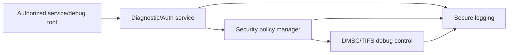
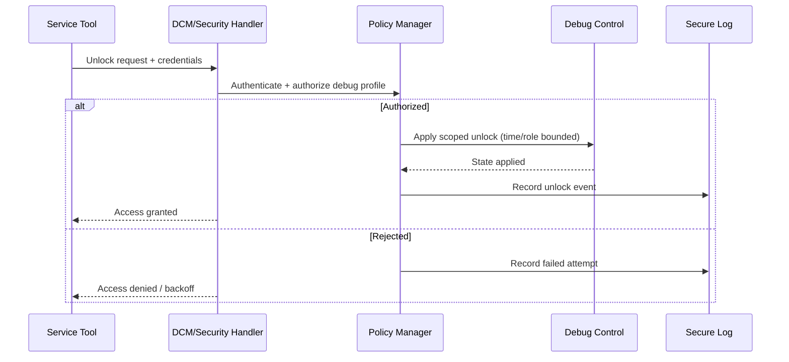
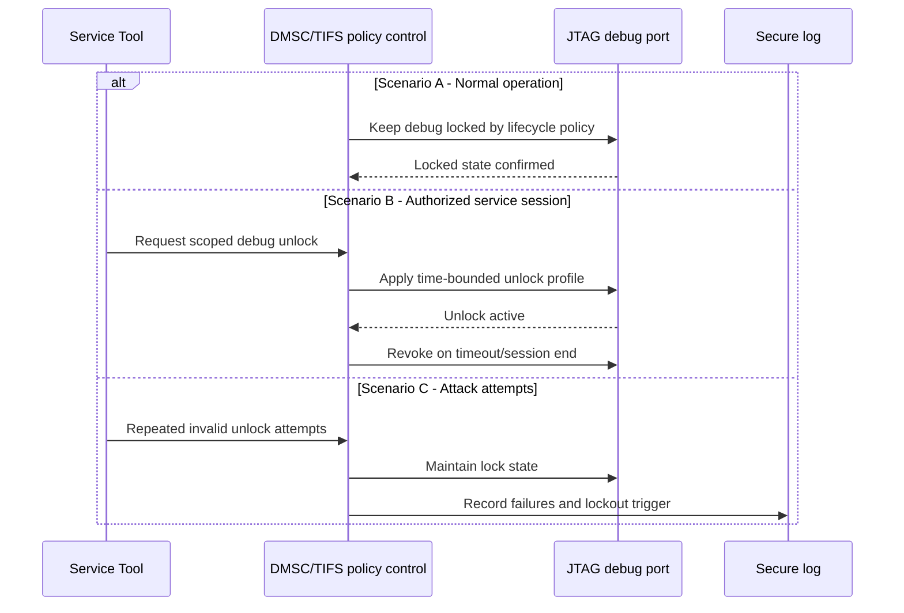

# Secure JTAG / Debug Control — TDA4VM ADAS ECU

## Scope and terminology note

This document covers production-grade debug protection for a TDA4VM-based ADAS ECU. "Secure JTAG" is treated as controlled debug authorization tied to lifecycle state, device identity, and auditable unlock policy, not as simple pin-level enable/disable.

## 0. Conceptual primer

JTAG itself is not insecure; unmanaged JTAG is insecure. In development, unrestricted debug is useful. In production, the same capability can bypass software controls, extract key material, patch safety logic, or suppress forensic evidence. Secure JTAG therefore means: locked-by-default, cryptographically authorized unlock, bounded privilege, and auditable transitions.

## 1. Cybersecurity engineering flow

## 2. Cybersecurity Goal

Prevent unauthorized debug access that could disclose secrets, bypass security controls, modify safety-relevant behavior, or weaken incident traceability.

## 3. Cybersecurity Requirements (item level)

CSR-JTAG-1: Debug unlock shall require cryptographic authorization, not static passwords.
CSR-JTAG-2: Production lifecycle state shall keep unrestricted JTAG disabled by default.
CSR-JTAG-3: Debug unlock attempts and debug state transitions shall be logged with integrity protection.
CSR-JTAG-4: Debug privileges shall be bounded by role, time, and session scope.
CSR-JTAG-5: Repeated failed unlock attempts shall trigger lockout/backoff policy.

## 4. Cybersecurity Concept

### 4.1 Functional Cybersecurity Concept & Requirements

FCR-JTAG-1: Enforce locked-by-default debug posture in production.
FCR-JTAG-2: Separate debug authentication from debug authorization level.
FCR-JTAG-3: Apply least-privilege debug profiles (observation-only vs invasive debug).
FCR-JTAG-4: Force re-authentication after reset, timeout, or privilege escalation request.

### 4.2 Technical Cybersecurity Concept & Requirements (TDA4VM-oriented)

TCR-JTAG-1: Use HS device lifecycle and DMSC/TIFS policy controls to govern debug access.
TCR-JTAG-2: Keep debug authorization assets in secure provisioning domain, not in application plaintext.
TCR-JTAG-3: Route unlock events and policy failures into secure logging with anti-tamper metadata.
TCR-JTAG-4: Ensure reset paths do not implicitly grant elevated debug privileges.

## 5. System Cybersecurity Architecture

## 6. SW Requirements & HW Requirements (allocated)

### 6.1 Software requirements

SWR-JTAG-1: Diagnostic stack shall not expose raw JTAG enable in normal sessions.
SWR-JTAG-2: Unlock workflow shall validate credentials, role, and expiry before granting any debug profile.
SWR-JTAG-3: Session manager shall automatically revoke debug privileges on timeout/reset.
SWR-JTAG-4: Security events shall be emitted for unlock success, failure, lockout, and revoke actions.

### 6.2 Hardware requirements

HWR-JTAG-1: Device lifecycle state shall enforce debug lock in production mode.
HWR-JTAG-2: Debug controller transitions shall be policy-gated by security subsystem.
HWR-JTAG-3: Hardware state after reset shall default to non-invasive/locked debug mode.

## 7. Software Architecture

## 8. Hardware Architecture and scenarios

### 8.1 Hardware dynamic sequence diagram

- Scenario A (normal operation): JTAG remains locked, no unlock request accepted without valid authorization.
- Scenario B (authorized service): Time-bounded unlock granted, then revoked automatically.
- Scenario C (attack attempts): Repeated invalid attempts trigger lockout and tamper-relevant logging.

## 9. Verification focus

- Negative security test: Unauthorized unlock attempt fails and is logged.
- Lifecycle test: Production lifecycle always boots with locked debug.
- Robustness test: Failed-attempt threshold enforces lockout/backoff policy.
- Session test: Debug privilege auto-revokes on timeout and reset.
