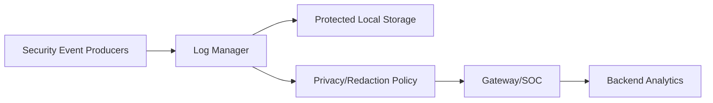
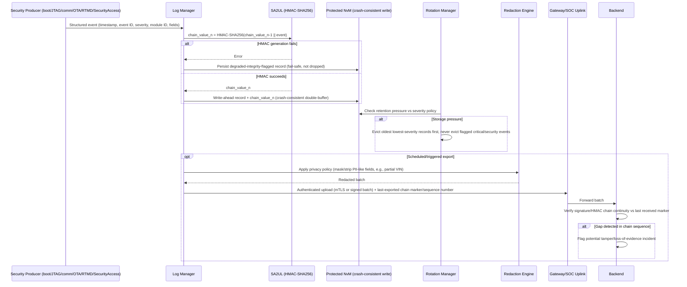

# Secure Logging Architecture Requirements - TDA4VM ADAS ECU

## 1. Functional Security Concept

### 1.1 Cybersecurity Requirements (CSR)
- CSR-LOG-1: Security-relevant events shall be logged with integrity protection.
- CSR-LOG-2: Retention/rotation shall preserve high-criticality events and prevent silent loss.
- CSR-LOG-3: Sensitive data fields shall be minimized or protected according to privacy policy.
- CSR-LOG-4: Time/counter context shall support event sequencing and cross-source correlation.
- CSR-LOG-5: Exported logs shall maintain provenance and integrity metadata.

### 1.2 Functional Security Concept (FSC)
- FSC-LOG-1: Make tampering with recorded security events detectable rather than merely difficult.
- FSC-LOG-2: Differentiate handling by event criticality so high-value evidence survives storage/retention pressure that lower-value events do not.
- FSC-LOG-3: Preserve enough context (time/sequence/source) to reconstruct a cross-component incident timeline.

### 1.3 Functional Security Requirements (FSR)
- FSR-LOG-1: Each security-relevant event shall be recorded with integrity protection sufficient to detect any later modification or deletion.
- FSR-LOG-2: Retention and rotation policy shall guarantee that high-criticality events are not overwritten before lower-criticality events under storage pressure.
- FSR-LOG-3: Fields containing sensitive/private data shall be minimized, masked, or protected consistent with defined privacy policy before storage or export.
- FSR-LOG-4: Every logged event shall carry a time or counter reference sufficient to order it relative to events from other sources.
- FSR-LOG-5: An exported log record shall retain provenance and integrity metadata usable to verify it was not altered after export.

## 2. System Requirements and System Static Architecture

### 2.1 System entities
- Security event producers (boot, diagnostics, comm, update, runtime monitor)
- Central log manager on ECU
- Gateway/SOC forwarding service
- Cloud/SOC backend for retention and analytics
- Service/tester endpoint for controlled retrieval

### 2.2 Trust boundaries and interfaces
- Boundary A: Event producer modules to log manager ingestion API
- Boundary B: Local protected storage domain to external export domain
- Boundary C: Privacy policy enforcement boundary before export
- Boundary D: Backend ingestion and long-term retention boundary

### 2.3 System Requirements (SYSR)
- SYSR-LOG-1: All event producer domains shall reach the Log Manager only through the ingestion API (Boundary A), so no producer can write directly to Protected Local Storage.
- SYSR-LOG-2: Privacy Policy Enforcement (Boundary C) shall apply uniformly to every export path (Boundary B/D) before data leaves the ECU, independent of destination.
- SYSR-LOG-3: The backend ingestion boundary (Boundary D) shall be able to detect gaps in chain continuity contributed by any producer domain, not just a single source.

## 3. Technical Security Concept

### 3.1 Technical Security Concept (TSC)
- TSC-LOG-1: Use tamper-evident record chaining or signed batches.
- TSC-LOG-2: Define severity classes with differentiated retention and upload behavior.
- TSC-LOG-3: Collect events from boot, diagnostics, reprogramming, comm security, and runtime monitoring.
- TSC-LOG-4: Ensure logging failure modes do not silently suppress critical events.

### 3.2 Technical Security Requirements (TSR)
- TSR-LOG-1: Use SA2UL-backed MAC/signature primitives for integrity tagging.
- TSR-LOG-2: Store critical logs in protected NvM partition with crash-consistent writes.
- TSR-LOG-3: Support authenticated upload to backend/SOC with chain continuity markers.
- TSR-LOG-4: Enforce local privacy redaction/masking policy before export.

## 4. Hardware Requirements and Hardware Static Architecture

### 4.1 Hardware elements
- TDA4VM (J721E) execution domain for log services: Cortex-A72/R5F application cores
- SA2UL crypto path for integrity tag generation
- Persistent flash/NvM partitions for secure retention
- Storage controller path with recoverable write guarantees
- Communication peripherals for authenticated export

### 4.2 Hardware Requirements (HWR)
- HWR-LOG-1: Wear-aware persistent retention behavior
- HWR-LOG-2: Atomic/recoverable write support
- HWR-LOG-3: Practical cost of integrity-tag generation via crypto hardware

## 5. Software Requirements and Software Static & Dynamic Architecture

### 5.1 Software blocks
- Log ingestion and normalization module
- Severity classifier and retention policy manager
- Integrity chain/signing module
- Rotation and storage-pressure manager
- Export and provenance metadata manager
- Privacy redaction/masking policy engine

### 5.2 Software Requirements (SWR)
- SWR-LOG-1: Classify/prioritize events by severity
- SWR-LOG-2: Persist integrity metadata per record or batch
- SWR-LOG-3: Preserve critical events under storage pressure
- SWR-LOG-4: Maintain ordering/provenance and apply privacy policy on export

### 5.3 Secure event logging and export sequence

### 5.4 Behavioral requirement focus
- Every record is chained to the previous one via an SA2UL-generated HMAC, so a gap or edit breaks the chain and is independently detectable by the backend, not just the local device (CSR-LOG-1, TSC-LOG-1)
- Writes are crash-consistent (write-ahead/double-buffer) so a power loss mid-write cannot corrupt or silently truncate the chain (TSR-LOG-2)
- Retention pressure evicts oldest/lowest-severity records first; records flagged as critical/security-relevant are never silently evicted (CSR-LOG-2, SWR-LOG-3)
- If integrity-tag generation itself fails, the event is still persisted with a degraded-integrity flag rather than dropped, preserving TSC-LOG-4's fail-safe (not fail-silent) requirement
- Export carries a chain-continuity marker so the backend can detect and flag gaps (evidence loss or tampering in transit/at rest), and privacy redaction is applied before the batch leaves the ECU boundary (CSR-LOG-5, TSR-LOG-4)

## 6. Hardware-Software Interface (HSI)

### 6.1 HSI elements
- SA2UL HMAC-SHA256 register interface for chain-value computation
- Protected NvM write-ahead/double-buffer controller interface
- Gateway/SOC authenticated-upload transport interface

### 6.2 HSI Requirements (HSI)
- HSI-LOG-1: The SA2UL HMAC interface shall report a distinguishable engine-failure status separate from a normal chain-value output, so the Log Manager can apply the degraded-integrity-flag path rather than silently persisting an unchained record.
- HSI-LOG-2: The Protected NvM controller interface shall guarantee that a write-ahead record and its chain value are committed atomically as a pair, never one without the other.
- HSI-LOG-3: The gateway/SOC upload interface shall expose the last-exported chain marker as a queryable value to the Log Manager, independent of upload success/failure.
