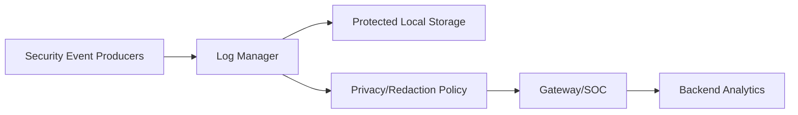
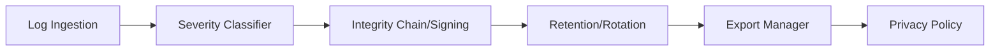
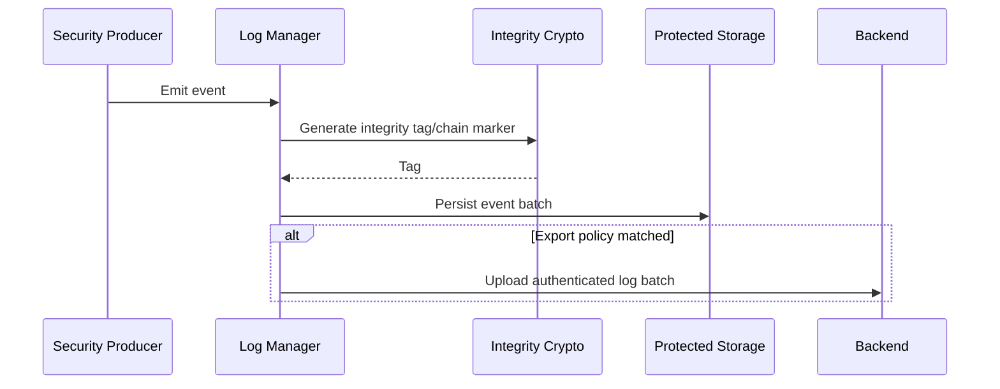

# Secure Logging Architecture Requirements - TDA4VM ADAS ECU

## 1. System Static Architecture

### 1.1 System entities
- Security event producers (boot, diagnostics, comm, update, runtime monitor)
- Central log manager on ECU
- Gateway/SOC forwarding service
- Cloud/SOC backend for retention and analytics
- Service/tester endpoint for controlled retrieval

### 1.2 Trust boundaries and interfaces
- Boundary A: Event producer modules to log manager ingestion API
- Boundary B: Local protected storage domain to external export domain
- Boundary C: Privacy policy enforcement boundary before export
- Boundary D: Backend ingestion and long-term retention boundary

### 1.3 System-level requirement allocation
- CSR-LOG-1 to CSR-LOG-5
- FCR-LOG-1 to FCR-LOG-4
- TCR-LOG-1 to TCR-LOG-4

## 2. Hardware Static Architecture

### 2.1 Hardware elements
- TDA4VM (J721E) execution domain for log services: Cortex-A72/R5F application cores
- SA2UL crypto path for integrity tag generation
- Persistent flash/NvM partitions for secure retention
- Storage controller path with recoverable write guarantees
- Communication peripherals for authenticated export

### 2.2 Hardware responsibility mapping
- HWR-LOG-1: Wear-aware persistent retention behavior
- HWR-LOG-2: Atomic/recoverable write support
- HWR-LOG-3: Practical cost of integrity-tag generation via crypto hardware

## 3. Software Static Architecture

### 3.1 Software blocks
- Log ingestion and normalization module
- Severity classifier and retention policy manager
- Integrity chain/signing module
- Rotation and storage-pressure manager
- Export and provenance metadata manager
- Privacy redaction/masking policy engine

### 3.2 Software requirement allocation
- SWR-LOG-1: Classify/prioritize events by severity
- SWR-LOG-2: Persist integrity metadata per record or batch
- SWR-LOG-3: Preserve critical events under storage pressure
- SWR-LOG-4: Maintain ordering/provenance and apply privacy policy on export

## 4. Dynamic / Behavioral Views

### 4.1 Secure event logging and export sequence

### 4.2 Behavioral requirement focus
- Logging is tamper-evident and integrity-protected (CSR-LOG-1, FCR-LOG-1)
- Critical evidence survives retention pressure (CSR-LOG-2, SWR-LOG-3)
- Export preserves provenance and privacy requirements (CSR-LOG-5, TCR-LOG-4)
