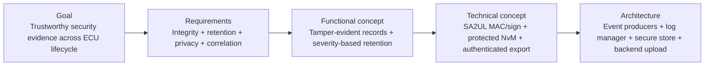
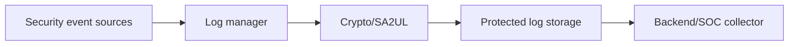
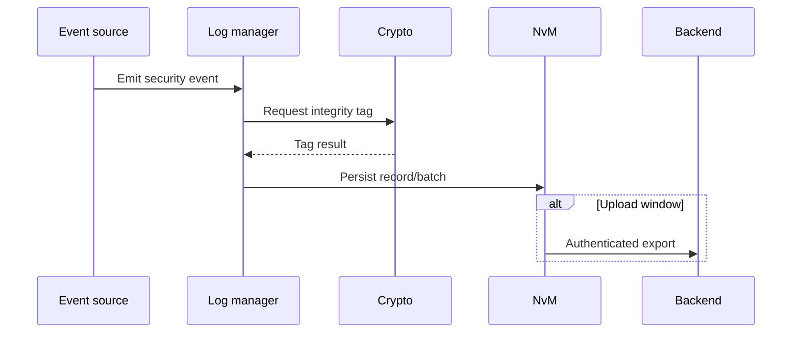
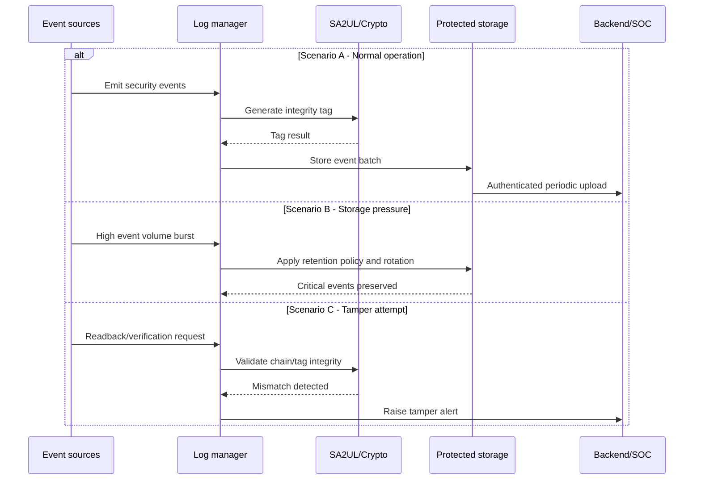

# Secure Logging — TDA4VM ADAS ECU

## Scope and terminology note

This document defines requirement traceability for tamper-evident security logging on a TDA4VM-based ADAS ECU, including event capture, retention, privacy filtering, and export trust.

## 0. Conceptual primer

Security controls without trustworthy logs are hard to audit and hard to improve. Logging is not only data storage; it is evidence integrity, ordering, retention policy, and privacy-aware disclosure.

## 1. Cybersecurity engineering flow

## 2. Cybersecurity Goal

Provide reliable, tamper-evident, privacy-aware security logs suitable for detection, incident investigation, and compliance evidence.

## 3. Cybersecurity Requirements (item level)

CSR-LOG-1: Security-relevant events shall be logged with integrity protection.
CSR-LOG-2: Retention/rotation shall preserve high-criticality events and prevent silent loss.
CSR-LOG-3: Sensitive data fields shall be minimized or protected according to privacy policy.
CSR-LOG-4: Time/counter context shall support event sequencing and cross-source correlation.
CSR-LOG-5: Exported logs shall maintain provenance and integrity metadata.

## 4. Cybersecurity Concept

### 4.1 Functional Cybersecurity Concept & Requirements

FCR-LOG-1: Use tamper-evident record chaining or signed batches.
FCR-LOG-2: Define severity classes with differentiated retention and upload behavior.
FCR-LOG-3: Collect events from boot, diagnostics, reprogramming, comm security, and runtime monitoring.
FCR-LOG-4: Ensure logging failure modes do not silently suppress critical events.

### 4.2 Technical Cybersecurity Concept & Requirements (TDA4VM-oriented)

TCR-LOG-1: Use SA2UL-backed MAC/signature primitives for integrity tagging.
TCR-LOG-2: Store critical logs in protected NvM partition with crash-consistent writes.
TCR-LOG-3: Support authenticated upload to backend/SOC with chain continuity markers.
TCR-LOG-4: Enforce local privacy redaction/masking policy before export.

## 5. System Cybersecurity Architecture

## 6. SW Requirements & HW Requirements (allocated)

### 6.1 Software requirements

SWR-LOG-1: Log manager shall classify and prioritize events by security severity.
SWR-LOG-2: Each persisted record/batch shall include integrity metadata.
SWR-LOG-3: Retention/rotation shall preserve critical events under storage pressure.
SWR-LOG-4: Export path shall retain ordering/provenance and apply privacy policy.

### 6.2 Hardware requirements

HWR-LOG-1: Persistent storage shall support wear-aware retention behavior.
HWR-LOG-2: Storage and controller paths shall support atomic or recoverable writes.
HWR-LOG-3: Crypto hardware shall support practical integrity-tag generation cost.

## 7. Software Architecture

## 8. Hardware Architecture and scenarios

### 8.1 Hardware dynamic sequence diagram

- Scenario A: Normal operation with prioritized retention and periodic upload.
- Scenario B: Storage pressure; low-priority entries rotate while critical evidence remains.
- Scenario C: Tamper attempt; integrity chain mismatch is detectable.

## 9. Verification focus

- Tamper-evidence test: Edited/deleted records must be detectable.
- Retention test: Critical events survive rotation pressure.
- Privacy/export test: Restricted fields remain masked and provenance remains verifiable.
