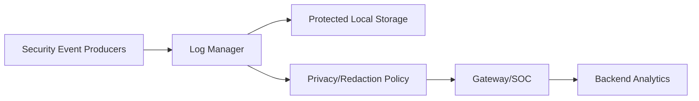
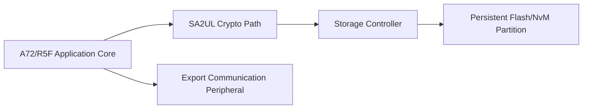
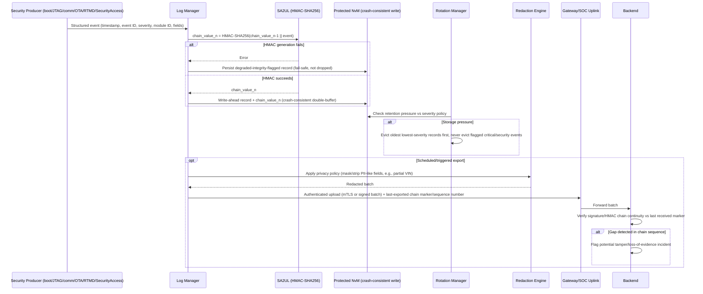

# Secure Logging Architecture Requirements - TDA4VM ADAS ECU

## 1. Functional Security Concept

### 1.1 Cybersecurity Requirements (CSR)
- CSR-LOG-1: Security-relevant events shall be logged with integrity protection.
- CSR-LOG-2: Retention/rotation shall preserve high-criticality events and prevent silent loss.
- CSR-LOG-3: Sensitive data fields shall be minimized or protected according to privacy policy.
- CSR-LOG-4: Time/counter context shall support event sequencing and cross-source correlation.
- CSR-LOG-5: Exported logs shall maintain provenance and integrity metadata.

### 1.2 Functional Security Concept (FSC)
- FSC-LOG-1: Make tampering with recorded security events detectable rather than merely difficult.
- FSC-LOG-2: Differentiate handling by event criticality so high-value evidence survives storage/retention pressure that lower-value events do not.
- FSC-LOG-3: Preserve enough context (time/sequence/source) to reconstruct a cross-component incident timeline.

### 1.3 Functional Security Requirements (FSR)
- FSR-LOG-1: Each security-relevant event shall be recorded with integrity protection sufficient to detect any later modification or deletion.
- FSR-LOG-2: Retention and rotation policy shall guarantee that high-criticality events are not overwritten before lower-criticality events under storage pressure.
- FSR-LOG-3: Fields containing sensitive/private data shall be minimized, masked, or protected consistent with defined privacy policy before storage or export.
- FSR-LOG-4: Every logged event shall carry a time or counter reference sufficient to order it relative to events from other sources.
- FSR-LOG-5: An exported log record shall retain provenance and integrity metadata usable to verify it was not altered after export.

## 2. System Requirements and System Static Architecture

### 2.1 System entities
- Security event producers (boot, diagnostics, comm, update, runtime monitor)
- Central log manager on ECU
- Gateway/SOC forwarding service
- Cloud/SOC backend for retention and analytics
- Service/tester endpoint for controlled retrieval

### 2.2 Trust boundaries and interfaces
- Boundary A: Event producer modules to log manager ingestion API
- Boundary B: Local protected storage domain to external export domain
- Boundary C: Privacy policy enforcement boundary before export
- Boundary D: Backend ingestion and long-term retention boundary

### 2.3 System Requirements (SYSR)
- SYSR-LOG-1: All event producer domains shall reach the Log Manager only through the ingestion API (Boundary A), so no producer can write directly to Protected Local Storage.
- SYSR-LOG-2: Privacy Policy Enforcement (Boundary C) shall apply uniformly to every export path (Boundary B/D) before data leaves the ECU, independent of destination.
- SYSR-LOG-3: The backend ingestion boundary (Boundary D) shall be able to detect gaps in chain continuity contributed by any producer domain, not just a single source.

## 3. Technical Security Concept

### 3.1 Technical Security Concept (TSC)
- TSC-LOG-1: Use tamper-evident record chaining or signed batches.
- TSC-LOG-2: Define severity classes with differentiated retention and upload behavior.
- TSC-LOG-3: Collect events from boot, diagnostics, reprogramming, comm security, and runtime monitoring.
- TSC-LOG-4: Ensure logging failure modes do not silently suppress critical events.

### 3.2 Technical Security Requirements (TSR)
- TSR-LOG-1: Use SA2UL-backed MAC/signature primitives for integrity tagging.
- TSR-LOG-2: Store critical logs in protected NvM partition with crash-consistent writes.
- TSR-LOG-3: Support authenticated upload to backend/SOC with chain continuity markers.
- TSR-LOG-4: Enforce local privacy redaction/masking policy before export.

## 4. Hardware Requirements and Hardware Static Architecture

### 4.1 Hardware elements
- TDA4VM (J721E) execution domain for log services: Cortex-A72/R5F application cores
- SA2UL crypto path for integrity tag generation
- Persistent flash/NvM partitions for secure retention
- Storage controller path with recoverable write guarantees
- Communication peripherals for authenticated export

### 4.2 Hardware Requirements (HWR)
- HWR-LOG-1: Wear-aware persistent retention behavior
- HWR-LOG-2: Atomic/recoverable write support
- HWR-LOG-3: Practical cost of integrity-tag generation via crypto hardware

## 5. Software Requirements and Software Static & Dynamic Architecture

### 5.1 Software blocks
- Log ingestion and normalization module
- Severity classifier and retention policy manager
- Integrity chain/signing module
- Rotation and storage-pressure manager
- Export and provenance metadata manager
- Privacy redaction/masking policy engine

### 5.2 Software Requirements (SWR)
- SWR-LOG-1: Classify/prioritize events by severity
- SWR-LOG-2: Persist integrity metadata per record or batch
- SWR-LOG-3: Preserve critical events under storage pressure
- SWR-LOG-4: Maintain ordering/provenance and apply privacy policy on export

### 5.3 Secure event logging and export sequence

  

Mermaid source (for editing/regeneration)

### 5.4 Behavioral requirement focus
- Every record is chained to the previous one via an SA2UL-generated HMAC, so a gap or edit breaks the chain and is independently detectable by the backend, not just the local device (CSR-LOG-1, TSC-LOG-1)
- Writes are crash-consistent (write-ahead/double-buffer) so a power loss mid-write cannot corrupt or silently truncate the chain (TSR-LOG-2)
- Retention pressure evicts oldest/lowest-severity records first; records flagged as critical/security-relevant are never silently evicted (CSR-LOG-2, SWR-LOG-3)
- If integrity-tag generation itself fails, the event is still persisted with a degraded-integrity flag rather than dropped, preserving TSC-LOG-4's fail-safe (not fail-silent) requirement
- Export carries a chain-continuity marker so the backend can detect and flag gaps (evidence loss or tampering in transit/at rest), and privacy redaction is applied before the batch leaves the ECU boundary (CSR-LOG-5, TSR-LOG-4)

## 6. Hardware-Software Interface (HSI)

### 6.1 HSI elements
- SA2UL HMAC-SHA256 register interface for chain-value computation
- Protected NvM write-ahead/double-buffer controller interface
- Gateway/SOC authenticated-upload transport interface

### 6.2 HSI Requirements (HSI)
- HSI-LOG-1: The SA2UL HMAC interface shall report a distinguishable engine-failure status separate from a normal chain-value output, so the Log Manager can apply the degraded-integrity-flag path rather than silently persisting an unchained record.
- HSI-LOG-2: The Protected NvM controller interface shall guarantee that a write-ahead record and its chain value are committed atomically as a pair, never one without the other.
- HSI-LOG-3: The gateway/SOC upload interface shall expose the last-exported chain marker as a queryable value to the Log Manager, independent of upload success/failure.

## Interview Appendix: Expert Q&A (20 Questions)

The following expert-level Q&A set is intended for interview practice and design review on this topic.

| # | Question | Difficulty | Detailed answer | Evidence |
|---|---|---|---|---|
| 1 | Why is secure logging not just “write events to flash”? | L1 | Secure logging is about the integrity and trustworthiness of the recorded evidence, not simply the act of writing a file. If the log can be overwritten, deleted, or silently modified, then it is not useful as evidence in a security investigation or functional safety review. The repo therefore uses a chained HMAC design so that a record’s integrity can be checked later and tampering becomes visible. | Secure Logging requirements, HMAC chain design |
| 2 | What is the purpose of chaining log entries with HMAC? | L2 | Chaining allows the system to detect if a record in the middle of the log was altered, because the chain value of later entries depends on earlier values. This gives the log integrity properties that a flat append-only file lacks, especially when an attacker tries to hide a tampering event. The chain acts as a tamper-evident ledger instead of a simple event list. | Secure Logging HMAC design, chained record model |
| 3 | Why is a log entry not considered valid simply because it was written successfully? | L2 | A write success only proves that the log store accepted the bytes; it does not prove the record is authentic or consistent with prior records. Forensic value comes from verifiability and integrity, not mere persistence. The design therefore treats the log as a trust mechanism requiring validation rather than a mere buffer. | secure logging integrity model |
| 4 | Why is the log path treated separately from the application path? | L2 | Application code can be compromised or manipulated, and the logging path must remain more trustworthy than the ordinary execution environment. By separating the log manager and its integrity chain from the application logic, the design preserves evidence even if a user or attacker can affect application behavior. | secure logging architecture |
| 5 | Why is the first boot-stage failure not written through the normal secure logging path? | L3 | Before the first trusted software stage is running, the system does not yet have an authenticated software context to emit a secure log. The repo explicitly notes that early boot failures are only observable via status or error indications, not through the normal secure logging path. This is a constraint of the trust chain, not a simple omission. | TSC-2, secure boot/logging boundary |
| 6 | What is the risk of logging without a chain value? | L2 | Without a chain value, an attacker can insert, delete, or modify entries without producing a detectable inconsistency in the rest of the file. That destroys the evidence trail and weakens the value of the logs in safety or incident investigations. | HMAC chain model |
| 7 | Why does the design separate event generation from export/import? | L2 | Event generation creates the underlying evidence; export/import handles transmission or recovery of that evidence. They are distinct because a log can be generated securely but still fail to be transmitted or recovered correctly. Separating these functions ensures that the exported state can be independently validated and tracked by a chain marker. | gateway upload/export requirements |
| 8 | What is the role of the chain marker in an export scenario? | L2 | The chain marker tells the log manager what was last successfully exported so that the next export can continue without re-sending already accepted records. This preserves ordering and prevents duplicate or missing evidence from being lost in an upload failure. | HSI-LOG-3 |
| 9 | Why is atomicity important in secure logging? | L3 | If the log manager writes a record without writing the associated chain value, the log becomes inconsistent. A later verifier cannot trust the partial state because the record and its integrity metadata are not committed together. At minimum, the design requires the log manager to treat the record and chain value as one logical commit. | HSI-LOG-2 |
| 10 | What kind of events should be logged as security-relevant events? | L1 | Events that indicate boot failures, authentication failures, tamper detection, access attempts, or state changes that affect trust or safety are all security relevant. The system must log enough to reconstruct what happened and which control failed. That evidence is the purpose of the secure logging function. | secure logging event taxonomy |
| 11 | Why is the write-ahead buffer or double-buffer pattern useful here? | L2 | It ensures that the log is not partially committed in the face of power loss or reset. A write-ahead mechanism keeps the integrity relationship intact even if the system crashes in the middle of a logging operation. This is essential because log integrity is meaningful only if the evidence survives faults without being silently broken. | Protected NvM controller interface |
| 12 | How does secure logging support safety investigations? | L2 | When a system fails, the log provides evidence about which module saw a mismatch, what kind of event occurred, and how the system responded. This supports both cybersecurity investigations and safety analyses because it links a system event to the monitored configuration or trigger. | secure logging / safety integration |
| 13 | Why does the design distinguish engine-failure status from integrity-mismatch status? | L2 | A hardware failure in the hashing engine is different from an actual tamper or integrity mismatch. If those are conflated, the system could misclassify a hardware problem as an attacker event and make the wrong response. The design therefore requires distinguishable statuses to support correct triage and action. | HSI-LOG-1 |
| 14 | Why is the log manager’s job more than just “collect events”? | L3 | The log manager also ensures ordering, integrity chaining, and export consistency. It is therefore part of the trust chain rather than a passive dumping process. If the logger were just a generic store, the system could not distinguish a valid sequence from a tampered or incomplete one. | secure logging architecture |
| 15 | How does secure logging interact with runtime tamper monitoring? | L2 | Runtime tamper detection produces the actual alerts, while secure logging records them in a way that preserves evidence. The tamper monitor decides that a mismatch occurred; the log manager ensures it is captured and chained in a trusted fashion. This makes the safety response and forensic evidence consistent. | runtime integrity requirements, secure logging integration |
| 16 | What is the security impact of not chaining records? | L3 | Without chaining, an attacker can erase or rewrite earlier records and create a clean-looking log that hides the timeline of compromise. That undermines both forensic analysis and safety and can delay or defeat incident response. The chain ensures that the evidence is not just present but also resistant to undetected alteration. | HMAC chain model |
| 17 | Why is export state tracked separately from log generation? | L2 | Export state indicates the last successfully uploaded boundary, which matters when a gateway or backend is unavailable. Without that, a repeated export can resend or skip records unpredictably, making the evidence trail inconsistent or incomplete. The design uses an exported chain marker to make this explicit and testable. | HSI-LOG-3 |
| 18 | What would be a realistic attack against a weak log implementation? | L3 | An attacker could inject a fake event into the middle of the log, overwrite older events, or tamper with the chain so the log appears valid during a quick review. If the implementation does not maintain a robust chain and atomic commit model, this becomes surprisingly easy. This is why secure logging is designed around integrity and append semantics rather than convenience. | HMAC chain, atomic commit design |
| 19 | How do you know a secure log is actually trustworthy? | L2 | You know it is trustworthy when it is generated by a protected logging path, chained and atomically committed, and validated in a way that distinguishes a real event from a storage or hardware failure. Trustworthiness is not about the presence of bytes; it is about the integrity and continuity of the evidence trail. | secure logging design principles |
| 20 | If you had to summarize the secure logging principle in one sentence, what would it be? | L1 | Secure logging exists to ensure that every significant event is recorded in a tamper-evident, chained, and recoverable form so that security and safety teams can validate what happened without trusting the application layer alone. | secure logging integrity requirements |
