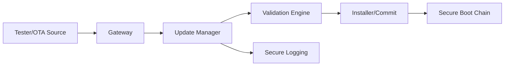
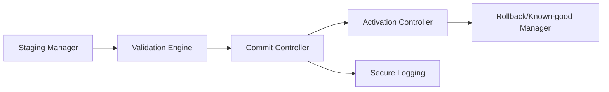
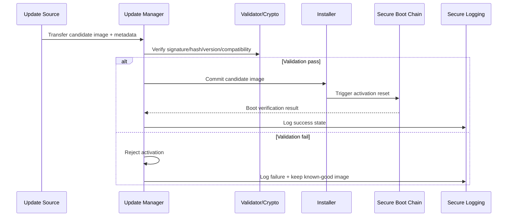

# Secure Reprogramming Architecture Requirements - TDA4VM ADAS ECU

## 1. System Static Architecture

### 1.1 System entities
- Authorized update source (tester or OTA backend)
- Gateway transport domain
- ECU update manager and installer domain
- Boot verification chain domain
- Logging and fleet operations domain

### 1.2 Trust boundaries and interfaces
- Boundary A: External update source to ECU download interface
- Boundary B: Downloaded candidate image to validation/commit boundary
- Boundary C: Commit boundary to activation reset/secure boot boundary
- Boundary D: Update state transitions to audit logging boundary

### 1.3 System-level requirement allocation
- CSR-SRP-1 to CSR-SRP-5
- FCR-SRP-1 to FCR-SRP-4
- TCR-SRP-1 to TCR-SRP-4

## 2. Hardware Static Architecture

### 2.1 Hardware elements
- TDA4VM (J721E) update control and flash programming domain: Cortex-R5F (SBL/flashing), DMSC (System Firmware/TIFS)
- SA2UL cryptographic acceleration for signature/hash verification
- DMSC BootROM trust anchor re-entered at every activation reset
- Flash layout for active/candidate image separation
- Monotonic anti-rollback source: eFuse SWREV counter checked by System Firmware

### 2.2 Hardware responsibility mapping
- HWR-SRP-1: Active/candidate image separation with atomic metadata updates
- HWR-SRP-2: DMSC BootROM + System Firmware enforce activation authenticity checks
- TCR-SRP-2: eFuse SWREV anti-rollback policy anchored in the hardware trust chain

## 3. Software Static Architecture

### 3.1 Software blocks
- Update manager state machine
- Download and staging manager
- Signature/hash/version/compatibility validator
- Installer and commit controller
- Rollback/known-good recovery manager
- Secure logging integration

### 3.2 Software requirement allocation
- SWR-SRP-1: Deterministic update state machine with interruption recovery
- SWR-SRP-2: Validation gates for signature/integrity/version/compatibility
- SWR-SRP-3: Block activation on policy or validation failure
- SWR-SRP-4: Automatic rollback/known-good recovery after failed activation

## 4. Dynamic / Behavioral Views

### 4.1 Secure reprogramming sequence

### 4.2 Behavioral requirement focus
- Staged workflow and explicit commit decision are mandatory (FCR-SRP-1, FCR-SRP-2)
- Activation always passes through secure boot chain (CSR-SRP-4, TCR-SRP-3)
- Known-good recovery remains available after failed activation (CSR-SRP-3, SWR-SRP-4)
