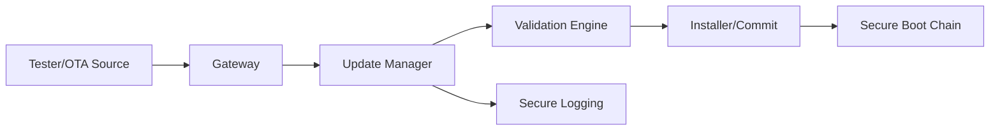
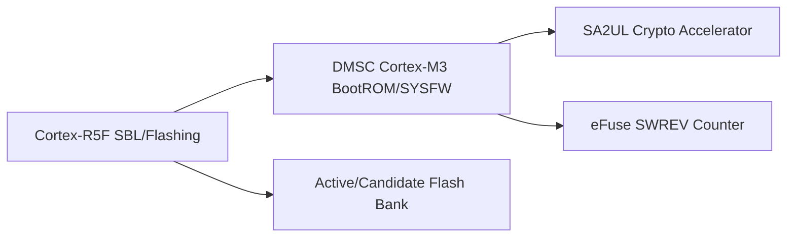
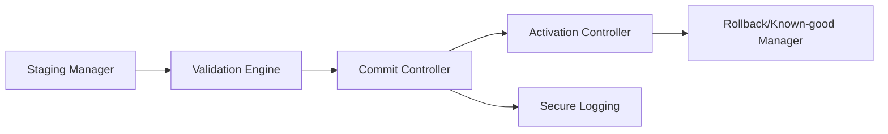
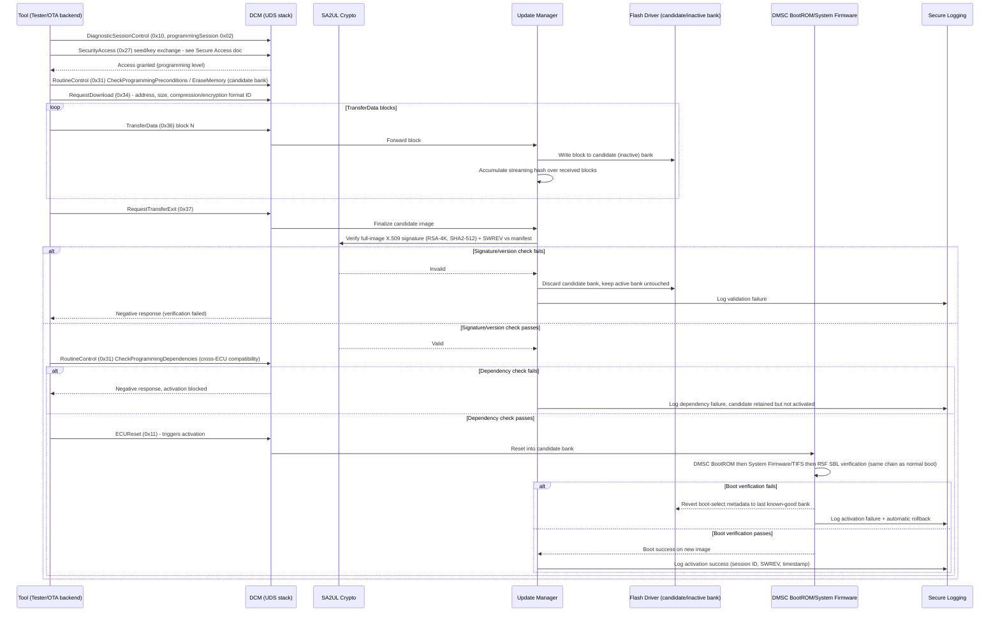

# Secure Reprogramming Architecture Requirements - TDA4VM ADAS ECU

## 1. Functional Security Concept

### 1.1 Cybersecurity Requirements (CSR)
- CSR-SRP-1: Downloaded images shall be authenticated and integrity-checked prior to activation.
- CSR-SRP-2: Anti-rollback policy shall reject vulnerable older versions.
- CSR-SRP-3: Interruption during flashing shall not create undefined executable state.
- CSR-SRP-4: Activation reset shall pass through the standard secure boot chain.
- CSR-SRP-5: Update metadata shall include compatibility/dependency policy inputs.

### 1.2 Functional Security Concept (FSC)
- FSC-SRP-1: Separate delivery, verification, and activation into distinct stages so a failure at any stage cannot silently proceed to the next.
- FSC-SRP-2: Never allow the currently active, known-good image to be overwritten until a candidate image is fully verified.
- FSC-SRP-3: Reuse the same trust chain for post-update activation as for ordinary boot, rather than a reduced-check path.

### 1.3 Functional Security Requirements (FSR)
- FSR-SRP-1: A downloaded image shall be authenticated and integrity-checked before it is committed as the active image.
- FSR-SRP-2: An image whose version fails the anti-rollback policy shall be rejected regardless of otherwise-valid signature/integrity.
- FSR-SRP-3: An interruption during the flashing process shall leave the ECU able to boot a known-valid image, never an undefined or partially written one.
- FSR-SRP-4: The activation reset following reprogramming shall pass through the same verification chain used at ordinary power-on.
- FSR-SRP-5: Update metadata shall be checked against target identity, dependency, and version-compatibility policy before activation is permitted.

## 2. System Requirements and System Static Architecture

### 2.1 System entities
- Authorized update source (tester or OTA backend)
- Gateway transport domain
- ECU update manager and installer domain
- Boot verification chain domain
- Logging and fleet operations domain

### 2.2 Trust boundaries and interfaces
- Boundary A: External update source to ECU download interface
- Boundary B: Downloaded candidate image to validation/commit boundary
- Boundary C: Commit boundary to activation reset/secure boot boundary
- Boundary D: Update state transitions to audit logging boundary

### 2.3 System Requirements (SYSR)
- SYSR-SRP-1: The Update Manager domain shall be the only entity permitted to move an image from the download boundary (Boundary A) to the validation boundary (Boundary B).
- SYSR-SRP-2: The Commit boundary (Boundary C) shall require an explicit pass result from validation before any activation-reset request is issued.
- SYSR-SRP-3: Update state transitions crossing Boundary D to logging shall be emitted for every boundary crossing, including rejected/blocked transitions, not only successful ones.

## 3. Technical Security Concept

### 3.1 Technical Security Concept (TSC)
- TSC-SRP-1: Use staged workflow (download, verify, commit, activate).
- TSC-SRP-2: Keep active and candidate images separable with explicit commit decision.
- TSC-SRP-3: Maintain rollback-safe recovery to last known-good executable image.
- TSC-SRP-4: Refuse activation if verification or policy checks fail.

### 3.2 Technical Security Requirements (TSR)
- TSR-SRP-1: Perform signature/hash checks using SA2UL-assisted cryptography.
- TSR-SRP-2: Enforce SWREV/equivalent monotonic version policy in trust chain.
- TSR-SRP-3: Activation shall re-run the DMSC BootROM -> System Firmware/TIFS -> R5F SBL -> application verification sequence.
- TSR-SRP-4: Log update state transitions and security failures using secure logging path.

## 4. Hardware Requirements and Hardware Static Architecture

### 4.1 Hardware elements
- TDA4VM (J721E) update control and flash programming domain: Cortex-R5F (SBL/flashing), DMSC (System Firmware/TIFS)
- SA2UL cryptographic acceleration for signature/hash verification
- DMSC BootROM trust anchor re-entered at every activation reset
- Flash layout for active/candidate image separation
- Monotonic anti-rollback source: eFuse SWREV counter checked by System Firmware

### 4.2 Hardware Requirements (HWR)
- HWR-SRP-1: Active/candidate image separation with atomic metadata updates
- HWR-SRP-2: DMSC BootROM + System Firmware enforce activation authenticity checks
- HWR-SRP-3: eFuse SWREV anti-rollback policy anchored in the hardware trust chain (TSR-SRP-2)

## 5. Software Requirements and Software Static & Dynamic Architecture

### 5.1 Software blocks
- Update manager state machine
- Download and staging manager
- Signature/hash/version/compatibility validator
- Installer and commit controller
- Rollback/known-good recovery manager
- Secure logging integration

### 5.2 Software Requirements (SWR)
- SWR-SRP-1: Deterministic update state machine with interruption recovery
- SWR-SRP-2: Validation gates for signature/integrity/version/compatibility
- SWR-SRP-3: Block activation on policy or validation failure
- SWR-SRP-4: Automatic rollback/known-good recovery after failed activation

### 5.3 Secure reprogramming sequence (ISO 14229-1 UDS flashing flow)

### 5.4 Behavioral requirement focus
- Reprogramming follows the standard UDS staged workflow - session control, SecurityAccess, erase/precondition check, block-wise download, transfer exit, dependency check, then reset-triggered activation - with an explicit commit decision at each gate (TSC-SRP-1, TSC-SRP-2)
- The active bank is never modified during download; only the candidate/inactive bank is written, so an interrupted transfer cannot leave the running image undefined (CSR-SRP-3, HWR-SRP-1)
- Full-image signature and SWREV/anti-rollback checks happen twice conceptually: once by the Update Manager/SA2UL at transfer-exit, and again by DMSC BootROM/System Firmware at activation reset using the same chain as ordinary power-on (CSR-SRP-4, TSR-SRP-3)
- Cross-ECU dependency/compatibility checks (RoutineControl CheckProgrammingDependencies) gate activation independently from image-integrity checks (CSR-SRP-5)
- A failed activation automatically reverts to the last known-good bank rather than leaving the ECU non-bootable (CSR-SRP-3, SWR-SRP-4)

## 6. Hardware-Software Interface (HSI)

### 6.1 HSI elements
- Flash driver-to-candidate/inactive-bank register interface
- SA2UL signature/hash register interface
- DMSC BootROM/System Firmware activation-trigger interface
- UDS RequestDownload/TransferData block-transfer register/DMA interface

### 6.2 HSI Requirements (HSI)
- HSI-SRP-1: The flash driver interface shall expose write access only to the candidate/inactive bank address range during TransferData, with the active bank's range hardware-protected against writes.
- HSI-SRP-2: The SA2UL full-image verification interface shall be invoked by the Update Manager only after RequestTransferExit, and its pass/fail result shall gate the commit-controller's activation request.
- HSI-SRP-3: The activation-trigger interface shall carry no software-settable flag capable of skipping the DMSC BootROM -> System Firmware -> R5F SBL verification sequence for a reprogramming-originated reset.
