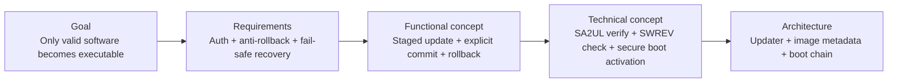
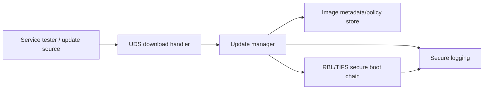
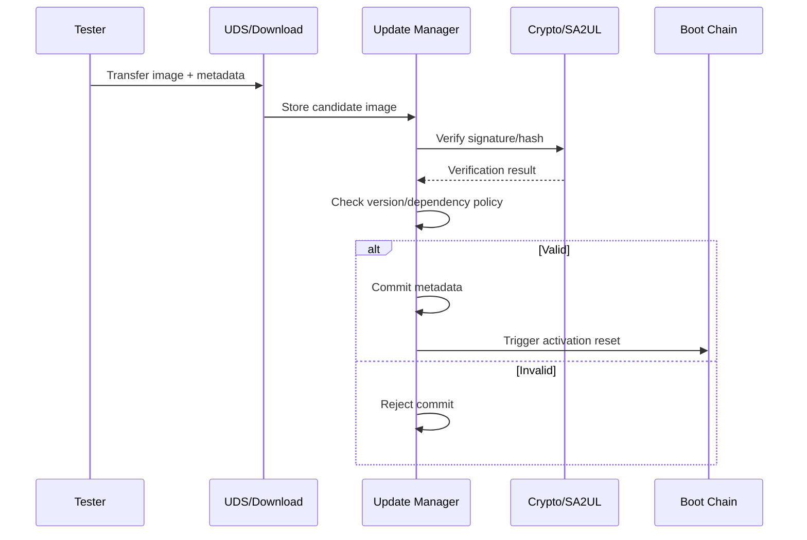
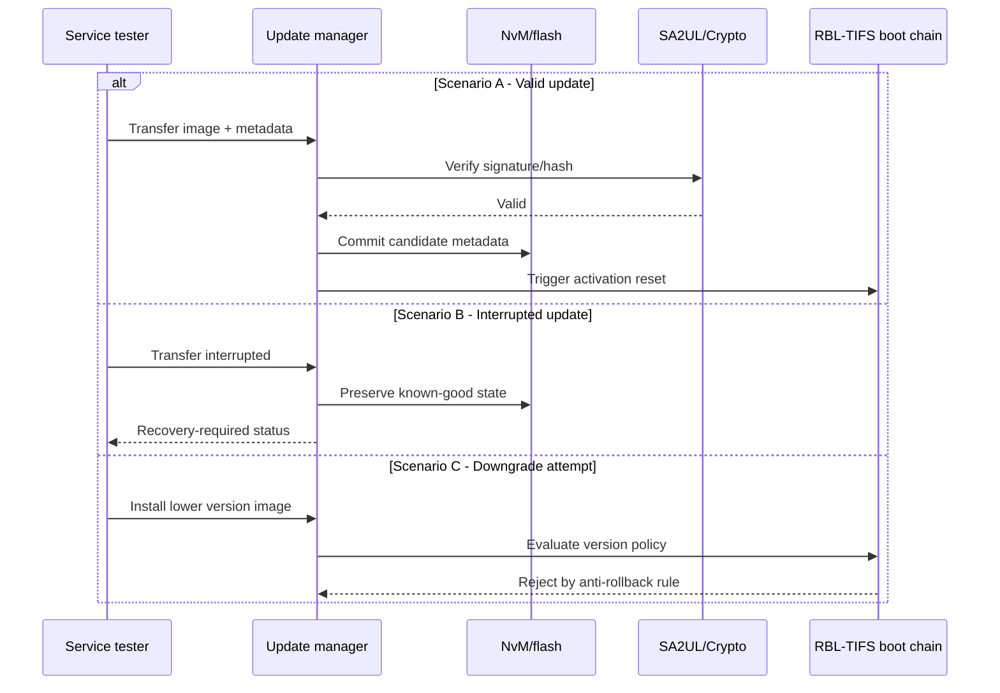

# Secure Reprogramming — TDA4VM ADAS ECU

## Scope and terminology note

This document defines requirement traceability for secure ECU reprogramming in plant and service conditions, covering transfer, verification, commit, and activation safety.

## 0. Conceptual primer

Secure flashing is not only "write image then reboot". A secure design must protect authenticity, integrity, rollback policy, interruption recovery, and deterministic activation. The most common failure is treating activation as a weaker side path.

## 1. Cybersecurity engineering flow

## 2. Cybersecurity Goal

Allow software updates only when image authenticity, integrity, version policy, and activation checks succeed; preserve known-good recoverability under fault conditions.

## 3. Cybersecurity Requirements (item level)

CSR-SRP-1: Downloaded images shall be authenticated and integrity-checked prior to activation.
CSR-SRP-2: Anti-rollback policy shall reject vulnerable older versions.
CSR-SRP-3: Interruption during flashing shall not create undefined executable state.
CSR-SRP-4: Activation reset shall pass through the standard secure boot chain.
CSR-SRP-5: Update metadata shall include compatibility/dependency policy inputs.

## 4. Cybersecurity Concept

### 4.1 Functional Cybersecurity Concept & Requirements

FCR-SRP-1: Use staged workflow (download, verify, commit, activate).
FCR-SRP-2: Keep active and candidate images separable with explicit commit decision.
FCR-SRP-3: Maintain rollback-safe recovery to last known-good executable image.
FCR-SRP-4: Refuse activation if verification or policy checks fail.

### 4.2 Technical Cybersecurity Concept & Requirements (TDA4VM-oriented)

TCR-SRP-1: Perform signature/hash checks using SA2UL-assisted cryptography.
TCR-SRP-2: Enforce SWREV/equivalent monotonic version policy in trust chain.
TCR-SRP-3: Activation shall re-run RBL -> TIFS -> SBL -> application verification sequence.
TCR-SRP-4: Log update state transitions and security failures using secure logging path.

## 5. System Cybersecurity Architecture

## 6. SW Requirements & HW Requirements (allocated)

### 6.1 Software requirements

SWR-SRP-1: Update manager shall implement deterministic state machine with interruption recovery.
SWR-SRP-2: Installer shall validate signature/integrity/version/compatibility before commit.
SWR-SRP-3: Activation shall be blocked when policy or validation fails.
SWR-SRP-4: Rollback/known-good recovery path shall be automatically available after failed activation.

### 6.2 Hardware requirements

HWR-SRP-1: Non-volatile layout shall support active/candidate image separation and atomic metadata update.
HWR-SRP-2: Boot trust anchor components shall enforce authenticity checks at activation reset.

## 7. Software Architecture

## 8. Hardware Architecture and scenarios

### 8.1 Hardware dynamic sequence diagram

- Scenario A: Valid update; activation reset follows full trust chain.
- Scenario B: Interrupted update; ECU remains recoverable and non-undefined.
- Scenario C: Downgrade attempt; rejected by version policy before activation.

## 9. Verification focus

- Downgrade test: Older disallowed version must be rejected.
- Recovery test: Power loss during transfer/commit must preserve recoverability.
- Activation test: Post-flash boot always uses standard secure boot chain.
