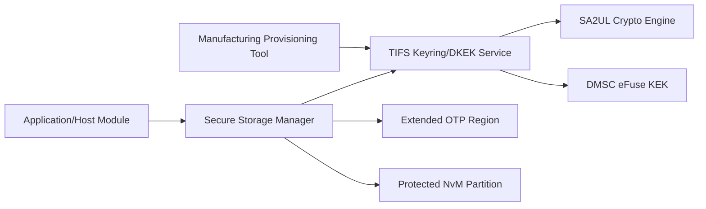
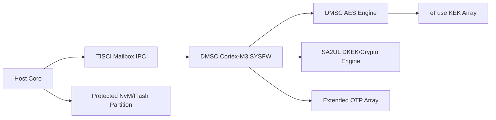
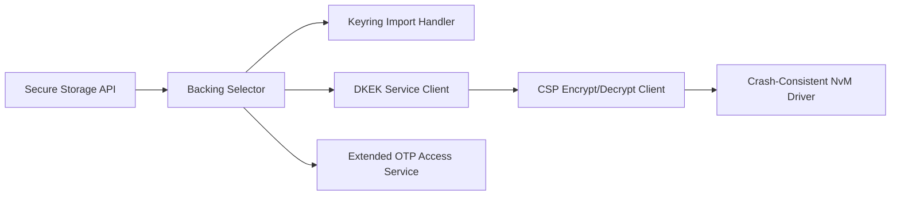
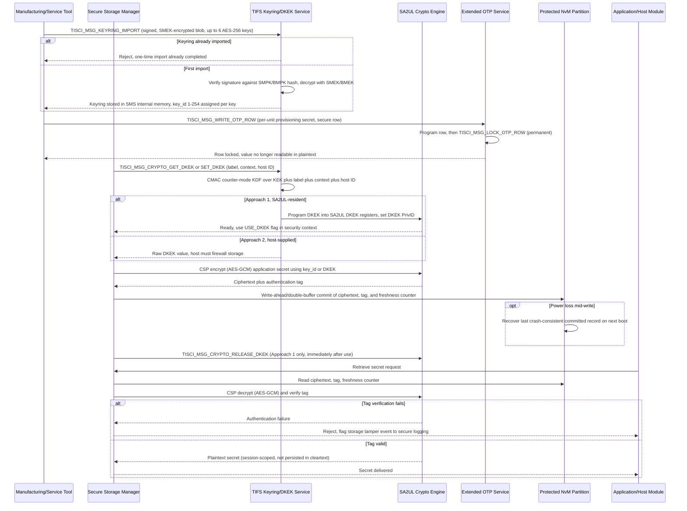

# Secure Storage Architecture Requirements - TDA4VM ADAS ECU

## 1. Functional Security Concept

### 1.1 Cybersecurity Requirements (CSR)
- CSR-STO-1: All persistently stored secrets (credentials, session/application keys, calibration or configuration data marked confidential) shall be stored encrypted at rest and never held in plaintext on non-volatile media.
- CSR-STO-2: Confidentiality of stored secrets shall be bound to device identity such that a secret extracted from one ECU's storage cannot be decrypted on another ECU.
- CSR-STO-3: Access to stored secrets and key material shall be restricted per key to authorized hosts/cores, not globally shared across all software on the device.
- CSR-STO-4: A power loss or reset during a secret write shall never corrupt or partially expose a previously stored secret.
- CSR-STO-5: Provisioning (initial write) of long-term secret material shall be a one-time, auditable operation that cannot be silently repeated or overwritten by an untrusted host.
- CSR-STO-6: Compromise or disclosure of one stored secret shall not enable derivation of other, unrelated stored secrets (key separation).

### 1.2 Functional Security Concept (FSC)
- FSC-STO-1: Anchor confidentiality of every stored secret in a hardware-unique root so extraction from one device yields nothing usable elsewhere.
- FSC-STO-2: Separate keys by purpose and owner so compromise of one secret cannot be leveraged to derive or expose another.
- FSC-STO-3: Make provisioning of long-term secrets a one-time, tamper-evident event, and make every write to persistent secret storage resilient to interruption.

### 1.3 Functional Security Requirements (FSR)
- FSR-STO-1: A secret shall never be written to or read from non-volatile media in plaintext form.
- FSR-STO-2: Decrypting a stored secret shall require key material that is unique to the originating device and unobtainable from another device's storage.
- FSR-STO-3: A given secret or key shall be usable only by the specific host/core(s) authorized for it, not by any software running on the device.
- FSR-STO-4: An interrupted write to secret storage shall leave either the previous valid secret or the new valid secret recoverable, never a corrupted or partially exposed intermediate state.
- FSR-STO-5: Initial provisioning of long-term secret material shall be performed at most once per device and shall be verifiable as such.
- FSR-STO-6: Disclosure of one stored secret shall not provide any computational advantage toward recovering another, unrelated stored secret.

## 2. System Requirements and System Static Architecture

### 2.1 System entities
- Application/host modules requesting storage of credentials, session keys, calibration/config secrets
- Secure Storage Manager (host-side service selecting the appropriate storage backing)
- TIFS Keyring and DKEK service (System Firmware, runs on DMSC)
- SA2UL crypto engine (DKEK registers, AES-GCM/CBC/ECB, PrivID gating)
- DMSC eFuse-resident factory Key Encryption Key (KEK)
- Extended OTP region (1024-bit customer general-purpose eFuse array)
- Protected NvM/flash partition for bulk encrypted secret blobs
- Manufacturing/service provisioning tool (one-time keyring and OTP provisioning)

### 2.2 Trust boundaries and interfaces
- Boundary A: Application/host to Secure Storage Manager API
- Boundary B: Secure Storage Manager to TIFS Keyring/DKEK service (TISCI mailbox)
- Boundary C: SA2UL DKEK register boundary, gated by hardware PrivID
- Boundary D: Extended OTP row read/write/lock ownership boundary (single write_host)
- Boundary E: Protected NvM partition to non-secure filesystem/export boundary

### 2.3 System Requirements (SYSR)
- SYSR-STO-1: The Secure Storage Manager shall route every storage request to either the DMSC-anchored key hierarchy (KEK/DKEK) or the Extended OTP backing, never persisting a raw secret in the Protected NvM partition without one of these two protections.
- SYSR-STO-2: The Manufacturing/service provisioning tool shall be the only system entity permitted to invoke keyring import and Extended OTP provisioning across the system.
- SYSR-STO-3: Each trust boundary crossing (Boundary A, B, C) shall carry only key-ID handles or ciphertext, never raw key material, except during the one-time provisioning boundary crossing.
- SYSR-STO-4: The system shall guarantee that a secret extracted from the Protected NvM partition of one ECU instance is not decryptable using another ECU instance's storage stack, since the underlying KEK differs per device.

## 3. Technical Security Concept

### 3.1 Technical Security Concept (TSC)
- TSC-STO-1: Anchor all higher-layer secret protection in a device-unique hardware root key that never leaves the SoC.
- TSC-STO-2: Derive per-purpose, per-host storage keys from the hardware root key using a standard KDF with domain-separating label/context inputs, instead of reusing one key for all secrets.
- TSC-STO-3: Reference keys by opaque key-ID handles for crypto operations rather than passing raw key material across host/firmware boundaries.
- TSC-STO-4: Enforce one-time, signed-and-encrypted bulk provisioning of the long-term symmetric keyring; reject any re-import attempt.
- TSC-STO-5: Use crash-consistent (write-ahead/double-buffer) writes for the protected secret storage partition.
- TSC-STO-6: Gate small, extremely high-value secrets (for example, a per-unit provisioning token) behind row-level, lockable OTP storage separate from the bulk encrypted flash partition.

### 3.2 Technical Security Requirements (TSR)
- TSR-STO-1: Use the DMSC-resident, factory-provisioned Key Encryption Key (KEK) - a 256-bit device-unique key burned into eFuse and reachable only through the DMSC AES engine's register interface (no DMA path) - as the storage root of trust.
- TSR-STO-2: Derive a Derived KEK (DKEK) per host/purpose using a CMAC-based counter-mode KDF (NIST SP 800-108) over a label plus context (limited to 41 bytes combined by the TISCI message size) plus the requesting host ID, via `TISCI_MSG_CRYPTO_GET_DKEK`/`TISCI_MSG_CRYPTO_SET_DKEK`.
- TSR-STO-3: Prefer the SA2UL-resident DKEK approach (`TISCI_MSG_CRYPTO_SET_DKEK` programs SA2UL DKEK registers, gated by the SA2UL DKEK PrivID register and the `USE_DKEK` security-context flag) over the host-supplied-raw-DKEK approach wherever hardware acceleration is available, since the former never exposes DKEK outside SA2UL.
- TSR-STO-4: Release SA2UL DKEK registers via `TISCI_MSG_CRYPTO_RELEASE_DKEK` immediately after use, closing the window in which secure and non-secure software sharing a PrivID on the same core could reuse a still-programmed DKEK.
- TSR-STO-5: Provision up to 6 AES-256 application secrets via the TIFS symmetric keyring (`TISCI_MSG_KEYRING_IMPORT`), each referenced by a 1-254 `key_id` with a `key_rights` bitmask (`image_enc_dec` / `CSP_decrypt` / `HKDF`) limiting permitted operations.
- TSR-STO-6: Encrypt/decrypt bulk secret blobs via the TIFS Cryptographic Services (CSP) API using AES-GCM (preferred, produces an authentication tag) referencing a keyring `key_id` rather than embedding raw key material in the request context.
- TSR-STO-7: Store a small set of irrevocable, high-value per-unit secrets in the 1024-bit Extended OTP region, with a single designated `write_host`, rows marked secure (value withheld from the TISCI read response, usable only to set up crypto contexts) or non-secure, and soft-locked (`TISCI_MSG_SOFT_LOCK_OTP_WRITE_GLOBAL`, until reset) or permanently locked (`TISCI_MSG_LOCK_OTP_ROW`) once provisioning is complete.

## 4. Hardware Requirements and Hardware Static Architecture

### 4.1 Hardware elements
- DMSC eFuse array: factory-random 256-bit KEK, marked read- and write-protected
- DMSC AES engine: register-interface-only path to the KEK, no DMA access
- SA2UL: DKEK registers with PrivID gating, AES-GCM/CBC/ECB engine, HMAC/CMAC
- Extended OTP array: 1024 bits, row-granular hardware write-lock latching
- Protected NvM/flash partition with an atomic/recoverable write path
- TISCI mailbox IPC transport (host cores to DMSC/TIFS for all key-management messages)

### 4.2 Hardware Requirements (HWR)
- HWR-STO-1: KEK is burnt once at TI factory, never retained in any database or manufacturing tester, and reachable only through the DMSC AES engine register interface
- HWR-STO-2: SA2UL enforces PrivID-based gating of DKEK register usage independent of secure/non-secure or privileged/user attributes
- HWR-STO-3: Extended OTP rows support independent write-lock latching in hardware, enforced even across warm/cold resets once permanently locked
- HWR-STO-4: Protected NvM partition write path guarantees atomic/recoverable commits across power loss

## 5. Software Requirements and Software Static & Dynamic Architecture

### 5.1 Software blocks
- Secure Storage API (store/retrieve/provision secret)
- Backing selector (chooses extended OTP vs symmetric keyring/DKEK-encrypted NvM by size/criticality/lifetime)
- Keyring import handler (one-time `TISCI_MSG_KEYRING_IMPORT` client)
- DKEK service client (get/set/release DKEK)
- Extended OTP access service (read/write/lock OTP row)
- CSP encrypt/decrypt client (AES-GCM against a keyring `key_id`)
- Crash-consistent NvM storage driver

### 5.2 Software Requirements (SWR)
- SWR-STO-1: Backing selector chooses extended OTP vs symmetric keyring/DKEK-encrypted NvM based on secret size, criticality, and lifetime
- SWR-STO-2: Keyring import handler enforces one-time-import semantics and validates `key_rights` before shipping
- SWR-STO-3: DKEK service client always releases DKEK after use (Approach 1) or firewalls the raw DKEK in its own memory (Approach 2)
- SWR-STO-4: CSP encrypt/decrypt calls reference a keyring `key_id`, never passing raw application secrets into DMSC/SA2UL registers except during initial keyring/OTP provisioning
- SWR-STO-5: Storage driver performs write-ahead/double-buffer commits and verifies the AES-GCM tag on read-back before releasing a secret to the caller

### 5.3 Secure storage provisioning and runtime store/retrieve sequence

  

Mermaid source (for editing/regeneration)

### 5.4 Behavioral requirement focus
- The symmetric keyring can only be imported once; any later `TISCI_MSG_KEYRING_IMPORT` attempt is rejected outright, which is what makes provisioning auditable and non-repeatable rather than a silently overwritable operation (CSR-STO-5, TSC-STO-4)
- Extended OTP rows carrying per-unit high-value secrets are permanently locked immediately after provisioning, so even a compromised host with write access afterward cannot rewrite or read them back in plaintext (TSC-STO-6, TSR-STO-7)
- DKEK is derived per host/label/context from a KEK that itself never leaves the DMSC AES engine's register interface, so different ECUs (different factory-burnt KEK) or different callers (different label/context/host ID) never converge on the same derived key - a secret pulled from one device's flash cannot be decrypted elsewhere (CSR-STO-2, TSR-STO-1, TSR-STO-2)
- Approach 1 (SA2UL-resident DKEK) is released immediately after use via `TISCI_MSG_CRYPTO_RELEASE_DKEK`, minimizing the window in which secure/non-secure code sharing a PrivID on the same core could reuse it (CSR-STO-3, TSR-STO-4)
- Every stored secret carries an AES-GCM authentication tag; a failed tag check on retrieval is treated as a storage-tamper event and reported to secure logging rather than silently returning corrupted or substituted data (CSR-STO-1, SWR-STO-5)
- Writes to the protected NvM partition are crash-consistent (write-ahead/double-buffer), so a power loss mid-write cannot corrupt or partially expose a previously committed secret (CSR-STO-4, TSC-STO-5)

## 6. Hardware-Software Interface (HSI)

### 6.1 HSI elements
- DMSC AES engine register interface: operate-with-KEK path only, no raw-KEK read path exposed to software
- SA2UL DKEK register set and PrivID gating register, accessed only via the `USE_DKEK` security-context flag
- TISCI mailbox message set: `TISCI_MSG_CRYPTO_GET_DKEK`/`SET_DKEK`/`RELEASE_DKEK`, `TISCI_MSG_KEYRING_IMPORT`, `TISCI_MSG_WRITE_OTP_ROW`, `TISCI_MSG_LOCK_OTP_ROW`, `TISCI_MSG_SOFT_LOCK_OTP_WRITE_GLOBAL`
- Extended OTP row read/write/lock-status register interface
- Protected NvM controller write-ahead/double-buffer commit interface

### 6.2 HSI Requirements (HSI)
- HSI-STO-1: The DMSC AES engine's KEK register interface shall expose no read path to software, only an operate-with-KEK path, so no driver or API may return the raw KEK value.
- HSI-STO-2: The SA2UL DKEK register interface shall be gated by hardware PrivID matching, and software shall treat `USE_DKEK` as the only permitted access flag rather than addressing DKEK registers directly.
- HSI-STO-3: The TISCI mailbox interface carrying key-management messages shall enforce message-level access control per host, independent of any software-level policy layered on top.
- HSI-STO-4: The Extended OTP row interface shall expose row lock-state (soft/permanent) to software as a queryable status, so the storage driver can detect and refuse writes to an already-locked row before issuing `TISCI_MSG_WRITE_OTP_ROW`.
