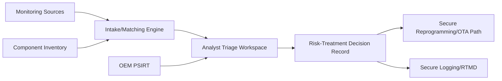
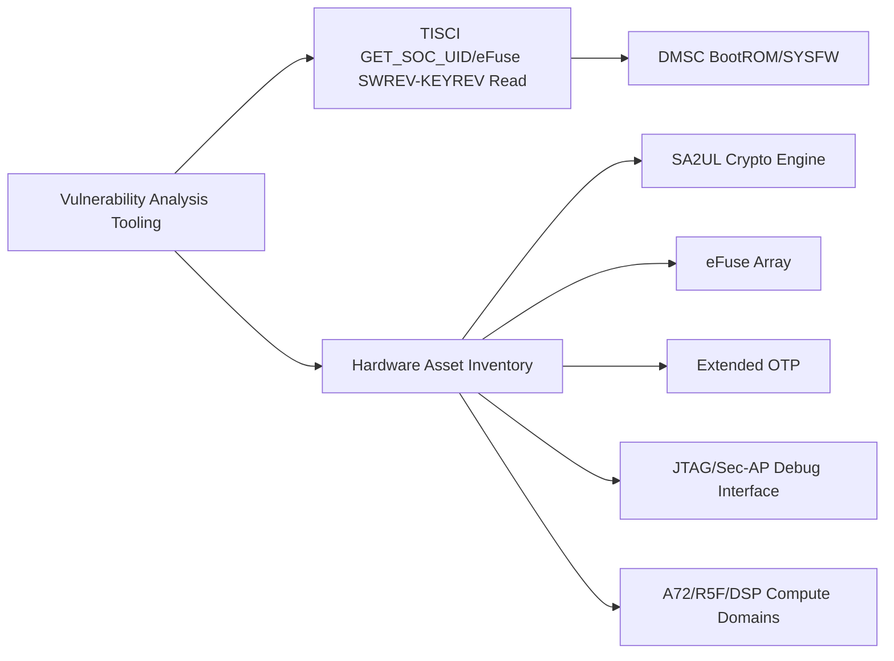
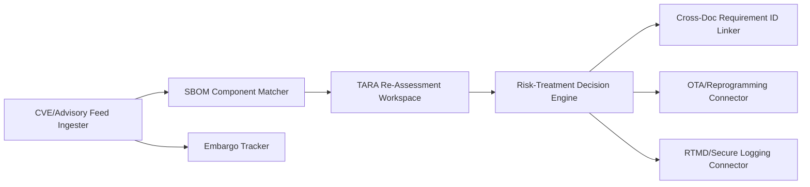
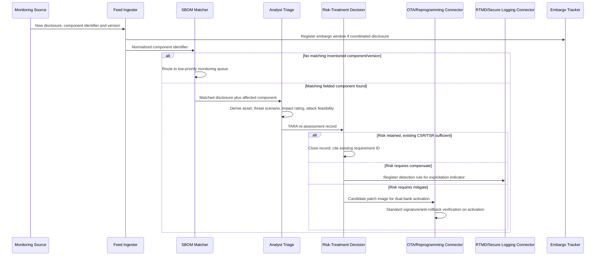

# Vulnerability Analysis and Management Requirements - TDA4VM ADAS ECU

**Scope note (this doc adapts the repo's template deliberately):** every other doc in this repo
covers a runtime security *mechanism* on the ECU (boot, JTAG, comms, storage, ...). Vulnerability
analysis is instead an ISO 21434 *continuous cybersecurity activity* (monitoring, event evaluation,
vulnerability analysis, vulnerability management) that runs across the item's whole lifecycle and
feeds back into those mechanisms. To keep this doc traceable in the same CSR->FSR->SYSR->TSC->TSR->
HWR/SWR->HSI shape as the rest of the repo:
- Section 4 ("Hardware Requirements and Hardware Static Architecture") is the **hardware asset
  inventory and fingerprinting surface** this activity analyzes, not a new crypto engine.
- Section 5 is the **tooling/workflow** that ingests disclosures and produces risk-treatment
  decisions, not an always-running runtime security stack.
- This doc's job is to *re-assess and route*, referencing the CSR/TSR/HWR/SWR IDs already defined
  in this repo's other nine docs - see the `traceability-matrix` skill for how those cross-doc links
  are built.

## 1. Functional Security Concept

### 1.1 Cybersecurity Requirements (CSR)
- CSR-VULN-1: Every deployed TDA4VM ECU software/hardware component (DMSC/TIFS, SA2UL crypto stack, R5F SBL, A72 HLOS/application software, third-party libraries) shall be tracked in a component inventory (SBOM) sufficient to determine whether a newly disclosed vulnerability applies to a given fielded configuration.
- CSR-VULN-2: External vulnerability disclosures relevant to any inventoried component (NVD/CVE feeds, TI PSIRT security bulletins, supplier/OSS advisories, internal red-team/pentest findings, coordinated disclosure reports) shall be continuously monitored, not reviewed only at a fixed release cadence.
- CSR-VULN-3: Every vulnerability matched to a fielded component shall be re-assessed using the item's own TARA vocabulary (asset, damage scenario, threat scenario, attack feasibility, impact rating) rather than adopting a generic third-party severity score unmodified.
- CSR-VULN-4: A vulnerability whose re-assessed risk exceeds the item's defined risk acceptance threshold shall trigger a tracked risk-treatment decision (mitigate via patch/config change, compensate via a monitoring control, or accept with documented rationale) within a bounded time.
- CSR-VULN-5: Vulnerability status, re-assessment outcome, and risk-treatment decisions shall be traceable to the specific CSR/TSR/HWR/SWR requirement ID(s) they affect across this repo's other topic documents.

### 1.2 Functional Security Concept (FSC)
- FSC-VULN-1: Maintain a continuously updated component/version inventory (SBOM) covering firmware, OS, and third-party software, correlated against the same version identifiers (SWREV/KEYREV, image manifest versions) used elsewhere in the boot/OTA/reprogramming chain, so a disclosed CVE can be matched to exactly the fielded configurations it affects.
- FSC-VULN-2: Run every matched disclosure through the item's own ISO 21434 TARA method (not the raw CVSS score alone) to decide whether existing controls already treat the threat scenario or a new/updated requirement is needed.
- FSC-VULN-3: Close the loop from vulnerability analysis to remediation by routing accepted risk-treatment decisions into the existing secure reprogramming/OTA delivery path, and into secure logging/RTMD for detecting in-field exploitation attempts of a known-vulnerable configuration before a patch is deployed.

### 1.3 Functional Security Requirements (FSR)
- FSR-VULN-1: The component inventory shall record, at minimum, component name, version/build identifier, and the specific hardware/software element(s) in this repo's Section 4/5 architectures it corresponds to.
- FSR-VULN-2: A newly ingested disclosure shall be automatically checked against the component inventory by version/identifier match before being queued for manual analyst triage.
- FSR-VULN-3: Manual triage shall produce, at minimum, an asset, a threat scenario/attack path, an impact rating (Safety/Financial/Operational/Privacy), and an attack feasibility rating, per this repo's ISO 21434 TARA vocabulary.
- FSR-VULN-4: A risk-treatment decision shall reference the specific existing CSR/TSR ID(s) judged sufficient, or shall flag that no existing requirement is sufficient, in the affected topic document(s).
- FSR-VULN-5: Coordinated-disclosure embargoes (externally reported vulnerabilities under a non-disclosure window) shall be tracked with an explicit embargo-end date, and shall not block continued internal risk-treatment work during the embargo.

## 2. System Requirements and System Static Architecture

### 2.1 System entities
- Vulnerability monitoring sources (NVD/CVE feeds, TI PSIRT bulletins, supplier/OSS advisories, internal red-team/pentest reports, coordinated disclosure reports)
- Component/version inventory (SBOM), correlated to this repo's hardware/software architecture elements
- Vulnerability intake and matching engine
- Analyst triage workspace (TARA re-assessment)
- Risk-treatment decision record, linked to this repo's requirement IDs
- OEM PSIRT / cybersecurity response team
- Secure reprogramming/OTA delivery path (remediation channel)
- Secure logging/RTMD (in-field exploitation-attempt detection)

### 2.2 Trust boundaries and interfaces
- Boundary A: External monitoring sources to intake/matching engine (untrusted external input, must be sanitized/rate-limited)
- Boundary B: Matching engine to analyst triage (only fielded-relevant, matched disclosures cross this boundary)
- Boundary C: Analyst triage to risk-treatment decision record (requires documented TARA fields, no undocumented severity override)
- Boundary D: Risk-treatment decision record to secure reprogramming/OTA path (only for mitigate-via-patch decisions)
- Boundary E: Risk-treatment decision record to secure logging/RTMD (for compensate-via-monitoring decisions)

### 2.3 System Requirements (SYSR)
- SYSR-VULN-1: The intake/matching engine shall be the only system entity permitted to promote an external disclosure to analyst triage (Boundary B), so an unmatched or irrelevant disclosure never reaches the triage backlog.
- SYSR-VULN-2: Analyst triage shall be the only path by which a risk-treatment decision record is created (Boundary C), so no severity score or remediation action bypasses TARA re-assessment.
- SYSR-VULN-3: A risk-treatment decision record shall reach the Secure Reprogramming/OTA path (Boundary D) only when the decision is explicitly "mitigate via patch", never as a side effect of a "compensate" or "accept" decision.
- SYSR-VULN-4: The OEM PSIRT shall be the single system-wide authority that closes a risk-treatment decision record, whether the outcome is mitigate, compensate, or accept.

## 3. Technical Security Concept

### 3.1 Technical Security Concept (TSC)
- TSC-VULN-1: Correlate CVE/advisory component identifiers against the SBOM's recorded component+version fields to determine applicability, rather than matching on product name alone.
- TSC-VULN-2: Reuse this repo's own eFuse SWREV/KEYREV and OTA/reprogramming image-manifest version fields as the authoritative "what's actually fielded" source for matching, since it is the same anti-rollback version state enforced at boot.
- TSC-VULN-3: Re-derive attack feasibility using TDA4VM-specific facts already established elsewhere in this repo (e.g., the DMSC KEK is register-only/no-DMA, JTAG default state depends on device security type) rather than accepting a generic CVSS attack-vector subscore unmodified.
- TSC-VULN-4: Where a risk-treatment decision is "mitigate", drive it through the existing secure reprogramming/OTA activation chain so the fix inherits the same signature/anti-rollback verification as any other update, never a side-channel patch path.

### 3.2 Technical Security Requirements (TSR)
- TSR-VULN-1: The SBOM matcher shall key component identity on the same version fields already surfaced via TISCI (`TISCI_MSG_GET_SOC_UID` device fingerprint, eFuse SWREV/KEYREV) and the OTA/reprogramming image manifest, not a separately maintained version string.
- TSR-VULN-2: Attack feasibility re-rating shall cite the specific TDA4VM hardware/firmware fact that changes the generic CVSS assumption (e.g., "requires physical JTAG access, downgraded from High to Low feasibility because this device's security type is HS-SE with JTAG closed by default").
- TSR-VULN-3: A "mitigate" risk-treatment decision targeting firmware/software shall be expressed as a candidate image routed through the standard dual-bank OTA/reprogramming activation path, inheriting DMSC BootROM -> System Firmware/TIFS -> R5F SBL verification on activation.
- TSR-VULN-4: A "compensate" risk-treatment decision shall register a corresponding detection rule with RTMD/secure logging (e.g., watch for the specific exploitation indicator) until a full mitigation ships.
- TSR-VULN-5: Coordinated-disclosure embargo state shall be stored alongside the risk-treatment decision record so a premature public disclosure alert (before embargo end) can be distinguished from a legitimate zero-day event.

## 4. Hardware Requirements and Hardware Static Architecture

### 4.1 Hardware elements (asset inventory and fingerprinting surface, not a new crypto engine)
- Device/firmware fingerprinting interface: `TISCI_MSG_GET_SOC_UID`, eFuse SWREV/KEYREV read-back
- The full TDA4VM hardware asset inventory tracked by vulnerability analysis: DMSC (BootROM/SYSFW), SA2UL, eFuse array (SMPK/BMPK/KEYREV/SWREV/JTAG-disable flag), Extended OTP, A72/R5F/DSP compute domains, JTAG/Sec-AP debug interface, flash/OSPI/eMMC
- Build/manifest metadata store used to populate the SBOM's hardware-revision and board-configuration fields
- Secure reprogramming/OTA flash path (remediation delivery, shared with those docs)

### 4.2 Hardware Requirements (HWR)
- HWR-VULN-1: The `TISCI_MSG_GET_SOC_UID` and eFuse SWREV/KEYREV read-back paths shall remain available to authorized diagnostic/fleet-management tooling specifically so fielded-version fingerprinting for vulnerability matching does not itself require a JTAG/debug unlock.
- HWR-VULN-2: The hardware asset inventory shall enumerate every hardware element already defined in this repo's other topic documents (DMSC, SA2UL, eFuse, Extended OTP, cores, JTAG/Sec-AP) so no fielded hardware block is invisible to vulnerability analysis.
- HWR-VULN-3: Any hardware erratum disclosed by TI against a TDA4VM silicon revision in the inventory shall be matched by silicon revision field, the same way a firmware CVE is matched by SWREV/KEYREV.

## 5. Software Requirements and Software Static & Dynamic Architecture

### 5.1 Software blocks
- CVE/advisory feed ingester (NVD, TI PSIRT, supplier/OSS advisories)
- SBOM component/version matcher
- TARA re-assessment workspace (asset/threat/impact/feasibility capture)
- Risk-treatment decision engine and record store
- Cross-doc requirement ID linker (traceability to this repo's other CSR/TSR IDs)
- OTA/secure reprogramming remediation connector
- RTMD/secure logging detection-rule connector
- Coordinated-disclosure embargo tracker

### 5.2 Software Requirements (SWR)
- SWR-VULN-1: The feed ingester shall normalize each disclosure's component identifier before handing it to the SBOM matcher, so vendor-specific naming variants do not silently fail to match.
- SWR-VULN-2: The SBOM matcher shall reject a disclosure with no matching inventoried component/version, routing it to a low-priority monitoring queue instead of the analyst triage backlog.
- SWR-VULN-3: The TARA re-assessment workspace shall block submission of a triage record missing any of asset, threat scenario, impact rating, or attack feasibility rating.
- SWR-VULN-4: The cross-doc requirement ID linker shall validate that every CSR/TSR ID cited in a risk-treatment decision actually exists in the target topic document, flagging an invalid citation rather than silently accepting it.
- SWR-VULN-5: The embargo tracker shall suppress external-facing disclosure of a decision record until its embargo-end date, while still allowing internal risk-treatment work to proceed.

### 5.3 Vulnerability ingestion, TARA re-assessment, and risk-treatment flow

  

Mermaid source (for editing/regeneration)

### 5.4 Behavioral requirement focus
- A disclosure that does not match any inventoried component/version is routed to monitoring only, never consuming analyst triage capacity (CSR-VULN-2, SWR-VULN-2)
- Every matched disclosure produces a full TARA record (asset, threat scenario, impact, attack feasibility) before any risk-treatment decision, not a bare CVSS pass-through (CSR-VULN-3, FSR-VULN-3, SWR-VULN-3)
- Attack feasibility re-rating explicitly cites the TDA4VM-specific hardware fact that changes the generic assumption, e.g. JTAG default state per device security type (TSR-VULN-2)
- A "mitigate" decision is delivered exclusively through the existing dual-bank OTA/reprogramming activation chain, so a vulnerability patch is never trusted more loosely than a routine update (TSR-VULN-3, SYSR-VULN-3)
- A "compensate" decision registers a concrete RTMD/secure logging detection rule rather than remaining a paper mitigation (TSR-VULN-4, SWR-VULN-5 embargo suppression is independent of this)
- Coordinated-disclosure embargoes gate only external communication, never internal risk-treatment progress (FSR-VULN-5, SWR-VULN-5)

## 6. Hardware-Software Interface (HSI)

### 6.1 HSI elements
- `TISCI_MSG_GET_SOC_UID` / eFuse SWREV-KEYREV read-back API (fingerprint interface)
- SBOM-to-image-manifest version field mapping interface (shared with the OTA/reprogramming docs)
- RTMD/secure logging detection-rule registration API

### 6.2 HSI Requirements (HSI)
- HSI-VULN-1: The fingerprint API shall return SWREV/KEYREV and device UID in a format directly consumable by the SBOM matcher without an intermediate manual translation step.
- HSI-VULN-2: The SBOM-to-image-manifest mapping interface shall use the identical version field format as the OTA/reprogramming image manifest, so a "mitigate" decision's candidate image version is unambiguous end to end.
- HSI-VULN-3: The RTMD/secure logging detection-rule registration API shall accept a rule keyed by the same Data ID/PDU or component identifier used in the risk-treatment decision record, so a compensate decision can be verified as actually active in the field.
