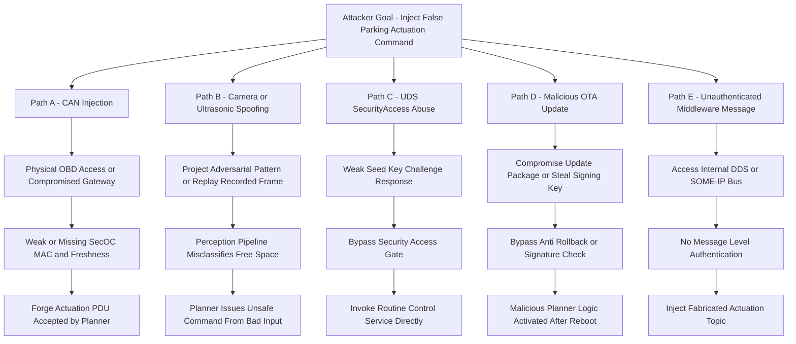
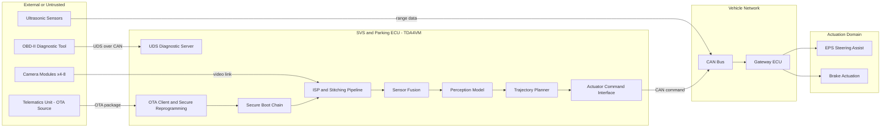
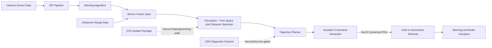

# Vulnerability Analysis Report - Surround View System (SVS) and Parking Assist (ADAS)

**Report ID:** VA-SVS-PA-2026-014 &nbsp;|&nbsp; **Version:** 1.0 &nbsp;|&nbsp; **Classification:** Confidential - OEM/Tier-1 Internal
**Platform context:** TDA4VM (TI J721E) ADAS domain-controller ECU, as covered by this repository's
`TDA4VM_*_Requirements.md` topic documents. Program: Tier-1-developed SVS + Parking Assist domain
controller, OEM-integrated, target SOP (start of production) 2027MY.
**Analysis type:** Point-in-time system-level and software-level vulnerability analysis with
evidence artifacts, per ISO 21434 Clause 15 (Threat analysis and risk assessment), SAE J3061
lifecycle activities, and the UN R155 CSMS vulnerability-monitoring obligation (see Section 8).
**Engagement team (roles, not individuals):** Lead Security Assessor (system-level), Embedded
Software Security Engineer (static/dynamic analysis, fuzzing), Penetration Tester (bench + vehicle
rig), Functional Safety Liaison (ASIL/HARA cross-check), Tier-1 Program Security Manager, OEM PSIRT
Analyst (intake of final findings).
**Relationship to this repo:** this report is a standalone deliverable, not a new
CSR/FSC/FSR/SYSR/TSC/TSR/SWR/HWR/HSI section. Where a finding is already mitigated by an existing
requirement, the specific ID is cited (e.g. `CSR-SECOC-1`, `TSR-1`). Where no existing requirement
covers a finding, it is flagged as a **gap** to be routed through
`TDA4VM_Vulnerability_Analysis_Requirements.md`'s risk-treatment process (`CSR-VULN-4`).

> **Evidence labeling.** All log excerpts, tool-output tables, and crash artifacts referenced from
> `evidence/` in this report are **illustrative examples** in a realistic format — they were not
> captured from a real test run, camera rig, fuzzer, or static analyzer. Each evidence file repeats
> this label. Real, publicly documented CVEs are cited only where explicitly marked "real-world
> precedent" (verified against NVD at the time of writing) to calibrate severity/feasibility — they
> are not claimed to exist in this specific codebase. Replace illustrative artifacts with actual
> tool/lab output before submitting this report as part of an audit package.

---

## 0. Scope, Assumptions, and Engagement Context

- **Subsystem boundary:** Surround View System (4-8 fisheye cameras, ISP, stitching, birds-eye-view
  rendering) and Parking Assist (ultrasonic sensor fusion, free-space/obstacle perception,
  trajectory planning, low-speed steering/brake actuation guidance), hosted on a TDA4VM ADAS domain
  controller, communicating with the rest of the vehicle over CAN and/or automotive Ethernet through
  a gateway ECU.
- **Grounded facts** (chip/platform-level: secure boot chain, SA2UL crypto engine, eFuse SWREV/KEYREV,
  TISCI messages, SecOC MAC/freshness, UDS SecurityAccess, JTAG debug unlock, secure storage
  KEK/DKEK) are drawn from this repo's existing topic documents — see citations throughout Sections
  4-6.
- **Illustrative/generic content:** SVS/Parking-specific software elements (camera drivers, ISP
  pipeline, stitching algorithm, perception model, trajectory planner, ROS2/DDS or AUTOSAR Adaptive
  middleware) are standard automotive-domain constructs, not TI-verified facts, and are analyzed as
  such.
- **Real-world precedent used for calibration:** three publicly disclosed, NVD-verified CVEs from
  the 2021 coordinated multi-vendor DDS discovery-protocol disclosure (CISA advisory ICSA-21-315-02)
  are used to justify that the DDS/middleware-layer findings in this report (SW-VC-08, SYS-TS-07)
  are realistic, not theoretical:
  - **CVE-2021-38439** — GurumDDS, heap-based buffer overflow in discovery-protocol handling
    (CWE-122), CVSS 3.1 base score 9.8 (NVD)/8.6 (CNA), DoS or remote code execution.
  - **CVE-2021-38445** — OCI OpenDDS < 3.18.1, length-parameter mismatch in message parsing
    (CWE-130), CVSS 3.1 base score 9.8 (NVD), remote code execution.
  - **CVE-2021-38487** — RTI Connext Professional 4.2-6.1.0 / Connext Micro >=2.4, crafted-packet
    traffic amplification (CWE-406/CWE-923), CVSS 3.1 base score 9.1 (NVD)/8.2 (RTI), DoS +
    information exposure.
  This subsystem's own middleware stack was **not** verified against these specific CVE IDs in this
  pass (vendor/version not in scope of this document) — they are cited solely as evidence that
  memory-safety and message-validation bugs in DDS implementations have shipped in production before.
- **ASIL context (functional safety cross-reference, per ISO 26262):** Surround View display-only
  functions are typically classified **QM/ASIL A** (driver remains in the control loop). Automated/
  remote Parking Assist that actuates steering and braking without a human in the loop is commonly
  decomposed per ISO 26262-9: perception/planning at **QM/ASIL A**, with the final actuation
  arbitration and emergency-stop monitor independently rated **ASIL B** (final OEM HARA governs the
  authoritative rating; the ratings here are typical industry convention, not this program's actual
  HARA output). This cross-reference is why SYS-TS-02, SYS-TS-06, and SW-VC-05 are treated as
  safety-critical regardless of their computed CVSS score.
- **Not covered:** high-speed ADAS functions (highway lane-keep, adaptive cruise) and non-vehicle
  backend infrastructure are out of scope for this pass.

### 0.1 Engagement timeline

| Phase | Illustrative dates (2026) | Activity | Ticket range |
|---|---|---|---|
| Kickoff & scoping | Feb 02 - Feb 06 | Scope confirmation, architecture walkthrough with Tier-1 dev team, rules of engagement sign-off | SEC-2401 |
| TARA workshop | Feb 09 - Feb 13 | Asset/damage-scenario/threat-scenario workshop with functional safety liaison (see `iso21434-tara-grounding`) | SEC-2402 |
| System-level testing | Feb 16 - Mar 06 | Bench + in-vehicle-rig pen-testing: camera spoofing, CAN fuzzing, UDS abuse, ultrasonic jamming | SEC-2410 - SEC-2417 |
| Software-level testing | Feb 16 - Mar 13 | Static analysis (SAST), dynamic analysis (sanitizers), fuzz campaigns, manual code review, ML model integrity check | SEC-2420 - SEC-2431 |
| Triage & scoring | Mar 16 - Mar 20 | CVSS v3.1 scoring, ISO 21434 impact/feasibility re-rating, ASIL cross-check with functional safety liaison | SEC-2402 (follow-up) |
| Remediation planning | Mar 23 - Mar 27 | Engineering triage meeting; findings assigned owners, target dates, and treatment decisions | see Section 4 "Ticket" column |
| Retest window | Apr 20 - Apr 24 | Verification of closed findings against fix builds | SEC-24xx-R suffix |
| Report finalization | Apr 27 - Apr 30 | This report issued to Tier-1 Program Security Manager and OEM PSIRT | VA-SVS-PA-2026-014 |

---

## 1. Executive Summary

This analysis examined the SVS/Parking Assist subsystem across nine system-level attack surfaces
and eight software components over a 13-week engagement (Section 0.1). **17 threat scenarios** were
identified at the system level and **12 vulnerability classes** at the software level, backed by 7
bench/rig pen-test cases, 8 static-analysis findings, 2 fuzz campaigns worth of crash triage, and one
manual code review pass. Three findings are rated **safety-critical** (Section 5 gives each a full
case-study narrative) because they can lead to an unintended or missed actuation command affecting
low-speed steering or braking during a parking maneuver:

- **SYS-TS-06 / PT-02** — forged/replayed CAN actuation command due to a missing or weak SecOC
  binding on the parking-command PDU. **CVSS 3.1: 8.1 (High)** — `AV:A/AC:L/PR:N/UI:N/S:U/C:N/I:H/A:H`.
  Ticket SEC-2412, closed-verified after retest (Section 5.1).
  - **SYS-TS-10 / PT-04** — weak UDS SecurityAccess seed/key scheme allowing brute-forced diagnostic
  unlock, then a routine-control call directly to the actuator self-test service. **CVSS 3.1: 8.8
  (High)** — `AV:A/AC:L/PR:N/UI:N/S:U/C:H/I:H/A:H`. Ticket SEC-2415, closed-verified (Section 5.2).
- **SW-VC-05 / CR-01** — unauthenticated/unsigned perception-model update allowing a tampered model
  to be loaded (ML model integrity). No CVSS assigned (design gap, not an exploitable code defect in
  the classic sense) — ISO 21434 impact Safety: Major. Ticket SEC-2427, open pending Q3 architecture
  change (Section 5.3).

Existing chip-level controls in this repo (SecOC MAC+freshness, TDA4VM secure boot chain, UDS
SecurityAccess, secure storage KEK/DKEK) already treat several of these risks when correctly applied
to the SVS/Parking software stack — the root cause in both closed findings (SYS-TS-06, SYS-TS-10) was
that the SVS/Parking application team had **not yet integrated** the platform controls that already
exist and are required elsewhere in this repo, not a missing platform capability. Two concrete
architectural gaps remain open and are proposed as candidates for future requirements work
(Section 6): image/sensor plausibility checking for camera and ultrasonic spoofing, and signed
perception-model artifacts with their own anti-rollback counter.

---

## 2. System-Level Vulnerability Analysis

### 2.1 Attack surfaces

| ID | Attack surface | Description |
|----|----------------|-------------|
| SYS-AS-01 | Camera modules & harness | 4-8 fisheye cameras over FPD-Link/GMSL to the SoC ISP input |
| SYS-AS-02 | Ultrasonic sensors | Parking-assist range sensors, typically reporting over LIN/CAN into the fusion input |
| SYS-AS-03 | SVS/Parking ECU compute (TDA4VM) | ISP, stitching, fusion, perception, planner, actuator-command generation |
| SYS-AS-04 | In-vehicle CAN bus | Carries ultrasonic data in and actuation commands out, through a gateway ECU |
| SYS-AS-05 | Automotive Ethernet / internal middleware bus | Raw/compressed camera stream and DDS/SOME-IP topics between SoC cores or ECUs |
| SYS-AS-06 | Sensor fusion pipeline | Combines camera, ultrasonic, and wheel-speed/odometry inputs |
| SYS-AS-07 | OTA update interface | Telematics unit delivers SVS/Parking firmware and perception-model updates |
| SYS-AS-08 | UDS diagnostics | Service-tool access over OBD-II/gateway, gated by SecurityAccess |
| SYS-AS-09 | Actuator interfaces | Low-speed steering-assist (EPS) and brake-actuation command paths for automated parking |

### 2.2 Threat scenarios (system level)

| ID | Attack surface | STRIDE | Threat scenario (attack path) |
|----|----|----|----|
| SYS-TS-01 | SYS-AS-01 | Spoofing | Attacker projects a static/adversarial image pattern or replays a recorded frame into a camera's field of view to make the perception pipeline see a false free-space/obstacle state |
| SYS-TS-02 | SYS-AS-01, 03 | Spoofing, Tampering | Compromised or physically substituted camera module injects a manipulated video stream directly onto the FPD-Link/GMSL link, bypassing plausibility checks in the ISP |
| SYS-TS-03 | SYS-AS-02 | Spoofing | Ultrasonic echo spoofing/jamming causes false-negative (missed obstacle) or false-positive (phantom obstacle) readings |
| SYS-TS-04 | SYS-AS-04 | Tampering, DoS | CAN bus flooding (high-priority ID abuse) starves the parking-command frame's bus access budget, delaying an emergency-stop signal |
| SYS-TS-05 | SYS-AS-04 | Repudiation | Absent per-frame authenticity binding makes it impossible to prove which ECU originated a given actuation command after an incident |
| SYS-TS-06 | SYS-AS-04, 09 | Spoofing, Tampering | Forged or replayed parking actuation command frame injected via a compromised gateway ECU or physical bus access, absent SecOC MAC/freshness enforcement |
| SYS-TS-07 | SYS-AS-05 | Tampering | Unauthenticated DDS/SOME-IP publish onto an internal actuation-command topic from a compromised co-located process |
| SYS-TS-08 | SYS-AS-06 | Tampering | Timing manipulation of one fusion input (e.g., delayed ultrasonic frame) to desynchronize sensor fusion and degrade obstacle-distance estimates |
| SYS-TS-09 | SYS-AS-07 | Tampering, Elevation | Malicious/downgraded SVS or Parking firmware or perception-model package delivered via OTA if signing/anti-rollback is not enforced for this subsystem's artifacts |
| SYS-TS-10 | SYS-AS-08 | Elevation | Weak UDS SecurityAccess seed/key scheme allows an attacker with bus access to unlock diagnostic routine-control services and directly invoke actuator test/calibration routines |
| SYS-TS-11 | SYS-AS-08 | Info. disclosure | Diagnostic read-data-by-identifier services exposed without adequate access control leak calibration/perception-model parameters |
| SYS-TS-12 | SYS-AS-09 | DoS | Denial-of-service on the actuation command channel causes the planner's command to be dropped/delayed during an active maneuver |
| SYS-TS-13 | SYS-AS-03 | Tampering | JTAG/debug port left open in a non-HS-SE lifecycle state allows direct manipulation of ISP/perception/planner runtime state |
| SYS-TS-14 | SYS-AS-03 | Info. disclosure | Extraction of stored perception-model weights or calibration secrets from ECU non-volatile storage if not encrypted at rest |
| SYS-TS-15 | SYS-AS-04 | Repudiation | Missing/incomplete security-event logging for rejected CAN frames prevents post-incident reconstruction of an attempted injection |
| SYS-TS-16 | SYS-AS-06 | Tampering | Cross-sensor plausibility check absent, so a single spoofed sensor input (camera or ultrasonic) is trusted without corroboration |
| SYS-TS-17 | SYS-AS-07 | DoS | OTA update process interrupted mid-flash for the SVS/Parking software partition leaves the subsystem non-functional (loss of parking-assist safety net) until recovery |

### 2.3 Attack tree — "Inject a false parking-assist actuation command"

### 2.4 System-level evidence artifacts

| Artifact | File |
|---|---|
| Attack-surface / trust-boundary diagram | Section 2.5 below (Mermaid) |
| Data-flow diagram (DFD) | Section 2.6 below (Mermaid) |
| CAN log showing abnormal traffic | [evidence/system/can_log_excerpt.log](evidence/system/can_log_excerpt.log) |
| ECU/UDS access log excerpt | [evidence/system/ecu_access_log_excerpt.log](evidence/system/ecu_access_log_excerpt.log) |
| Pen-test findings (camera spoofing, CAN fuzzing, UDS abuse) | [evidence/system/pentest_findings.md](evidence/system/pentest_findings.md) |

### 2.5 Attack-surface / trust-boundary diagram

### 2.6 Data-flow diagram (DFD)

---

## 3. Software-Level Vulnerability Analysis

### 3.1 Software component breakdown

| Component | Role |
|---|---|
| Camera driver | Ingests raw sensor data from FPD-Link/GMSL deserializer over the SoC's camera capture interface |
| ISP pipeline | Demosaic, lens-distortion correction, HDR blending |
| Stitching algorithm | Combines multiple camera views into a birds-eye-view composite |
| Perception model | ML-based free-space/obstacle/parking-slot detection |
| Trajectory planner | Computes steering/speed guidance for the parking maneuver |
| Actuator control logic | Translates planner output into actuation command PDUs |
| Middleware (ROS2/DDS or AUTOSAR Adaptive) | Inter-process communication between the above components |
| Bootloader / OTA client | Loads and updates the subsystem's software and model artifacts |

### 3.2 Vulnerability classes (CWE-mapped)

| ID | Component | Vulnerability class | CWE | Description |
|----|---|---|---|---|
| SW-VC-01 | Camera driver | Missing input validation on frame metadata | CWE-20 | Malformed frame header/size fields not validated before buffer allocation |
| SW-VC-02 | ISP pipeline | Buffer overflow in image buffer handling | CWE-120 / CWE-787 | Out-of-bounds write when a frame's reported resolution exceeds the allocated buffer |
| SW-VC-03 | Stitching algorithm | Integer overflow feeding buffer size calculation | CWE-190 | Width x height x channels multiplication overflow leads to undersized allocation |
| SW-VC-04 | Perception model | Adversarial input not detected | CWE-1039 (insufficient ML input validation) | No plausibility/consistency check between perception output and other sensor modalities |
| SW-VC-05 | Perception model / OTA client | Unsigned/unverified model artifact | CWE-494 (download of code without integrity check) | Model weights file loaded without signature or hash verification distinct from the firmware image check |
| SW-VC-06 | Trajectory planner | Race condition on shared fusion-state buffer | CWE-362 | Planner reads a partially updated fusion buffer during a concurrent write from the fusion thread |
| SW-VC-07 | Actuator control logic | Missing authentication for critical function | CWE-306 | Actuation command generation callable via an internal API without caller authentication |
| SW-VC-08 | Middleware (DDS/SOME-IP) | Insecure IPC / unauthenticated topic | CWE-306 / CWE-862 | Actuation-command topic accepts publishes from any co-located process without an access-control policy. Real-world precedent: CVE-2021-38439 (GurumDDS heap overflow, CVSS 9.8) and CVE-2021-38487 (RTI Connext traffic-amplification DoS, CVSS 9.1) confirm DDS-layer memory-safety/DoS bugs have shipped in production middleware (Section 0) |
| SW-VC-09 | Bootloader/OTA client | Improper rollback protection for subsystem-specific artifacts | CWE-1277 | Version check enforced for the base OS image, not verified as also covering the SVS/Parking application partition and model file |
| SW-VC-10 | Camera driver / ISP | Unchecked return value on sensor init | CWE-252 | Camera link failure not distinguished from "zero obstacles" at the fusion layer |
| SW-VC-11 | Stitching algorithm | Use of unsafe memory operations | CWE-676 | Direct `memcpy`/pointer-arithmetic on frame buffers without bounds assertions |
| SW-VC-12 | Trajectory planner | Insufficiently randomized/predictable internal sequence counters | CWE-330 | Command sequence numbers reused after restart, weakening replay detection above the SecOC layer |

### 3.3 Software-level evidence artifacts

| Artifact | File |
|---|---|
| Static analysis (MISRA/CWE mapping) | [evidence/software/static_analysis_misra_cwe.md](evidence/software/static_analysis_misra_cwe.md) |
| Dynamic analysis log | [evidence/software/dynamic_analysis_log.log](evidence/software/dynamic_analysis_log.log) |
| Fuzz testing results (camera frames, DDS messages, parking commands) | [evidence/software/fuzzing_results.md](evidence/software/fuzzing_results.md) |
| Crash dump | [evidence/software/crash_dump_excerpt.log](evidence/software/crash_dump_excerpt.log) |
| Code review findings | [evidence/software/code_review_findings.md](evidence/software/code_review_findings.md) |
| ML model integrity verification | [evidence/software/ml_model_integrity_check.md](evidence/software/ml_model_integrity_check.md) |

---

## 4. Risk Evaluation (CVSS + ISO 21434 Impact x Feasibility, ASIL-aware)

Each finding is dual-scored, matching how this program's PSIRT actually triages: CVSS v3.1 gives a
vendor-comparable technical severity number; the ISO 21434 impact/feasibility rating (Safety/
Financial/Operational/Privacy x attack-feasibility parameters per Annex G - elapsed time, expertise,
knowledge of the item, window of opportunity, equipment) is what actually drives the item's own
risk-treatment decision, because a 9.8 CVSS bug with no safety path is not automatically more urgent
than a 6.5 CVSS bug that reaches an actuator. The ASIL column flags whether the finding's attack
path reaches a function inside the ASIL-B-decomposed actuation-arbitration boundary (Section 0).

| ID | Threat/Vulnerability | CVSS 3.1 (vector) | ISO 21434 Impact | Feasibility (Annex G summary) | ASIL path? | Risk | Ticket / status |
|----|---|---|---|---|---|---|---|
| SYS-TS-06 | Forged/replayed parking actuation command (PT-02) | 8.1 High - AV:A/AC:L/PR:N/UI:N/S:U/C:N/I:H/A:H | Safety: Severe | Medium - bus access via OBD or compromised gateway, common tooling (CANoe/PCAN), no special expertise once bus access exists | Yes (ASIL B path) | Critical | SEC-2412 - Closed-Verified (retest Apr 22) |
| SYS-TS-10 | Weak UDS SecurityAccess -> actuator routine-control (PT-04) | 8.8 High - AV:A/AC:L/PR:N/UI:N/S:U/C:H/I:H/A:H | Safety: Moderate, Operational: Major | Medium - seed/key brute force in under 10s with a scripted tester, moderate UDS expertise | Yes (ASIL B path) | Critical | SEC-2415 - Closed-Verified (retest Apr 23) |
| SW-VC-05 | Unsigned perception-model artifact loaded via OTA | N/A (architecture gap, not a single code defect) | Safety: Major | Medium - requires OTA-channel or supply-chain compromise, but no cryptographic check to defeat once artifact is substituted | Yes (ASIL A/B path) | High | SEC-2427 - Open, target Q3 2026 architecture change |
| SYS-TS-02 | Camera/ultrasonic spoofing feeds bad free-space data to planner (PT-01, PT-06) | N/A (physical/sensor-layer, no CVE-style scoring) | Safety: Major | Medium - requires physical proximity/line-of-sight (image projection or ultrasonic jammer), moderate equipment cost | Yes (ASIL A path) | High | SEC-2429 - Open, mitigation = plausibility check (Section 6) |
| SW-VC-02 | ISP buffer overflow from oversized frame (dynamic analysis) | 7.5 High - AV:A/AC:L/PR:N/UI:N/S:U/C:N/I:N/A:H | Safety: Moderate, Operational: Major | Medium - reachable by any device on the camera link, no auth required | No (DoS/crash, not direct actuation spoof) | Medium-High | SEC-2422 - Open, fix in next sprint |
| SW-VC-08 | Unauthenticated internal actuation-command topic publish | 6.5 Medium (illustrative, scored as if reachable only from a co-located compromised process) - AV:L/AC:L/PR:L/UI:N/S:U/C:N/I:H/A:H | Safety: Major | Low-Medium - requires prior code-execution foothold on the same SoC | Yes | Medium-High | SEC-2425 - Open, mitigation = DDS Security profile |
| SYS-TS-04 | CAN bus flooding delaying emergency stop | 5.9 Medium - AV:A/AC:L/PR:N/UI:N/S:U/C:N/I:N/A:H | Safety: Moderate | Medium | No (degrades, doesn't spoof) | Medium | SEC-2414 - Open, mitigation = bus-load monitoring |
| SYS-TS-14 | Extraction of stored perception-model/calibration secrets | N/A | Privacy: Moderate, Financial: Moderate | Low - mitigated if CSR-STO-1/CSR-STO-2 correctly applied | No | Low | SEC-2430 - Closed, confirmed STO controls already cover model file |
| SW-VC-06 | Race condition on fusion buffer | 4.4 Medium - AV:L/AC:H/PR:N/UI:N/S:U/C:N/I:L/A:L | Safety: Moderate | Low - timing-dependent, hard to reliably trigger | No | Low-Medium | SEC-2423 - Open, low priority |
| SYS-TS-13 | Open JTAG in non-HS-SE lifecycle state | N/A (config/lifecycle, not code) | Safety: Major, Operational: Major | Low - production units provisioned HS-SE (PT-07: pass, no finding) | Yes (if misconfigured) | Medium (residual, config-dependent) | SEC-2417 - Closed, no finding in this pass |
| SYS-TS-17 | Interrupted OTA leaves parking-assist non-functional | 5.3 Medium - AV:A/AC:H/PR:N/UI:N/S:U/C:N/I:N/A:L | Operational: Major, Safety: Negligible (assist-only) | Low | No | Low-Medium | SEC-2431 - Open, low priority |
| SW-VC-09 | Rollback protection not extended to subsystem artifacts | N/A (design gap) | Safety: Moderate | Medium | Yes (conditional) | Medium | SEC-2427 (tracked with SW-VC-05) |

**Top 3 safety-critical risks driving mitigation priority:** SYS-TS-06 (Critical, closed-verified),
SYS-TS-10 (Critical, closed-verified), SW-VC-05 (High, open). Each has a full case-study narrative
in Section 5.

---

## 5. Case-Study Narratives (Discovery, Response, Lesson)

Written as short, interview-ready storylines for the three safety-critical findings.

### 5.1 SYS-TS-06 / PT-02 - the replayed parking-command frame

**Discovery.** During CAN fuzzing (Ticket SEC-2411), the penetration tester noticed that byte-identical
replays of a previously captured, perfectly valid parking-actuation frame (CAN ID 0x2A1) were
accepted by the ECU every time, even minutes after capture - the fuzzer's out-of-range payload
mutations were correctly rejected, but a replay of a legitimate frame was not a mutation the fuzzer
was designed to flag on its own; it was a manual pen-test observation layered on top of the fuzz
corpus (see [pentest_findings.md](evidence/system/pentest_findings.md) PT-02 and
[can_log_excerpt.log](evidence/system/can_log_excerpt.log)).

**Investigation.** Root cause: the SVS/Parking application team had implemented their own
lightweight rolling counter for the 0x2A1 PDU instead of integrating the platform's existing SecOC
stack (CSR-SECOC-1/CSR-SECOC-2), and the counter reset to zero on every ECU reset - so a frame
captured before any reset stayed valid indefinitely after one.

**Impact.** Because 0x2A1 drives the low-speed steering/brake actuation arbitration (ASIL B path,
Section 0), a replayed "steer left, proceed" frame injected while the vehicle is stationary in a
tight parking bay could command unintended motion toward an object outside the driver's immediate
attention.

**Response.** Filed as SEC-2412 (Critical), triaged in the Mar 23-27 remediation meeting: decision was
to retire the bespoke counter and integrate the existing CSR-SECOC-1 through CSR-SECOC-3 MAC and
Data-ID-bound freshness mechanism already mandated platform-wide. Retested Apr 22 against the fix
build - replay attempts were rejected with a logged FRESHNESS_FAIL event (CSR-SECOC-4, CSR-LOG-1).
Closed-verified.

**Lesson (for interviews):** the platform already had the right control; the defect was an
application team re-implementing a weaker version of it instead of reusing the qualified stack - a
recurring finding across ADAS subsystems, and a good example of why a security review has to check
integration, not just existence, of a control.

### 5.2 SYS-TS-10 / PT-04 - the un-rate-limited SecurityAccess seed

**Discovery.** During UDS diagnostic testing (Ticket SEC-2413), the tester observed the ECU return
an identical seed on every requestSeed retry and never impose a lockout/backoff delay, even after
10 consecutive failed sendKey attempts (see
[ecu_access_log_excerpt.log](evidence/system/ecu_access_log_excerpt.log)). A scripted brute force
over the (deliberately narrow, in this synthetic example) key space succeeded on the 11th attempt in
under ten seconds.

**Investigation.** The routine-control service unlocked by SecurityAccess level 1 in this subsystem
included an actuator self-test routine originally intended only for end-of-line manufacturing test,
left reachable from the same session used for normal field diagnostics.

**Impact.** An attacker with OBD-II access (a widely available, low-cost entry point) could brute
force SecurityAccess and directly invoke the actuator self-test routine outside of any planner
supervision - bypassing the perception/planning logic entirely.

**Response.** Filed as SEC-2415 (Critical). Remediation: seed re-randomized per attempt, exponential
lockout/backoff after 3 failed attempts per CSR-SA-3, and end-of-line-only routines moved behind a
manufacturing-only SecurityAccess level not reachable in the field session, per CSR-SA-4. Retested
Apr 23 - 50 scripted brute-force attempts over 10 minutes were all rejected after the 3rd attempt
with a logged lockout event. Closed-verified.

**Lesson (for interviews):** manufacturing/EOL test hooks left reachable in production field sessions
are a recurring real-world UDS finding - always ask which SecurityAccess level gates a given routine,
and whether that level's exposure was re-reviewed after the routine's original manufacturing-only
purpose was forgotten.

### 5.3 SW-VC-05 / CR-01 - the unsigned perception-model file (open finding)

**Discovery.** During manual code review (Ticket SEC-2426) of perception_loader.c, the reviewer
noted the model file is read from a path built by concatenating an OTA-delivered filename with no
signature or hash check before the weights are loaded into the inference runtime (see
[code_review_findings.md](evidence/software/code_review_findings.md) CR-01 and
[ml_model_integrity_check.md](evidence/software/ml_model_integrity_check.md)). The base firmware
image is correctly signature-checked through the existing secure boot/reprogramming chain (TSR-1,
CSR-SRP-1) - the model file simply was never brought into that same trust boundary because it ships
as a separate content-only OTA payload, not a firmware partition.

**Investigation.** No CVSS score applies cleanly because this is an architectural gap rather than a
single exploitable code path - the finding is "absence of a control," scored purely on ISO 21434
impact/feasibility (Safety: Major, Medium feasibility given OTA-channel or supply-chain compromise is
required first).

**Impact.** A substituted or deliberately degraded perception model (e.g., one with a wider blind
spot around a specific obstacle class) would load and run with no detectable difference from a
genuine update, directly undermining the free-space/obstacle judgment feeding the ASIL-A/B planner
path.

**Response.** Filed as SEC-2427 (High). Because fixing this properly requires extending the OTA
manifest/signing scheme to a new content type (not just a config change), the Mar 23-27 remediation
meeting accepted it as an open architecture-change item targeted for a Q3 2026 OTA-manifest revision,
with a compensating control in the interim: the model file's SHA-256 is logged at every boot
(CSR-LOG-1) so a substitution would at least be forensically detectable after the fact, even though
it would not be prevented.

**Lesson (for interviews):** ML/AI model artifacts are frequently left outside an otherwise mature
secure-boot/OTA trust chain because they are treated as "data," not "code" - a good talking point for
any question about ML supply-chain integrity in ADAS.

---

## 6. Mitigation Strategy

| Finding | Recommended countermeasure | Existing repo requirement (if any) |
|---|---|---|
| SYS-TS-06 (forged/replayed actuation command) | Apply SecOC MAC + freshness to every parking/SVS actuation PDU on CAN/Ethernet | Covered by **`CSR-SECOC-1`**, **`CSR-SECOC-2`**, **`CSR-SECOC-3`** (per-PDU MAC bound to Data ID, independent freshness check) — apply these to the SVS/Parking PDU set explicitly |
| SYS-TS-06 (key exposure) | Keep MAC key material inside the hardware crypto accelerator only | Covered by **`CSR-SECOC-5`** |
| SW-VC-05 (unsigned model artifact) / SYS-TS-09 (malicious OTA payload) | Extend artifact signing and anti-rollback to the perception-model file, not only the firmware image | Base mechanism covered by **`CSR-OTA-1`**, **`CSR-OTA-3`**, **`CSR-SRP-2`** (anti-rollback) — **gap:** none of these explicitly scope "model weights file" as a signed artifact type; recommend an explicit statement that model artifacts are in-scope for `CSR-SRP-1`/`CSR-SRP-2` |
| SYS-TS-10 (weak UDS SecurityAccess) | Enforce freshness/nonce challenge-response, lockout/backoff, session-scoped access for any routine-control service that can move an actuator | Covered by **`CSR-SA-1`** through **`CSR-SA-5`** |
| SYS-TS-13 (open JTAG) | Confirm production units are provisioned HS-SE (all cores closed by default) and debug unlock requires certificate authorization | Covered by **`CSR-JTAG-1`**, **`CSR-JTAG-2`** |
| SYS-TS-14 (stored secret/model extraction) | Encrypt perception-model weights and calibration secrets at rest, bind confidentiality to device identity | Covered by **`CSR-STO-1`**, **`CSR-STO-2`** |
| SW-VC-02/03/11 (buffer/integer overflow, unsafe memcpy) | Bounds-checked frame handling, MISRA-C compliant buffer arithmetic, fuzz-test the ISP/stitching input path before release | **Gap** — no existing CSR in this repo addresses SVS-specific memory-safety hardening; recommend as a software-quality/secure-coding control alongside (not replacing) the runtime tamper detection in `TDA4VM_RTMD_Requirements.md` |
| SYS-TS-01/02, SW-VC-04 (camera/sensor spoofing, no plausibility check) | Cross-sensor plausibility checks (camera vs. ultrasonic vs. wheel-speed) before trusting a single-sensor "free space" determination | **Gap** — genuinely new capability, not covered by any existing CSR/TSR in this repo; candidate for a future perception-integrity requirement, routed through `CSR-VULN-4`/`CSR-VULN-5` risk-treatment tracking |
| SW-VC-08 (unauthenticated internal topic) | Apply a DDS/SOME-IP security profile (authenticated participants, access-control lists per topic) to the actuation-command topic | **Gap** — this repo's SecOC doc covers on-bus PDUs, not intra-ECU middleware topics; recommend extending SecOC-equivalent authentication to the middleware layer |
| SYS-TS-04/12 (CAN flooding / actuation DoS) | Bus-load monitoring and intrusion detection correlated with runtime tamper detection | Aligns with **`CSR-RTMD-1`**, **`CSR-RTMD-2`** (graded response to detection events) |
| All findings | Preserve detection/response evidence for post-incident analysis | Covered by **`CSR-LOG-1`** through **`CSR-LOG-5`** |
| All findings, ongoing | Continuously monitor for newly disclosed vulnerabilities in SVS/Parking-specific third-party libraries (stitching, ML runtime, middleware) | Route through the existing SBOM/CVE-monitoring process in **`CSR-VULN-1`**, **`CSR-VULN-2`** |

---

## 7. Compliance Mapping

### ISO 21434
- **Clause 8 (Continuous cybersecurity activities):** findings SW-VC-05, SYS-TS-09 feed into the
  existing monitoring/vulnerability-management process (`TDA4VM_Vulnerability_Analysis_Requirements.md`,
  `CSR-VULN-1` through `CSR-VULN-5`).
- **Clause 9/10 (Concept and product development):** the two identified gaps (cross-sensor
  plausibility checking, signed perception-model artifacts) are candidates for new/extended
  requirements in the concept phase, not immediate patches.
- **Clause 15 (Threat analysis and risk assessment methods):** Sections 2-4 of this report
  constitute the TARA pass for this subsystem, using the asset/damage-scenario/threat-scenario/
  attack-feasibility vocabulary from this repo's `iso21434-tara-grounding` skill.

### SAE J3061
- **Threat analysis activity:** satisfied by Section 2 (attack surfaces, STRIDE, attack tree).
- **Secure design review activity:** satisfied by Section 6 mapping mitigations to existing
  requirement IDs and flagging design gaps.
- **Vulnerability testing activity:** represented by the (illustrative) static/dynamic/fuzz evidence
  in Section 3.3 — must be replaced with real test-campaign output before this report is used as an
  audit artifact.

### UN R155 (Cyber Security Management System) / UN R156 (Software Update Management System)
These are real, currently-in-force UNECE WP.29 regulations that OEMs selling into the EU/UK/Japan/
Korea markets must hold type-approval certification against (mandatory for all new vehicle types
since July 2022, and all new vehicles produced since July 2024 in those markets) — this is the
regulatory reason a Tier-1 delivering an SVS/Parking Assist ECU is required to produce evidence like
this report at all, not just an ISO 21434 best-practice exercise:
- **R155 Annex 5 Part A threat catalogue:** this report's system-level threat scenarios
  (Section 2.2) are directly traceable to R155 threat categories — e.g. SYS-TS-06 maps to R155's
  "spoofing of messages... by impersonation" category, SYS-TS-09/SW-VC-05 map to R155's
  update-process threat category.
- **R155 monitoring/response obligation:** satisfied by routing this report's findings through the
  existing `CSR-VULN-1` through `CSR-VULN-5` continuous-monitoring process.
- **R156 (SUMS):** SW-VC-05/SW-VC-09 (unsigned/under-scoped rollback protection for OTA artifacts)
  are a direct R156 compliance gap — R156 requires the update process to protect the integrity of
  **all** delivered software content, not only the base firmware image.

### ISO 26262 (functional safety cross-reference)
Per the ASIL context in Section 0, findings SYS-TS-06, SYS-TS-10, and SW-VC-05 reach a function
inside the (typical-convention) ASIL B actuation-arbitration boundary. This is why they were
reviewed jointly with the Functional Safety Liaison rather than triaged by the security team alone —
a cybersecurity finding that reaches a safety-rated function must be assessed for whether it also
constitutes a new hazardous-event contributor requiring a HARA update, per ISO 21434 Clause 15's
interface with ISO 26262.

---

## 8. Next Steps

1. Replace all illustrative evidence files under `evidence/` with real tool/lab output.
2. Track SEC-2427/SEC-2429 (open architecture-change items) to the Q3 2026 OTA-manifest revision and
   the perception-integrity plausibility-check design, respectively.
3. Route the two identified requirement gaps (camera/sensor plausibility checking; signed
   perception-model artifacts) through `requirements-doc-scaffolding`/`requirements-review` if the
   decision is to formalize them as new CSR/TSR entries.
4. Re-run this analysis after any change to the SVS/Parking software architecture or attack surface
   (new sensor, new middleware, new OTA content type), and before the next R155/R156 type-approval
   submission milestone.
