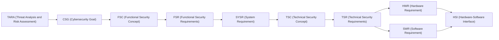

# TDA4VM ADAS ECU Cybersecurity Requirements

This site is a collection of automotive cybersecurity requirements documents and TARA
(Threat Analysis and Risk Assessment) dashboards, organized per ECU. It exists as a learning
and interview-preparation resource for grounding automotive cybersecurity concepts in real
hardware/firmware facts (TI TISCI mailbox APIs, DMSC, SA2UL, TIFS, eFuse/OTP, etc.) rather
than generic textbook descriptions, while following established standards vocabulary
(ISO 21434, ISO 14229 UDS, AUTOSAR SecOC).

## Choose an ECU

  <a class="ecu-card" href="{{ '/Parking/' | relative_url }}">
    <h2>PARKING</h2>
    
ADAS Parking Assist / Surround View System (SVS) ECU

    
Requirements documents, TARA dashboard, and vulnerability analysis report

  </a>
  <a class="ecu-card ecu-card-tbd" href="{{ '/SDV/' | relative_url }}">
    <h2>SDV</h2>
    
Software Defined Vehicle platform

    TBD
  </a>

## Requirement ID taxonomy

TARA (Threat Analysis and Risk Assessment - see each ECU's TARA dashboard) is what supplies the
CSG: every Cybersecurity Goal comes from a TARA risk-treatment decision, and each subsequent ID in
the chain below is derived from the one before it, in order:

- **CSG** - Cybersecurity Goal (what must be true)
- **FSC** - Functional Security Concept (the overarching strategy for realizing the CSGs)
- **FSR** - Functional Security Requirements (decomposed, testable, still implementation-agnostic)
- **SYSR** - System Requirement (system-level allocation across entities/trust boundaries)
- **TSC** - Technical Security Concept (how, at a functional level)
- **TSR** - Technical Security Requirements (how, at a concrete TI TDA4VM mechanism level)
- **HWR** - Hardware Requirement
- **SWR** - Software Requirement
- **HSI** - Hardware-Software Interface Requirement (register/API/message contract)

## Intended use

This is not a product specification for a real vehicle program - it's a self-contained
knowledge base for studying automotive cybersecurity engineering (requirements writing,
TARA-based rationale, and TI TDA4VM-specific security mechanisms) in a realistic, traceable
format. See the [README on GitHub](https://github.com/vinodneelakantam/Sec_Concepts_Req_tracability#readme)
for the full repo/tooling overview.
